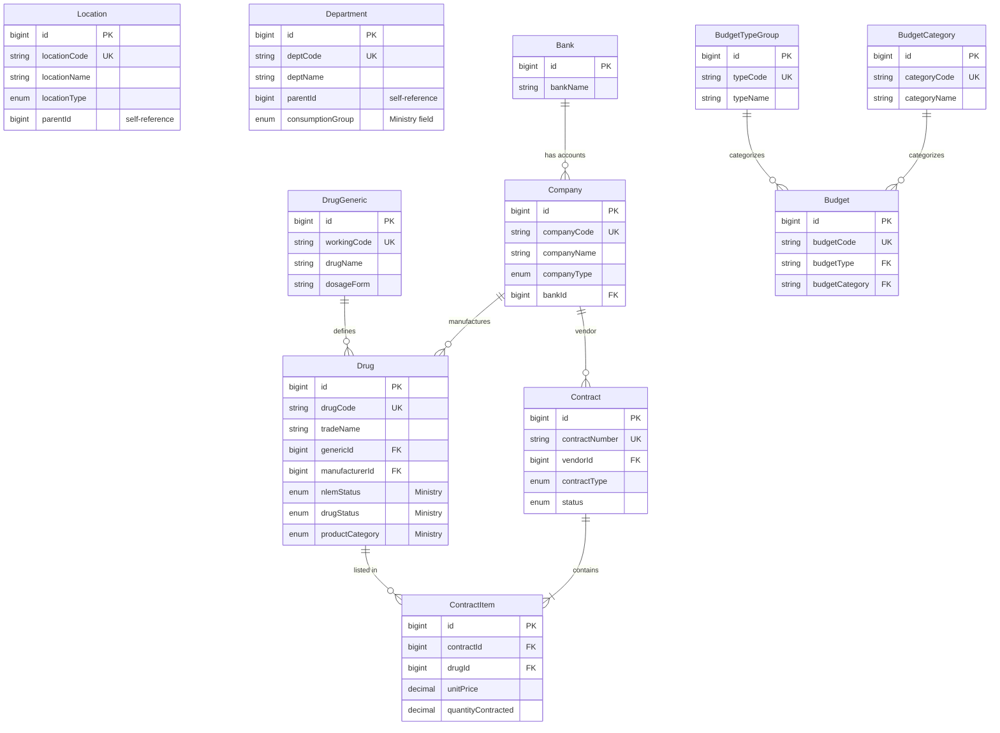

# Developer Handbook - Master Data Management System

**Version**: 2.2.0 | **Last Updated**: 2025-01-21 | **Priority**: ⭐⭐⭐ High

> Complete all-in-one guide for developers building the Master Data Management system

---

## 📖 Table of Contents

1. [🎯 Quick Start (5 Minutes)](#-quick-start-5-minutes)
2. [📊 System Overview](#-system-overview)
3. [🔄 Complete Workflows](#-complete-workflows)
4. [✅ Implementation Checklist](#-implementation-checklist)
5. [🚨 Common Issues & Solutions](#-common-issues--solutions)
6. [📚 References](#-references)

---

## 🎯 Quick Start (5 Minutes)

### Prerequisites

```bash
# Check PostgreSQL is running
docker ps | grep invs-modern-db

# Check Prisma client
npm run db:generate
```

### Environment Setup

```bash
# 1. Start database
docker-compose up -d

# 2. Run migrations
npm run db:migrate

# 3. Seed master data
npm run db:seed

# 4. Test connection
npm run dev
# Expected: ✅ Database connected successfully!
```

### Verify Installation

```bash
# Open Prisma Studio
npm run db:studio
# → http://localhost:5555

# Check master data tables:
# - locations (5 records)
# - departments (5 records)
# - companies (5 records)
# - drug_generics (5 records)
# - budgets (6 records)
```

✅ **Installation Complete!** Ready to develop APIs

---

## 📊 System Overview

### Master Data Tables (11 Tables)

**Entity Relationship Diagram:**



**Foreign Key Relationships Summary:**

| # | From Table | Field | References | Type |
|---|------------|-------|------------|------|
| 1 | Budget | budgetType | BudgetTypeGroup.typeCode | Required |
| 2 | Budget | budgetCategory | BudgetCategory.categoryCode | Required |
| 3 | Company | bankId | Bank.id | Optional |
| 4 | Drug | genericId | DrugGeneric.id | Optional |
| 5 | Drug | manufacturerId | Company.id | Optional |
| 6 | Contract | vendorId | Company.id | Required |
| 7 | ContractItem | contractId | Contract.id | Required |
| 8 | ContractItem | drugId | Drug.id | Required |

**Independent Tables (No FK):** Location, Department, BudgetTypeGroup, BudgetCategory, DrugGeneric, Bank

**Total:** 10 Master Data Tables + 1 Junction Table (ContractItem)

---

### Table Purposes

| Table | Purpose | Records | Priority |
|-------|---------|---------|----------|
| **Location** | Storage locations (คลัง/ห้องยา/แผนก) | ~10-20 | ⭐⭐⭐ |
| **Department** | Hospital departments | ~20-50 | ⭐⭐⭐ |
| **BudgetTypeGroup** | Budget types (งบบำรุง/ลงทุน) | 3-5 | ⭐⭐ |
| **BudgetCategory** | Budget categories (หมวดค่าใช้จ่าย) | 10-20 | ⭐⭐ |
| **Budget** | Budget allocations | 20-50 | ⭐⭐⭐ |
| **Bank** | Bank master data | ~15 | ⭐ |
| **Company** | Drug vendors/manufacturers (ผู้ผลิต/จำหน่ายยา) | 100-500 | ⭐⭐⭐ |
| **DrugGeneric** | Generic drugs (ยาสามัญ) | 500-2,000 | ⭐⭐⭐ |
| **Drug** | Trade name drugs (ยาชื่อการค้า) | 2,000-10,000 | ⭐⭐⭐ |
| **Contract** | Purchase contracts (สัญญาจัดซื้อ) | 50-200 | ⭐⭐⭐ |

### Key Concepts

#### 1. Location Types

```typescript
enum LocationType {
  WAREHOUSE     // Main warehouse (คลังกลาง)
  PHARMACY      // Pharmacy (ห้องยา)
  WARD          // Ward storage (คลังแผนก)
  EMERGENCY     // Emergency storage (คลังฉุกเฉิน)
  OR            // Operating room storage (คลังห้องผ่าตัด)
  ICU           // ICU storage (คลัง ICU)
  GENERAL       // General storage
}
```

#### 2. Company Types

```typescript
enum CompanyType {
  VENDOR        // Vendor only (ผู้จำหน่าย)
  MANUFACTURER  // Manufacturer only (ผู้ผลิต)
  BOTH          // Both vendor and manufacturer
}
```

#### 3. Drug Relationships

- **DrugGeneric** (ยาสามัญ) → **Drug** (ชื่อการค้า)
  - Example: Paracetamol (generic) → Sara, Tylenol (trade names)
- **Company** (manufacturer) → **Drug**
- **Contract** (pricing & quantity) → **Drug**

#### 4. Ministry Compliance Fields ⭐

These fields are required for Ministry of Public Health (DMSIC Standards พ.ศ. 2568) reporting:

```typescript
// Drug Status - Drug lifecycle (สถานะวงจรชีวิตของยา)
enum DrugStatus {
  ACTIVE         // 1 - Active use (ใช้งานปกติ)
  DISCONTINUED   // 2 - Discontinued (ยกเลิกการใช้)
  SPECIAL_CASE   // 3 - Special approval required (กรณีพิเศษ ต้องขออนุมัติ)
  REMOVED        // 4 - Removed from list (ถูกลบออกจากบัญชียา)
}

// NLEM Status - National List of Essential Medicines (บัญชียาหลักแห่งชาติ)
enum NlemStatus {
  E              // Essential (ยาหลัก)
  N              // Non-Essential (ยาเสริม)
}

// Product Category - Product type (ประเภทผลิตภัณฑ์)
enum ProductCategory {
  MODERN_REGISTERED      // 1 - Registered modern medicine (ยาแผนปัจจุบันที่ขึ้นทะเบียน)
  MODERN_HOSPITAL        // 2 - Hospital-made modern medicine (ยาแผนปัจจุบันที่ผลิตใน รพ.)
  HERBAL_REGISTERED      // 3 - Registered herbal medicine (ยาสมุนไพรที่ขึ้นทะเบียน)
  HERBAL_HOSPITAL        // 4 - Hospital-made herbal medicine (ยาสมุนไพรที่ผลิตใน รพ.)
  OTHER                  // 5 - Other
}

// Department Consumption Group - Usage pattern classification (กลุ่มหน่วยงานตามรูปแบบการใช้ยา)
enum DeptConsumptionGroup {
  OPD_IPD_MIX           // 1 - OPD + IPD mixed (ผสม OPD + IPD)
  OPD_MAINLY            // 2 - Mainly OPD (OPD เป็นหลัก)
  IPD_MAINLY            // 3 - Mainly IPD (IPD เป็นหลัก)
  OTHER_INTERNAL        // 4 - Other internal departments (อื่นๆ ภายใน รพ.)
  PRIMARY_CARE          // 5 - Community health center (ศูนย์สุขภาพชุมชน)
  PC_TRANSFERRED        // 6 - Transferred from primary care (ส่งต่อจากศูนย์สุขภาพ)
  OTHER_EXTERNAL        // 7-9 - Other external (อื่นๆ นอก รพ.)
}
```

---

## 🔄 Complete Workflows

### Workflow 1: Add New Drug (Step by Step)

#### Step 1: Create Company (Manufacturer)

```typescript
// POST /api/companies
import { prisma } from '@/lib/prisma'

async function createCompany(data: {
  companyCode: string
  companyName: string
  companyType: 'VENDOR' | 'MANUFACTURER' | 'BOTH'
  taxId?: string
  email?: string
}) {
  // 1. Validate input
  if (!/^C\d{5}$/.test(data.companyCode)) {
    throw new Error('Company code must be in format C00001')
  }

  // 2. Check for duplicates
  const existing = await prisma.company.findUnique({
    where: { companyCode: data.companyCode }
  })
  if (existing) {
    throw new Error('Duplicate company code')
  }

  // 3. Create company
  const company = await prisma.company.create({
    data: {
      companyCode: data.companyCode,
      companyName: data.companyName,
      companyType: data.companyType,
      taxId: data.taxId,
      email: data.email,
      isActive: true
    }
  })

  return company
}

// Example usage:
const gpo = await createCompany({
  companyCode: 'C00001',
  companyName: 'บริษัท จีพีโอ จำกัด',  // Company name in Thai
  companyType: 'BOTH',
  taxId: '0105536001433',
  email: 'contact@gpo.co.th'
})
console.log(gpo)
// { id: 1, companyCode: 'C00001', ... }
```

#### Step 2: Create Drug Generic

```typescript
// POST /api/drug-generics
async function createDrugGeneric(data: {
  workingCode: string
  drugName: string
  dosageForm: string
  saleUnit: string
  strength?: number
  strengthUnit?: string
}) {
  // 1. Validate working code format
  if (!/^[A-Z]{3}\d{4}$/.test(data.workingCode)) {
    throw new Error('Working code must be in format PAR0001')
  }

  // 2. Check for duplicates
  const existing = await prisma.drugGeneric.findUnique({
    where: { workingCode: data.workingCode }
  })
  if (existing) {
    throw new Error('Duplicate working code')
  }

  // 3. Create generic drug
  const generic = await prisma.drugGeneric.create({
    data: {
      workingCode: data.workingCode,
      drugName: data.drugName,
      dosageForm: data.dosageForm,
      saleUnit: data.saleUnit,
      strength: data.strength,
      strengthUnit: data.strengthUnit,
      isActive: true
    }
  })

  return generic
}

// Example usage:
const paracetamol = await createDrugGeneric({
  workingCode: 'PAR0001',
  drugName: 'Paracetamol',
  dosageForm: 'TAB',     // Tablet (เม็ด)
  saleUnit: 'TAB',       // Sold by tablet (ขายเป็นเม็ด)
  strength: 500,
  strengthUnit: 'mg'
})
```

#### Step 3: Create Trade Drug

```typescript
// POST /api/drugs
async function createDrug(data: {
  drugCode: string
  tradeName: string
  genericId: number
  manufacturerId: number
  strength?: string
  packSize?: number
  unitPrice?: number
  nlemStatus?: 'E' | 'N'              // ⭐ Ministry compliance field
  drugStatus?: DrugStatus
  productCategory?: ProductCategory
}) {
  // 1. Validate drug code format
  if (!/^[A-Z0-9]{7,24}$/.test(data.drugCode)) {
    throw new Error('Invalid drug code format')
  }

  // 2. Verify relationships exist
  const [generic, manufacturer] = await Promise.all([
    prisma.drugGeneric.findUnique({ where: { id: data.genericId } }),
    prisma.company.findUnique({ where: { id: data.manufacturerId } })
  ])

  if (!generic) throw new Error('Generic drug not found')
  if (!manufacturer) throw new Error('Manufacturer not found')

  // 3. Create drug
  const drug = await prisma.drug.create({
    data: {
      drugCode: data.drugCode,
      tradeName: data.tradeName,
      genericId: data.genericId,
      manufacturerId: data.manufacturerId,
      strength: data.strength,
      packSize: data.packSize || 1,
      unitPrice: data.unitPrice,
      nlemStatus: data.nlemStatus,              // ⭐ NLEM classification
      drugStatus: data.drugStatus || 'ACTIVE',
      productCategory: data.productCategory || 'MODERN_REGISTERED',
      statusChangedDate: new Date(),             // ⭐ Track status changes
      isActive: true
    },
    include: {
      generic: true,      // Include generic info
      manufacturer: true  // Include manufacturer info
    }
  })

  return drug
}

// Example usage:
const sara = await createDrug({
  drugCode: 'SARA500',
  tradeName: 'Sara 500mg',
  genericId: paracetamol.id,
  manufacturerId: gpo.id,
  strength: '500 mg',
  packSize: 1000,        // 1000 tablets per box (บรรจุ 1000 เม็ด/กล่อง)
  unitPrice: 2.50,       // 2.50 baht per tablet (ราคา 2.50 บาท/เม็ด)
  nlemStatus: 'E',       // Essential drug (ยาหลักแห่งชาติ)
  drugStatus: 'ACTIVE',
  productCategory: 'MODERN_REGISTERED'
})

console.log(sara)
// {
//   id: 1,
//   drugCode: 'SARA500',
//   tradeName: 'Sara 500mg',
//   generic: { drugName: 'Paracetamol', ... },
//   manufacturer: { companyName: 'บริษัท จีพีโอ', ... }
// }
```

#### Step 4: Create Inventory Record

```typescript
// POST /api/inventory
async function createInventoryRecord(data: {
  drugId: number
  locationId: number
  minLevel: number      // Minimum stock level (จำนวนต่ำสุด)
  maxLevel: number      // Maximum stock level (จำนวนสูงสุด)
  reorderPoint: number  // Reorder point (จุดสั่งซื้อใหม่)
}) {
  // 1. Verify relationships
  const [drug, location] = await Promise.all([
    prisma.drug.findUnique({ where: { id: data.drugId } }),
    prisma.location.findUnique({ where: { id: data.locationId } })
  ])

  if (!drug) throw new Error('Drug not found')
  if (!location) throw new Error('Location not found')

  // 2. Check for duplicates
  const existing = await prisma.inventory.findUnique({
    where: {
      drugId_locationId: {
        drugId: data.drugId,
        locationId: data.locationId
      }
    }
  })

  if (existing) {
    throw new Error('Inventory record already exists for this drug-location')
  }

  // 3. Create inventory record
  const inventory = await prisma.inventory.create({
    data: {
      drugId: data.drugId,
      locationId: data.locationId,
      quantityOnHand: 0,           // Initial stock
      minLevel: data.minLevel,
      maxLevel: data.maxLevel,
      reorderPoint: data.reorderPoint,
      averageCost: 0,
      lastCost: 0
    },
    include: {
      drug: { include: { generic: true } },
      location: true
    }
  })

  return inventory
}

// Example usage:
const inv = await createInventoryRecord({
  drugId: sara.id,
  locationId: 1,          // Main Warehouse (คลังกลาง)
  minLevel: 1000,         // Min 1,000 tablets (ต่ำสุด 1,000 เม็ด)
  maxLevel: 10000,        // Max 10,000 tablets (สูงสุด 10,000 เม็ด)
  reorderPoint: 2000      // Reorder at 2,000 tablets (สั่งใหม่เมื่อเหลือ 2,000 เม็ด)
})
```

### Workflow 2: Create Purchase Contract

```typescript
// POST /api/contracts
async function createContract(data: {
  contractNumber: string
  contractType: 'CENTRAL_PURCHASE' | 'SMALL_PURCHASE' | 'ANNUAL_CONTRACT'
  vendorId: number
  startDate: Date
  endDate: Date
  totalValue: number
  fiscalYear: string
  items: Array<{
    drugId: number
    unitPrice: number
    quantityContracted: number
  }>
}) {
  // 1. Validate dates
  if (data.startDate >= data.endDate) {
    throw new Error('Start date must be before end date')
  }

  // 2. Validate vendor
  const vendor = await prisma.company.findUnique({
    where: { id: data.vendorId }
  })
  if (!vendor) throw new Error('Vendor not found')

  // 3. Verify all drugs exist
  const drugIds = data.items.map(item => item.drugId)
  const drugs = await prisma.drug.findMany({
    where: { id: { in: drugIds } }
  })
  if (drugs.length !== drugIds.length) {
    throw new Error('Some drugs not found')
  }

  // 4. Create contract with items using transaction
  const contract = await prisma.$transaction(async (tx) => {
    // Create contract
    const newContract = await tx.contract.create({
      data: {
        contractNumber: data.contractNumber,
        contractType: data.contractType,
        vendorId: data.vendorId,
        startDate: data.startDate,
        endDate: data.endDate,
        totalValue: data.totalValue,
        remainingValue: data.totalValue,  // Initial remaining equals total
        fiscalYear: data.fiscalYear,
        status: 'ACTIVE'
      }
    })

    // Create contract items
    const items = await tx.contractItem.createMany({
      data: data.items.map(item => ({
        contractId: newContract.id,
        drugId: item.drugId,
        unitPrice: item.unitPrice,
        quantityContracted: item.quantityContracted,
        quantityRemaining: item.quantityContracted  // Initial remaining
      }))
    })

    return newContract
  })

  return contract
}

// Example usage:
const contract = await createContract({
  contractNumber: 'CNT-2025-001',
  contractType: 'ANNUAL_CONTRACT',
  vendorId: gpo.id,
  startDate: new Date('2025-01-01'),
  endDate: new Date('2025-12-31'),
  totalValue: 1000000,     // 1 million baht (มูลค่า 1 ล้านบาท)
  fiscalYear: '2568',      // Fiscal year BE 2568 (ปีงบประมาณ พ.ศ. 2568)
  items: [
    {
      drugId: sara.id,
      unitPrice: 2.30,             // Contract price 2.30 baht/tablet (ราคาตามสัญญา)
      quantityContracted: 500000   // 500,000 tablets (จำนวน 500,000 เม็ด)
    }
  ]
})
```

---

## ✅ Implementation Checklist

### Phase 1: Setup & Basic CRUD (Week 1)

#### Backend API Setup

- [ ] Install Express/Fastify server
- [ ] Setup middleware (cors, body-parser, error handler)
- [ ] Setup authentication (JWT)
- [ ] Setup Prisma client

#### Location Management

- [ ] GET /api/locations (with pagination)
- [ ] GET /api/locations/:id
- [ ] POST /api/locations
- [ ] PUT /api/locations/:id
- [ ] PATCH /api/locations/:id/activate
- [ ] PATCH /api/locations/:id/deactivate
- [ ] Add validation (Zod schema)
- [ ] Add authorization
- [ ] Write unit tests

#### Department Management

- [ ] GET /api/departments (with hierarchy)
- [ ] GET /api/departments/:id
- [ ] POST /api/departments
- [ ] PUT /api/departments/:id
- [ ] PATCH /api/departments/:id/activate
- [ ] PATCH /api/departments/:id/deactivate
- [ ] Add validation
- [ ] Add authorization
- [ ] Write tests

### Phase 2: Budget System (Week 1)

#### Budget Types & Categories

- [ ] GET /api/budget-types
- [ ] POST /api/budget-types
- [ ] GET /api/budget-categories
- [ ] POST /api/budget-categories
- [ ] GET /api/budgets (combined type+category)
- [ ] POST /api/budgets

### Phase 3: Company & Drug Management (Week 2)

#### Company Management

- [ ] GET /api/companies (with filters: type, active status)
- [ ] GET /api/companies/:id
- [ ] POST /api/companies
- [ ] PUT /api/companies/:id
- [ ] PATCH /api/companies/:id/activate
- [ ] PATCH /api/companies/:id/deactivate
- [ ] Validation: company_code format, tax_id, email
- [ ] Business rule: Cannot deactivate if has active contracts
- [ ] Authorization
- [ ] Tests

#### Drug Generic Management

- [ ] GET /api/drug-generics
- [ ] GET /api/drug-generics/:id
- [ ] POST /api/drug-generics
- [ ] PUT /api/drug-generics/:id
- [ ] PATCH /api/drug-generics/:id/activate
- [ ] Validation: working_code format
- [ ] Tests

#### Drug Management

- [ ] GET /api/drugs (with filters + search)
- [ ] GET /api/drugs/:id (include generic + manufacturer)
- [ ] POST /api/drugs
- [ ] PUT /api/drugs/:id
- [ ] PATCH /api/drugs/:id/status (change drug_status) ⭐ Ministry compliance
- [ ] Validation: All fields including ministry compliance fields
- [ ] Business rules:
  - [ ] Must have valid generic_id
  - [ ] Must have valid manufacturer_id
  - [ ] Track status_changed_date when status changes
- [ ] Authorization
- [ ] Tests

### Phase 4: Contract Management (Week 2)

#### Contract CRUD

- [ ] GET /api/contracts
- [ ] GET /api/contracts/:id (with items)
- [ ] POST /api/contracts (with items)
- [ ] PUT /api/contracts/:id
- [ ] PATCH /api/contracts/:id/status
- [ ] Business rules:
  - [ ] start_date < end_date
  - [ ] Update remaining_value when PO created
  - [ ] Cannot delete if has active POs
- [ ] Tests

### Phase 5: Testing & Documentation

- [ ] Integration tests (E2E)
- [ ] API documentation (Swagger/OpenAPI)
- [ ] Postman collection
- [ ] Performance testing
- [ ] Security audit

---

## 🚨 Common Issues & Solutions

### Issue 1: Duplicate Key Errors

**Problem**:

```
Error: Unique constraint failed on the fields: (`company_code`)
```

**Solution**:

```typescript
// Always check before creating
const existing = await prisma.company.findUnique({
  where: { companyCode: data.companyCode }
})

if (existing) {
  throw new ValidationError('COMP001', 'Duplicate company code')
}
```

### Issue 2: Foreign Key Constraint Failed

**Problem**:

```
Error: Foreign key constraint failed on the field: `manufacturer_id`
```

**Solution**:

```typescript
// Validate relationships exist first
const manufacturer = await prisma.company.findUnique({
  where: { id: data.manufacturerId }
})

if (!manufacturer) {
  throw new ValidationError('DRUG002', 'Manufacturer not found')
}
```

### Issue 3: Cannot Deactivate Company with Active Contracts

**Problem**: Trying to deactivate a company that has active contracts

**Solution**:

```typescript
async function deactivateCompany(id: number) {
  // Check for active contracts
  const activeContracts = await prisma.contract.count({
    where: {
      vendorId: id,
      status: 'ACTIVE'
    }
  })

  if (activeContracts > 0) {
    throw new BusinessRuleError(
      'COMP010',
      `Cannot deactivate company with ${activeContracts} active contracts. Please close contracts first.`
    )
  }

  // Safe to deactivate
  await prisma.company.update({
    where: { id },
    data: { isActive: false }
  })
}
```

### Issue 4: Prisma Type Errors

**Problem**:

```typescript
// Type error: 'drugStatus' does not exist on type Drug
drug.drugStatus = 'ACTIVE'
```

**Solution**:

```bash
# Regenerate Prisma client after schema changes
npm run db:generate

# Or use db:push for dev
npm run db:push
```

### Issue 5: Missing Ministry Compliance Fields

**Problem**: Export views missing ministry compliance fields

**Solution**: Ministry compliance fields are available in database (v2.2.0):

- `drugs.nlem_status` ✅
- `drugs.drug_status` ✅
- `drugs.product_category` ✅
- `drugs.status_changed_date` ✅
- `departments.consumption_group` ✅

Use these fields in API responses for ministry exports.

---

## 📚 References

### Detailed Documentation

- [Schema Details](detailed/01-SCHEMA.md) - Complete table structures
- [State Machines](detailed/02-STATE-MACHINES.md) - Status transitions
- [Validation Rules](detailed/03-VALIDATION-RULES.md) - All validation logic
- [Authorization](detailed/04-AUTHORIZATION.md) - Permissions matrix
- [Test Cases](detailed/05-TEST-CASES.md) - Test cases + sample data
- [Integration](detailed/06-INTEGRATION.md) - System integrations

### API Documentation

- [API Specification](api/API_SPECIFICATION.md) - OpenAPI-style docs
- [Endpoints Reference](api/ENDPOINTS_REFERENCE.md) - Quick reference
- [Postman Collection](api/POSTMAN_EXAMPLES.json) - Import & test

### Database

- `prisma/schema.prisma` - Complete database schema
- `prisma/seed.ts` - Seed data script
- Prisma Studio - http://localhost:5555

### Project Files

- `PROJECT_STATUS.md` - Project status
- `SYSTEM_SETUP_GUIDE.md` - Complete setup guide
- `docs/flows/` - Business flow documentation

---

## 💡 Best Practices

### 1. Use Transactions for Multi-Table Operations

```typescript
await prisma.$transaction(async (tx) => {
  const contract = await tx.contract.create({ ... })
  await tx.contractItem.createMany({ ... })
})
```

### 2. Include Related Data in Responses

```typescript
const drug = await prisma.drug.findUnique({
  where: { id },
  include: {
    generic: true,      // Include generic info
    manufacturer: true  // Include manufacturer info
  }
})
```

### 3. Use Soft Delete (is_active flag)

```typescript
// Don't actually delete
// await prisma.company.delete({ where: { id } })

// Use soft delete instead
await prisma.company.update({
  where: { id },
  data: { isActive: false }
})
```

### 4. Validate Early, Fail Fast

```typescript
// Validate all input before touching database
if (!data.companyCode || !/^C\d{5}$/.test(data.companyCode)) {
  throw new ValidationError('COMP001', 'Invalid company code format')
}
```

### 5. Track Ministry Compliance Changes

```typescript
// When updating drug_status, always update status_changed_date
await prisma.drug.update({
  where: { id },
  data: {
    drugStatus: newStatus,
    statusChangedDate: new Date(), // ⭐ Always track changes
  }
})
```

---

**🎉 Ready to Start!**

Follow the **Implementation Checklist** step by step, reference detailed documentation when needed, and test thoroughly using the **Test Cases** documentation.

Good luck! 🚀

---

**Version**: 2.2.0
**Last Updated**: 2025-01-21
**Maintained by**: INVS Modern Team
