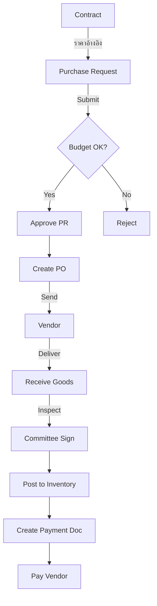

# Workflow Diagrams - Procurement System

## Complete Procurement Flow



## Status Transitions

### Purchase Request
```
DRAFT → SUBMITTED → APPROVED → CONVERTED (to PO)
              ↓
          REJECTED
```

### Purchase Order
```
DRAFT → PENDING → APPROVED → SENT → RECEIVED → CLOSED
```

### Receipt
```
DRAFT → RECEIVED → PENDING_VERIFICATION → VERIFIED → POSTED
```

### Payment
```
PENDING → SUBMITTED → APPROVED → PAID
                 ↓
            CANCELLED
```
