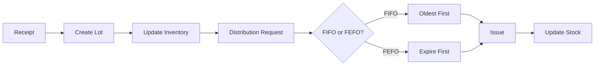

# FIFO/FEFO Flow

```mermaid
graph LR
    A[Receipt] --> B[Create Lot]
    B --> C[Update Inventory]
    C --> D[Distribution Request]
    D --> E{FIFO or FEFO?}
    E -->|FIFO| F[Oldest First]
    E -->|FEFO| G[Expire First]
    F --> H[Issue]
    G --> H
    H --> I[Update Stock]
```

## Functions
- `get_fifo_lots()` - Get lots oldest first
- `get_fefo_lots()` - Get lots expiring first
