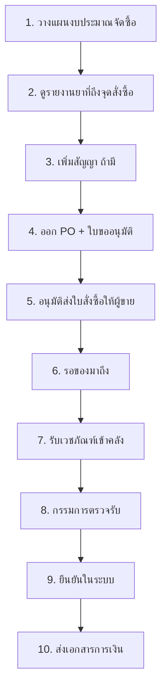
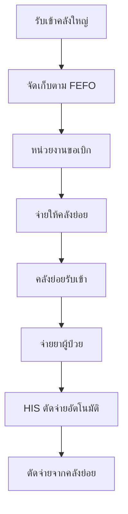

# สรุประบบ INVS - ระบบบริหารเวชภัณฑ์โรงพยาบาล

**จากการประชุมครั้งที่ 3 - วันที่ 20 ตุลาคม 2568**

---

## 📋 ภาพรวมระบบ

ระบบ INVS แบ่งออกเป็น **2 ระบบหลัก** ที่ทำงานเชื่อมโยงกัน:

```
ผู้ขาย → [ระบบจัดซื้อ] → คลังใหญ่ → [ระบบคลัง] → คลังย่อย → ผู้ป่วย
```

---

## 🛒 ระบบที่ 1: จัดซื้อ (Procurement System)

**วัตถุประสงค์:** ทำอย่างไรให้เวชภัณฑ์มาถึงโรงพยาบาล

### 📊 ขั้นตอนการทำงาน



### 🔄 Flow การรับเวชภัณฑ์ (ขั้นตอน 7-10)

| ลำดับ | ขั้นตอน | ผู้รับผิดชอบ | เอกสาร/ผลลัพธ์ |
|-------|---------|-------------|----------------|
| 1 | **ของมาถึง** | เจ้าหน้าที่รับของจากขนส่ง | - |
| 2 | **บันทึกรับเวชภัณฑ์** | เจ้าหน้าที่คลัง | กรอกข้อมูล: Lot, วันหมดอายุ |
| 3 | **พิมพ์ใบตรวจรับ** | ระบบ INVS | ใบตรวจรับพร้อมข้อมูล |
| 4 | **ตรวจรับจริง** | กรรมการตรวจรับ | ตรวจสอบคุณภาพ + ลงนาม |
| 5 | **ยืนยันในระบบ** | เจ้าหน้าที่คลัง | ✅ จำนวนคงคลังเพิ่มขึ้น |
| 6 | **ส่งเอกสารการเงิน** | เจ้าหน้าที่คลัง | เอกสารสำหรับจ่ายเงิน |

### ⭐ จุดเด่นของระบบจัดซื้อ

#### 1. **ไม่ต้องมี PR (Purchase Request)**
```
❌ ระบบทั่วไป: หน่วยงาน → ขอซื้อ (PR) → จัดซื้อ → PO
✅ INVS:        คลัง → ดูรายงาน → สั่งซื้อเลย (PO)
```
**เหตุผล:** คลังเป็นผู้จัดซื้อเองไม่ใช่หน่วยงาน จึงไม่ต้องมีขั้นตอน PR

#### 2. **สร้าง PO + ใบขออนุมัติพร้อมกัน**
- บันทึกครั้งเดียวได้ทั้ง PO และใบขออนุมัติ
- ลดขั้นตอนการทำงาน ประหยัดเวลา

#### 3. **รับ ≠ ตรวจรับ** (แยกชัดเจนตามระเบียบ)
- **รับเข้า:** บันทึกข้อมูลในระบบ (Lot, วันหมดอายุ)
- **ตรวจรับ:** กรรมการตรวจสอบคุณภาพตามจริง
- **ยืนยัน:** ถึงจะเพิ่มคงคลังจริง

---

## 📦 ระบบที่ 2: คลัง (Inventory System)

**วัตถุประสงค์:** ทำอย่างไรให้เวชภัณฑ์ถึงมือผู้ป่วย

### 📊 ขั้นตอนการทำงาน



### 🏢 โครงสร้างคลัง

```
🏢 คลังใหญ่ (Main Warehouse)
    ├─ MAIN: Main Warehouse (คลังกลาง)
    ├─ PHARM: Central Pharmacy (คลังเภสัช)
    └─ EMRG: Emergency Department (คลังฉุกเฉิน)

🏪 คลังย่อย (Sub Warehouse)
    ├─ OPD: Outpatient Department (คลังผู้ป่วยนอก)
    └─ ICU: Intensive Care Unit (คลัง ICU)
```

### 🔄 Flow การจ่ายเวชภัณฑ์

| ลำดับ | ขั้นตอน | ระบบที่เกี่ยวข้อง | หมายเหตุ |
|-------|---------|------------------|---------|
| 1 | **รับเข้าคลังใหญ่** | INVS | จากระบบจัดซื้อ |
| 2 | **จัดเก็บ (FEFO)** | INVS | ใกล้หมดอายุก่อน → อยู่หน้า |
| 3 | **หน่วยงานขอเบิก** | INVS | สร้างใบเบิก |
| 4 | **จ่ายให้คลังย่อย** | INVS | ตัดจากคลังใหญ่ |
| 5 | **คลังย่อยรับเข้า** | INVS | เพิ่มในคลังย่อย |
| 6 | **จ่ายยาผู้ป่วย** | HIS | แพทย์สั่งยา |
| 7 | **ตัดจ่ายอัตโนมัติ** | HIS → INVS | เชื่อมโยง API |

### ⭐ จุดเด่นของระบบคลัง

#### 1. **คลังใหญ่-คลังย่อย (Multi-Warehouse)**
- บริหารหลายคลังพร้อมกัน
- ติดตามสต็อกแต่ละคลังแยกกัน
- ควบคุมการเบิกจ่ายระหว่างคลัง

#### 2. **FEFO อัตโนมัติ (First Expire First Out)**
```
วันหมดอายุ → จัดเรียงอัตโนมัติ
ใกล้หมดอายุก่อน → จ่ายก่อน
ลดยาเสีย → ประหยัดงบประมาณ
```

#### 3. **เชื่อมกับ HIS (Hospital Information System)**
```
แพทย์สั่งยาใน HIS
    ↓
HIS ส่งข้อมูลมา INVS (API)
    ↓
INVS ตัดจ่ายอัตโนมัติ
    ↓
อัพเดทคงคลังแบบ Real-time
```

---

## 🔗 ความเชื่อมโยงระหว่าง 2 ระบบ

### วงจรเวชภัณฑ์แบบครบวงจร

```
┌─────────────────────────────────────────────────────────┐
│                   🛒 ระบบจัดซื้อ                         │
│                                                          │
│  วางแผน → สัญญา → PO → อนุมัติ → รับ → ตรวจรับ → ยืนยัน │
└─────────────────────────────┬───────────────────────────┘
                              │ ✅ ยืนยันรับเข้า
                              ↓
┌─────────────────────────────────────────────────────────┐
│                   📦 ระบบคลัง                            │
│                                                          │
│  คลังใหญ่ → FEFO → เบิกจ่าย → คลังย่อย → จ่ายยา → HIS   │
└─────────────────────────────────────────────────────────┘
```

### จุดเชื่อมต่อสำคัญ

| จุดเชื่อมต่อ | จาก | ไป | Event Trigger |
|-------------|-----|-----|---------------|
| **รับเข้าคลัง** | จัดซื้อ | คลัง | ยืนยันตรวจรับ → เพิ่มคงคลัง |
| **จ่ายยา** | คลัง | HIS | แพทย์สั่งยา → ตัดจ่ายอัตโนมัติ |
| **สั่งซื้อ** | คลัง | จัดซื้อ | ยาถึงจุดสั่งซื้อ → สร้าง PO |

---

## 📊 สรุปความแตกต่าง

| หัวข้อ | ระบบจัดซื้อ | ระบบคลัง |
|--------|------------|---------|
| **วัตถุประสงค์** | ให้เวชภัณฑ์มาถึง รพ. | ให้เวชภัณฑ์ถึงมือผู้ป่วย |
| **ผู้ใช้งานหลัก** | เจ้าหน้าที่จัดซื้อ | เจ้าหน้าที่คลัง, เภสัชกร |
| **เริ่มต้น** | วางแผนงบประมาณ | รับเข้าคลังใหญ่ |
| **สิ้นสุด** | ยืนยันตรวจรับ + ส่งการเงิน | จ่ายยาผู้ป่วย |
| **เอกสารสำคัญ** | PO, ใบอนุมัติ, ใบตรวจรับ | ใบเบิก, ใบจ่าย |
| **ระบบภายนอก** | ผู้ขาย, การเงิน | HIS (ระบบรพ.) |

---

## 🎯 Key Features

### ระบบจัดซื้อ
- ✅ ไม่ต้องมี PR - คลังสั่งซื้อเองได้
- ✅ สร้าง PO + ใบอนุมัติพร้อมกัน
- ✅ แยก "รับ" กับ "ตรวจรับ" ชัดเจน
- ✅ ติดตามสถานะแต่ละขั้นตอน
- ✅ รองรับสัญญาจัดซื้อ

### ระบบคลัง
- ✅ Multi-Warehouse (คลังใหญ่-คลังย่อย)
- ✅ FEFO อัตโนมัติ (ลดยาเสีย)
- ✅ เชื่อม HIS (ตัดจ่ายอัตโนมัติ)
- ✅ ติดตาม Lot & วันหมดอายุ
- ✅ Reorder Point (แจ้งเตือนยาใกล้หมด)

---

## 📈 ประโยชน์ที่ได้รับ

### 1. **ลดขั้นตอนการทำงาน**
- ไม่ต้องทำ PR → ประหยัดเวลา 1-2 วัน
- สร้าง PO + อนุมัติพร้อมกัน → ประหยัดเวลาอีก 1 วัน

### 2. **ลดยาเสีย**
- FEFO จ่ายใกล้หมดอายุก่อน
- แจ้งเตือนยาใกล้หมดอายุ

### 3. **ตรวจสอบได้ทุกขั้นตอน**
- Audit Trail ครบถ้วน
- รู้ว่ายาอยู่ที่ไหน เวลาไหน

### 4. **เชื่อมโยงระบบ**
- เชื่อม HIS → ตัดจ่ายอัตโนมัติ
- เชื่อมการเงิน → ส่งเอกสารจ่ายเงิน

### 5. **รายงานครบถ้วน**
- รายงานยาถึงจุดสั่งซื้อ
- รายงานยาใกล้หมดอายุ
- รายงานคงคลังทุกคลัง
- รายงานงบประมาณ

---

## 📝 สรุป

ระบบ INVS เป็นระบบบริหารเวชภัณฑ์แบบครบวงจร ที่ครอบคลุมตั้งแต่:
- **การจัดซื้อ** (ให้เวชภัณฑ์มาถึง รพ.)
- **การจัดการคลัง** (ให้เวชภัณฑ์ถึงมือผู้ป่วย)

โดยมี **จุดเด่น** คือ:
1. ไม่ต้องมี PR - คลังสั่งซื้อเองได้
2. FEFO อัตโนมัติ - ลดยาเสีย
3. เชื่อม HIS - ตัดจ่ายอัตโนมัติ
4. Multi-Warehouse - บริหารหลายคลัง
5. Audit Trail - ตรวจสอบได้ทุกขั้นตอน

**ผลลัพธ์:** ลดขั้นตอนการทำงาน, ลดยาเสีย, เพิ่มประสิทธิภาพ, ตรวจสอบได้ครบถ้วน 🎯

---

**เอกสารนี้สรุปจาก:** การประชุมครั้งที่ 3 - วันที่ 20 ตุลาคม 2568
**ผู้สรุป:** INVS Development Team
**Version:** 1.0
