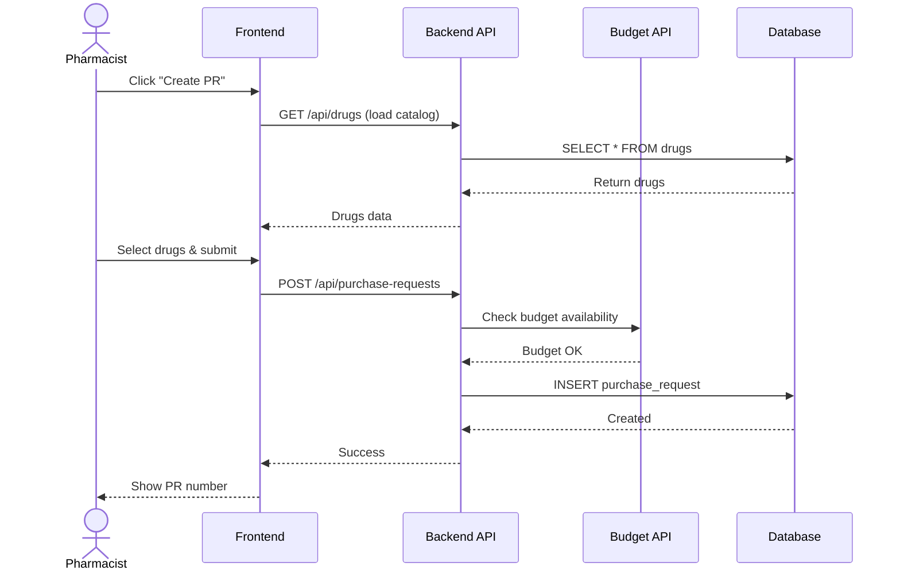
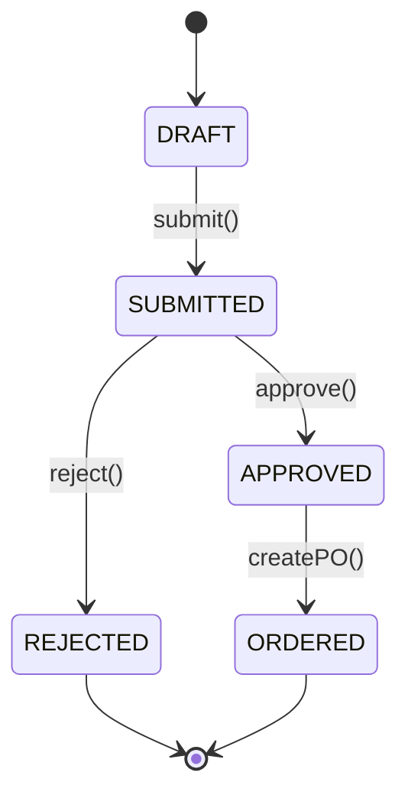

# 📘 Documentation Structure Guide

**INVS Modern - Documentation Best Practices**

**Version:** 2.4.0
**Last Updated:** 2025-01-22

---

## 🎯 Overview

คู่มือนี้อธิบายโครงสร้างการจัดเอกสารของแต่ละระบบใน `docs/systems/` ให้มีความสม่ำเสมอและครบถ้วน

---

## 📁 Standard Structure

แต่ละระบบใน `docs/systems/XX-system-name/` ควรมีโครงสร้างดังนี้:

```
XX-system-name/
├── README.md                    ⭐ Main entry point
├── SCHEMA.md                    📊 Database schema details
├── WORKFLOWS.md                 🔄 Detailed workflows
├── STATE_DIAGRAMS.md           🎯 State machine diagrams (optional)
├── api/                        🔌 API documentation
│   └── openapi.yaml            (auto-generated from AegisX)
└── mock-ui/                    🎨 UI mockups
    └── SYSTEM_UI_MOCKUPS.md
```

---

## 📋 README.md Structure

**Purpose**: ภาพรวมของระบบที่ developer เห็นครั้งแรก - ต้องมีข้อมูลครบและ diagram หลักๆ

### 1️⃣ Header Section
```markdown
# 🏢 System Name

**Brief description**

**Priority:** ⭐⭐⭐ High/Medium/Low
**Tables:** X tables
**Status:** ✅ Production Ready
**Ministry Compliance:** ✅ 100% (if applicable)
```

### 2️⃣ Overview Section
- ภาพรวมของระบบ
- กลุ่มตารางหลัก (แยกตาม functional group)
- System dependencies (ระบบไหนต้องใช้ระบบนี้บ้าง)

### 3️⃣ **⭐ Main Sequence Diagram (NEW!)**
```markdown
## 🔄 Main Workflow

**เพิ่มใหม่**: Sequence diagram หลักๆ 1-2 อันที่สำคัญที่สุด

เช่น:
- Procurement: Create Purchase Request → Approve → Create PO
- Distribution: Request Distribution → Pick Items → Distribute
- Inventory: Receive Goods → Update Inventory → FIFO/FEFO

ให้ใช้ mermaid diagram แบบง่ายๆ ไม่ยาวเกิน 15 steps
```

**Example:**
````markdown
### 🔄 Main Workflow: Create Purchase Request


````

### 4️⃣ Key Features Section
- คุณสมบัติเด่นของระบบ
- Ministry compliance fields (if any)
- Data integrity features

### 5️⃣ **Tables Summary (Updated!)**
```markdown
## 📊 Tables in This System

### Core Tables (X tables)
| Table | Records | Purpose | Phase |
|-------|---------|---------|-------|
| `table_name` | ~100 | Description | v2.0.0 |
| `new_table` | ~50 | Description | ⭐ v2.3.0 Phase 1 |

### Support Tables (X tables) ⭐ NEW
| Table | Records | Purpose | Phase |
|-------|---------|---------|-------|
| `support_table` | ~20 | Description | ⭐ v2.3.0 Phase 2 |

**Total:** XX tables (YY core + ZZ support)
```

### 6️⃣ Quick Start Section
- Code examples
- Basic CRUD operations
- Testing queries

### 7️⃣ Related Documentation Section
- Links to other docs
- API references
- Technical specs

---

## 📊 SCHEMA.md Structure

**Purpose**: รายละเอียดโครงสร้างตาราง, ER diagram, relationships

### Sections:
1. **Table Overview** - สรุปตารางทั้งหมด with record counts
2. **ER Diagram** - Mermaid ER diagram showing relationships
3. **Table Details** - ละเอียดแต่ละตาราง
   - Fields list with data types
   - Constraints (PK, FK, Unique)
   - Indexes
   - Business rules
4. **Relationships** - FK relationships อธิบาย
5. **Enums** - Enum values ที่เกี่ยวข้อง

---

## 🔄 WORKFLOWS.md Structure

**Purpose**: รายละเอียด workflows, business processes, sequence diagrams ทั้งหมด

### Sections:
1. **Overview** - สรุป workflows ทั้งหมด
2. **Workflow 1: Name**
   - User stories
   - Process flow (Flowchart)
   - **Detailed Sequence Diagram** (ละเอียดกว่าใน README)
   - API endpoints used
   - Database operations
   - Business rules
   - Validation rules
   - Error handling
3. **Workflow 2: Name** (same structure)
4. **State Diagrams** (if applicable)
5. **Edge Cases & Error Handling**

---

## 🎯 STATE_DIAGRAMS.md Structure (Optional)

**Purpose**: State machine diagrams สำหรับ workflows ที่มี status/state

**เหมาะสำหรับ:**
- Procurement (Draft → Submitted → Approved → Ordered → Received)
- Distribution (Requested → Picked → Distributed → Confirmed)
- Budget (Planned → Allocated → Reserved → Committed)

### Example:
````markdown
## Purchase Request State Machine


````

---

## 📝 Best Practices

### ✅ DO:

1. **ใส่ Diagram ใน README.md**
   - Main sequence diagram 1-2 อัน (เพื่อให้เห็นภาพรวมทันที)
   - Simple and clear (ไม่เกิน 15 steps)

2. **แยก Detailed Diagrams ไปไว้ WORKFLOWS.md**
   - All workflows with full details
   - Error handling flows
   - Alternative flows

3. **อัพเดทจำนวนตารางให้ถูกต้อง**
   - นับรวมตารางใหม่จาก Phase 1-3
   - ระบุ Phase ที่เพิ่มเข้ามา

4. **ใส่ภาพรวมก่อนลงรายละเอียด**
   - README = Overview + Main diagram
   - SCHEMA/WORKFLOWS = Details

5. **Link ระหว่างเอกสาร**
   - README มี links to SCHEMA.md, WORKFLOWS.md
   - Cross-reference between systems

### ❌ DON'T:

1. **อย่าใส่ทุก diagram ใน README.md**
   - README ยาวเกินไป อ่านยาก
   - ควรมีแค่ main diagram

2. **อย่าลืมอัพเดทจำนวนตาราง**
   - เช็คจาก schema.prisma ให้แน่ใจ

3. **อย่าลืม Phase/Version tags**
   - ตารางใหม่ต้องมี ⭐ และ Phase marker

---

## 🔄 Migration: Moving Diagrams from WORKFLOWS.md to README.md

### Steps:

1. **เลือก Main Diagram**
   - Workflow ที่สำคัญที่สุดของระบบนั้น
   - ไม่เกิน 2 workflows

2. **ลดรายละเอียดลง**
   - เก็บแค่ happy path
   - ตัดส่วนที่ซับซ้อนออก

3. **ใส่ใน README.md**
   - Section ใหม่: "## 🔄 Main Workflow"
   - ก่อน Quick Start section

4. **เก็บ Full Diagram ไว้ใน WORKFLOWS.md**
   - รักษา detailed version ไว้
   - อ้างอิงกลับจาก README

---

## 📊 Tables Count by System (v2.4.0)

**After Phase 1-4 Migrations:**

| System | Before | New Tables | After | Notes |
|--------|--------|------------|-------|-------|
| 01-master-data | 9 | +3 | **12** | drug_pack_ratios, drug_components, drug_focus_lists |
| 02-budget-management | 4 | 0 | **4** | No change |
| 03-procurement | 12 | +3 | **15** | purchase_methods, purchase_types, purchase_order_reasons |
| 04-inventory | 3 | 0 | **3** | No change |
| 05-distribution | 2 | +1 | **3** | distribution_types |
| 06-drug-return | 2 | +1 | **3** | return_reasons |
| 07-tmt-integration | 10 | 0 | **10** | No change |
| 08-hpp-system | 2 | 0 | **2** | No change |
| **TOTAL** | **36** | **+8** | **44** | ✅ |

---

## 🎯 Summary

### README.md ควรมี:
✅ Overview
✅ Tables summary (with NEW tables marked)
✅ **Main sequence diagram (1-2 workflows)** ⭐ NEW
✅ Key features
✅ Quick start
✅ Links to detailed docs

### WORKFLOWS.md ควรมี:
✅ Detailed sequence diagrams (all workflows)
✅ State diagrams
✅ Business rules
✅ Error handling

### อื่นๆ:
✅ SCHEMA.md - Table structures + ER diagrams
✅ STATE_DIAGRAMS.md (optional) - State machines
✅ UI Mockups - Frontend examples

---

**Best Practice**: README = "What & Why", WORKFLOWS = "How (in detail)"

**Remember**: Documentation ที่ดีต้อง:
1. 📊 มี visual (diagrams) ช่วยให้เข้าใจเร็ว
2. 🎯 เริ่มจากภาพรวม ค่อยลงรายละเอียด
3. 🔄 อัพเดทให้ตรงกับ code เสมอ
4. 📝 ใช้ภาษาง่ายๆ มี examples

---

**Generated**: 2025-01-22
**Author**: Claude Code
**Version**: 2.4.0
