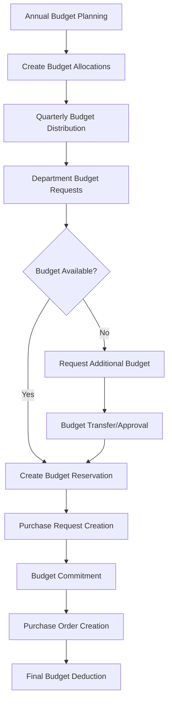
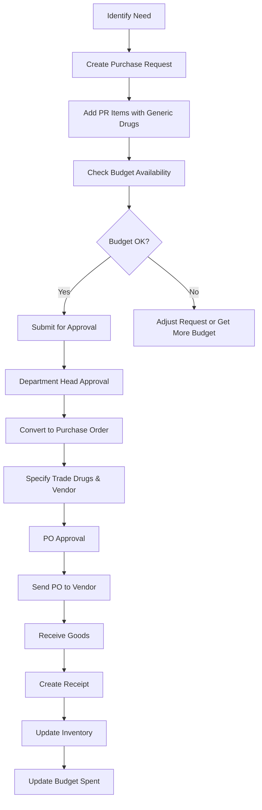
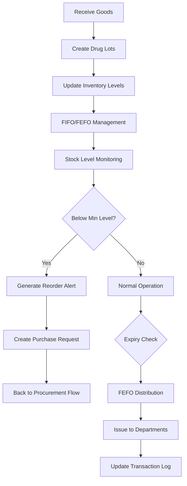
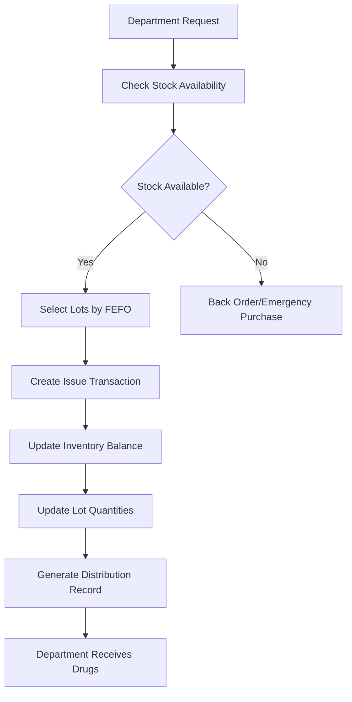

# INVS Modern - System Flows & Business Processes

## 🔄 Core Business Flows

### 1. Budget Management Flow



**Key Steps:**
1. **Budget Allocation**: ตั้งงบประมาณรายปีแบ่งเป็น Q1-Q4
2. **Budget Reservation**: จองงบเมื่อมี Purchase Request
3. **Budget Commitment**: ตัดงบเมื่อ approve Purchase Order
4. **Real-time Tracking**: ติดตามการใช้งบแบบ real-time

### 2. Procurement Flow



**Key Steps:**
1. **Purchase Request**: เริ่มจาก generic drugs, ระบุจำนวนและเหตุผล
2. **Budget Check**: ตรวจสอบงบประมาณ แล้วจองงบ
3. **Approval Workflow**: อนุมัติตามสายงาน
4. **Purchase Order**: เปลี่ยนเป็น trade drugs, เลือก vendor
5. **Goods Receipt**: รับของ สร้าง lot, อัปเดต inventory

### 3. Inventory Management Flow



**Key Features:**
- **FIFO/FEFO**: First In First Out / First Expire First Out
- **Multi-location**: แยก stock ตาม location
- **Automatic Reorder**: แจ้งเตือนเมื่อถึง reorder point
- **Lot Tracking**: ติดตาม lot number และ expiry date

### 4. Drug Distribution Flow



## 🗂️ Data Relationships

### Master Data Hierarchy
```
Company (Vendors/Manufacturers)
├── Drugs (Trade Names)
│   └── DrugGeneric (Generic Names)
├── Locations (Storage Areas)
│   └── Inventory (Stock per Location)
└── Departments (Hospital Units)
    └── Budget Allocations
```

### Transaction Flow
```
Purchase Request → Purchase Order → Receipt → Inventory Transaction
                     ↓
                Budget Reservation → Budget Commitment
```

## 🔐 Authorization Matrix

### Budget Operations
| Role | Create Budget | Approve Budget | Transfer Budget | Emergency Override |
|------|---------------|----------------|-----------------|-------------------|
| Department Head | ✓ | ❌ | ✓ (with approval) | ❌ |
| Finance Manager | ✓ | ✓ | ✓ | ❌ |
| Hospital Director | ✓ | ✓ | ✓ | ✓ |

### Procurement Operations
| Role | Create PR | Approve PR | Create PO | Approve PO | Receive Goods |
|------|-----------|------------|-----------|------------|---------------|
| Requestor | ✓ | ❌ | ❌ | ❌ | ❌ |
| Department Head | ✓ | ✓ | ❌ | ✓ | ✓ |
| Procurement Officer | ✓ | ✓ | ✓ | ❌ | ✓ |
| Finance Manager | ❌ | ✓ | ❌ | ✓ | ❌ |

### Inventory Operations
| Role | View Stock | Issue Drugs | Adjust Stock | Transfer Stock |
|------|------------|-------------|--------------|----------------|
| Staff | ✓ | ❌ | ❌ | ❌ |
| Pharmacist | ✓ | ✓ | ✓ | ✓ |
| Inventory Manager | ✓ | ✓ | ✓ | ✓ |

## 📊 Reporting Flows

### Daily Reports
- Low stock alerts (below reorder point)
- Expiring drugs (within 30 days)
- Budget utilization by department
- Pending approvals

### Monthly Reports
- Budget vs actual spending
- Inventory turnover analysis
- Vendor performance metrics
- Drug usage patterns

### Annual Reports
- Total budget utilization
- Inventory valuation
- Purchase order summary
- Cost savings analysis

## ⚠️ Exception Handling

### Budget Exceptions
- Emergency override for critical drugs
- Budget transfer between departments
- Post-facto budget adjustments
- Temporary budget increase procedures

### Inventory Exceptions
- Manual stock adjustments with justification
- Emergency drug dispensing
- Direct delivery to departments (bypass warehouse)
- Return processing for defective items

### System Exceptions
- Fallback to manual processes during downtime
- Data recovery procedures
- Manual override capabilities
- Backup approval workflows

## 🔄 Integration Points

### Internal Systems
- HIS (Hospital Information System)
- Financial System
- HR System (for user management)
- Laboratory System

### External Systems
- Vendor EDI systems
- Government reporting systems
- Drug regulatory databases
- Banking systems for payments

---

*This document provides a comprehensive overview of all business flows in the INVS Modern system.*