# INVS Modern - Entity Relationship Diagram

## 🗄️ Database Schema Overview

### Complete ER Diagram

```mermaid
erDiagram
    %% Master Data
    Location {
        bigint id PK
        string location_code UK
        string location_name
        enum location_type
        bigint parent_id FK
        string address
        string responsible_person
        boolean is_active
        datetime created_at
    }
    
    Department {
        bigint id PK
        string dept_code UK
        string dept_name
        bigint parent_id FK
        string head_person
        string budget_code
        boolean is_active
        datetime created_at
    }
    
    BudgetType {
        bigint id PK
        string budget_code UK
        string budget_name
        string budget_description
        boolean is_active
        datetime created_at
    }
    
    Company {
        bigint id PK
        string company_code UK
        string company_name
        enum company_type
        string tax_id
        string address
        string phone
        string email
        string contact_person
        boolean is_active
        datetime created_at
        datetime updated_at
    }
    
    %% Drug Management
    DrugGeneric {
        bigint id PK
        string working_code UK
        string drug_name
        string dosage_form
        string sale_unit
        string composition
        decimal strength
        string strength_unit
        boolean is_active
        datetime created_at
    }
    
    Drug {
        bigint id PK
        string drug_code UK
        string trade_name
        bigint generic_id FK
        string strength
        string dosage_form
        bigint manufacturer_id FK
        string atc_code
        string standard_code
        string barcode
        int pack_size
        string unit
        boolean is_active
        datetime created_at
        datetime updated_at
    }
    
    %% Inventory Management
    Inventory {
        bigint id PK
        bigint drug_id FK
        bigint location_id FK
        decimal quantity_on_hand
        decimal min_level
        decimal max_level
        decimal reorder_point
        decimal average_cost
        decimal last_cost
        datetime last_updated
    }
    
    DrugLot {
        bigint id PK
        bigint drug_id FK
        bigint location_id FK
        string lot_number
        date expiry_date
        decimal quantity_available
        decimal unit_cost
        date received_date
        bigint receipt_id FK
        boolean is_active
        datetime created_at
    }
    
    InventoryTransaction {
        bigint id PK
        bigint inventory_id FK
        enum transaction_type
        decimal quantity
        decimal unit_cost
        bigint reference_id
        string reference_type
        string notes
        bigint created_by
        datetime created_at
    }
    
    %% Budget Management
    BudgetAllocation {
        bigint id PK
        int fiscal_year
        bigint budget_type_id FK
        bigint department_id FK
        decimal total_budget
        decimal q1_budget
        decimal q2_budget
        decimal q3_budget
        decimal q4_budget
        decimal total_spent
        decimal q1_spent
        decimal q2_spent
        decimal q3_spent
        decimal q4_spent
        decimal remaining_budget
        enum status
        datetime created_at
        datetime updated_at
    }
    
    BudgetReservation {
        bigint id PK
        bigint allocation_id FK
        bigint pr_id FK
        bigint po_id FK
        decimal reserved_amount
        date reservation_date
        enum status
        date expires_date
        datetime created_at
    }
    
    %% Procurement
    PurchaseRequest {
        bigint id PK
        string pr_number UK
        date pr_date
        bigint department_id FK
        bigint budget_allocation_id FK
        decimal requested_amount
        string purpose
        enum urgency
        enum status
        string requested_by
        string approved_by
        date approval_date
        boolean converted_to_po
        bigint po_id FK
        string remarks
        datetime created_at
    }
    
    PurchaseRequestItem {
        bigint id PK
        bigint pr_id FK
        int item_number
        bigint generic_id FK
        string description
        decimal quantity_requested
        decimal estimated_unit_cost
        decimal estimated_total_cost
        string justification
        enum status
    }
    
    PurchaseOrder {
        bigint id PK
        string po_number UK
        bigint vendor_id FK
        date po_date
        date delivery_date
        bigint department_id FK
        bigint budget_type_id FK
        enum status
        decimal total_amount
        int total_items
        string notes
        bigint created_by
        bigint approved_by
        datetime created_at
        datetime updated_at
    }
    
    PurchaseOrderItem {
        bigint id PK
        bigint po_id FK
        bigint drug_id FK
        decimal quantity_ordered
        decimal unit_cost
        decimal quantity_received
        string notes
    }
    
    Receipt {
        bigint id PK
        string receipt_number UK
        bigint po_id FK
        date receipt_date
        string delivery_note
        enum status
        int total_items
        decimal total_amount
        bigint received_by
        bigint verified_by
        string notes
        datetime created_at
        datetime updated_at
    }
    
    ReceiptItem {
        bigint id PK
        bigint receipt_id FK
        bigint drug_id FK
        decimal quantity_received
        decimal unit_cost
        string lot_number
        date expiry_date
        string notes
    }
    
    %% Relationships
    
    %% Master Data Relationships
    Location ||--o{ Location : "parent-child"
    Department ||--o{ Department : "parent-child"
    Company ||--o{ Drug : "manufactures"
    
    %% Drug Relationships
    DrugGeneric ||--o{ Drug : "has trade names"
    DrugGeneric ||--o{ PurchaseRequestItem : "requested"
    Drug ||--o{ Inventory : "stocked at"
    Drug ||--o{ DrugLot : "has lots"
    Drug ||--o{ PurchaseOrderItem : "ordered"
    Drug ||--o{ ReceiptItem : "received"
    
    %% Location Relationships
    Location ||--o{ Inventory : "stores"
    Location ||--o{ DrugLot : "stores lots"
    
    %% Inventory Relationships
    Inventory ||--o{ InventoryTransaction : "has transactions"
    
    %% Budget Relationships
    BudgetType ||--o{ BudgetAllocation : "allocated to"
    Department ||--o{ BudgetAllocation : "receives budget"
    BudgetAllocation ||--o{ BudgetReservation : "reserved from"
    BudgetReservation ||--o| PurchaseRequest : "reserves for"
    BudgetReservation ||--o| PurchaseOrder : "commits to"
    
    %% Procurement Relationships
    Department ||--o{ PurchaseRequest : "requests"
    PurchaseRequest ||--o{ PurchaseRequestItem : "contains"
    PurchaseRequest ||--o| PurchaseOrder : "converts to"
    
    Company ||--o{ PurchaseOrder : "vendor"
    Department ||--o{ PurchaseOrder : "orders for"
    BudgetType ||--o{ PurchaseOrder : "funded by"
    PurchaseOrder ||--o{ PurchaseOrderItem : "contains"
    PurchaseOrder ||--o{ Receipt : "received as"
    
    Receipt ||--o{ ReceiptItem : "contains"
    Receipt ||--o{ DrugLot : "creates lots"
```



## 🔗 Key Relationships

### 1. Master Data Relationships
- **Hierarchical**: Location → Parent Location
- **Hierarchical**: Department → Parent Department  
- **Manufacturing**: Company → Drug (as manufacturer)
- **Vendor**: Company → PurchaseOrder (as vendor)

### 2. Drug Management Relationships
- **Generic-Trade**: DrugGeneric (1) → Drug (many)
- **Location-Stock**: Location + Drug → Inventory (unique)
- **Lot Tracking**: Drug + Location → DrugLot (many)

### 3. Budget Flow Relationships
- **Allocation**: Department + BudgetType + Year → BudgetAllocation (unique)
- **Reservation**: BudgetAllocation → BudgetReservation → PurchaseRequest/PurchaseOrder
- **Tracking**: Real-time budget usage through purchase orders

### 4. Procurement Flow Relationships
- **Request Flow**: Department → PurchaseRequest → PurchaseRequestItem
- **Order Flow**: PurchaseRequest → PurchaseOrder → PurchaseOrderItem
- **Receipt Flow**: PurchaseOrder → Receipt → ReceiptItem → DrugLot

### 5. Inventory Transaction Relationships
- **Transaction Log**: Inventory → InventoryTransaction (all movements)
- **Reference Tracking**: Transaction references PO, Receipt, etc.
- **FIFO/FEFO**: DrugLot enables proper lot rotation

## 📋 Table Constraints

### Unique Constraints
- `Location`: location_code
- `Department`: dept_code
- `BudgetType`: budget_code
- `Company`: company_code
- `DrugGeneric`: working_code
- `Drug`: drug_code
- `Inventory`: drug_id + location_id
- `BudgetAllocation`: fiscal_year + budget_type_id + department_id
- `PurchaseRequest`: pr_number
- `PurchaseOrder`: po_number
- `PurchaseOrderItem`: po_id + drug_id
- `Receipt`: receipt_number

### Foreign Key Constraints
- All relationships properly constrained
- Cascade deletes on detail records
- Protect master data from deletion

### Check Constraints (Recommended)
```sql
-- Budget allocation must equal quarterly sums
ALTER TABLE budget_allocations 
ADD CONSTRAINT chk_budget_quarters 
CHECK (total_budget = q1_budget + q2_budget + q3_budget + q4_budget);

-- Remaining budget calculation
ALTER TABLE budget_allocations 
ADD CONSTRAINT chk_remaining_budget 
CHECK (remaining_budget = total_budget - total_spent);

-- Positive quantities
ALTER TABLE inventory 
ADD CONSTRAINT chk_positive_quantity 
CHECK (quantity_on_hand >= 0);

-- Expiry date in future
ALTER TABLE drug_lots 
ADD CONSTRAINT chk_future_expiry 
CHECK (expiry_date > received_date);
```

## 🎯 Indexes for Performance

### Critical Indexes
```sql
-- Drug lookups
CREATE INDEX idx_drug_generic_working_code ON drug_generics(working_code);
CREATE INDEX idx_drug_generic_name ON drug_generics(drug_name);
CREATE INDEX idx_drug_code ON drugs(drug_code);

-- Inventory queries
CREATE INDEX idx_inventory_drug_location ON inventory(drug_id, location_id);
CREATE INDEX idx_inventory_reorder ON inventory(location_id) WHERE quantity_on_hand <= reorder_point;

-- Transaction history
CREATE INDEX idx_inventory_transaction_date ON inventory_transactions(created_at);
CREATE INDEX idx_inventory_transaction_type ON inventory_transactions(transaction_type, created_at);

-- Budget tracking
CREATE INDEX idx_budget_allocation_year_dept ON budget_allocations(fiscal_year, department_id);
CREATE INDEX idx_budget_reservation_status ON budget_reservations(status, reservation_date);

-- Procurement workflow
CREATE INDEX idx_purchase_request_status ON purchase_requests(status, pr_date);
CREATE INDEX idx_purchase_order_status ON purchase_orders(status, po_date);

-- Lot expiry management
CREATE INDEX idx_drug_lot_expiry ON drug_lots(expiry_date, location_id) WHERE is_active = true;
CREATE INDEX idx_drug_lot_fifo ON drug_lots(drug_id, location_id, received_date);
```

---

*This ER diagram represents the complete data model for the INVS Modern system with all relationships and constraints properly defined.*