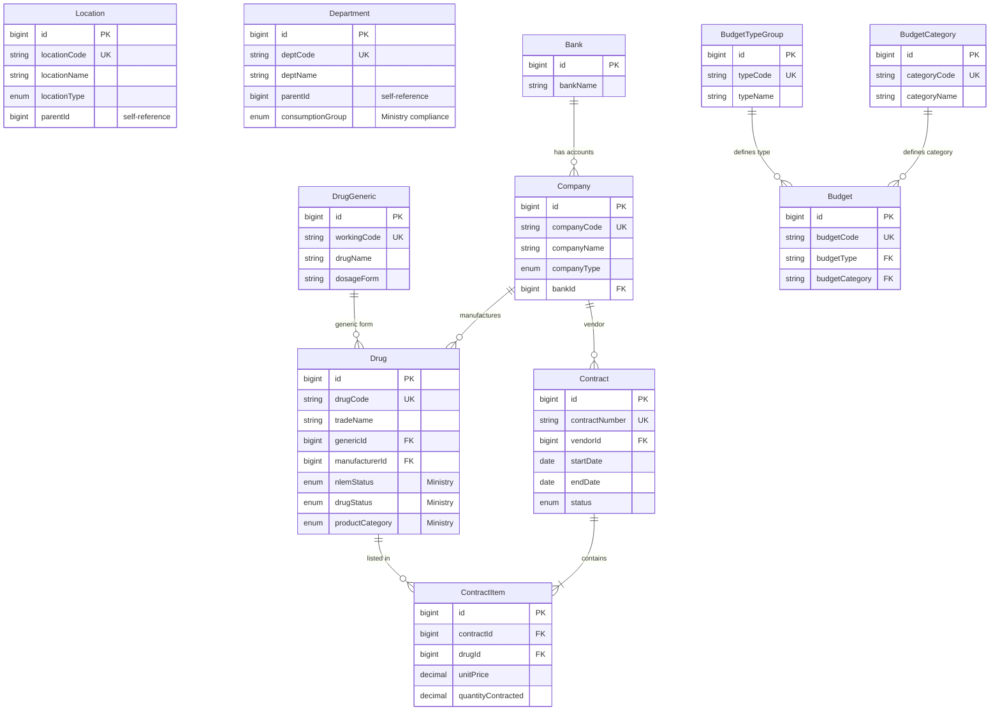
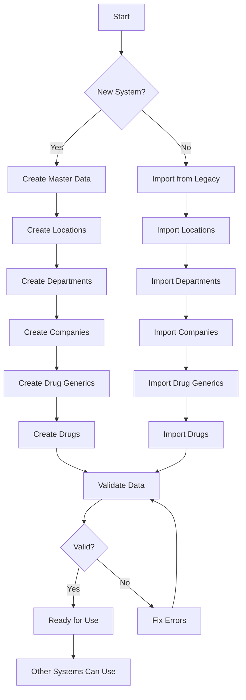

# 📦 Master Data Management System

**Priority**: ⭐⭐⭐ High (Must implement first)
**Tables**: 11 tables
**Complexity**: ⭐⭐ Medium
**Est. Time**: 1-2 weeks

---

## 📋 Overview

Master Data is the foundation data that all other systems depend on. It includes:

- 📍 **Locations** - Storage locations (คลัง, ห้องยา, หอผู้ป่วย)
- 🏢 **Departments** - Hospital departments (แผนกต่างๆ ในโรงพยาบาล)
- 🏭 **Companies** - Vendors and manufacturers (บริษัทผู้ขาย/ผู้ผลิต)
- 💊 **Drug Generics** - Generic drugs (1,104 records)
- 💉 **Drugs** - Trade name drugs (7,258 records)
- 🏦 **Banks** - Bank master data (for finance)
- 💰 **Budget Types** - Budget type classification (ประเภทงบประมาณ)
- 📊 **Budget Categories** - Expense categories (หมวดค่าใช้จ่าย)
- 💼 **Budgets** - Budget allocations (type + category)
- 📄 **Contracts** - Purchase contracts (สัญญาจัดซื้อ)

---

## 📐 Entity Relationships

### Master Data Tables Structure (11 Tables)

**Mermaid ER Diagram:**



**Key Relationships:**
- **Budget** = BudgetTypeGroup + BudgetCategory (combines type and category)
- **Drug** → DrugGeneric (many-to-one: multiple trade drugs per generic)
- **Drug** → Company (many-to-one: manufacturer relationship)
- **Contract** → Company (many-to-one: vendor relationship)
- **ContractItem** → Contract + Drug (junction table: many-to-many between contracts and drugs)
- **Company** → Bank (many-to-one: optional bank account)

---

## 🗄️ Database Tables (11 tables)

### 1. Locations - Storage Locations

```prisma
model Location {
  id                BigInt       @id @default(autoincrement())
  locationCode      String       @unique // Location code (รหัสสถานที่)
  locationName      String       // Location name (ชื่อสถานที่)
  locationType      LocationType // warehouse, pharmacy, ward, emergency
  parentId          BigInt?      // Parent location for hierarchy (สถานที่แม่)
  address           String?
  responsiblePerson String?      // Person in charge (ผู้รับผิดชอบ)
  isActive          Boolean      @default(true)
  createdAt         DateTime     @default(now())

  // Relations
  parent            Location?    @relation("LocationHierarchy")
  children          Location[]   @relation("LocationHierarchy")
  inventory         Inventory[]
  drugLots          DrugLot[]
}

enum LocationType {
  WAREHOUSE      // Main warehouse (คลังกลาง)
  PHARMACY       // Pharmacy (ห้องยา)
  WARD           // Ward storage (คลังหอผู้ป่วย)
  EMERGENCY      // Emergency storage (ห้องฉุกเฉิน)
  OR             // Operating room (ห้องผ่าตัด)
  ICU            // ICU storage
  GENERAL        // General storage
}
```

**Business Rules**:
- Location code must be unique
- Can have parent-child hierarchy
- Must have at least 1 WAREHOUSE location
- Must have at least 1 PHARMACY location

---

### 2. Departments - Hospital Departments

```prisma
model Department {
  id                BigInt             @id @default(autoincrement())
  deptCode          String             @unique // Department code (รหัสแผนก)
  deptName          String             // Department name (ชื่อแผนก)
  hisCode           String?            // HIS system code (รหัสใน HIS)
  parentId          BigInt?            // Parent department for hierarchy (แผนกแม่)
  headPerson        String?            // Department head (หัวหน้าแผนก)
  isActive          Boolean            @default(true)
  createdAt         DateTime           @default(now())

  // Ministry Compliance (NEW - v2.2.0)
  consumptionGroup  DeptConsumptionGroup? // Drug usage pattern (ประเภทการใช้ยา)

  // Relations
  parent            Department?        @relation("DepartmentHierarchy")
  children          Department[]       @relation("DepartmentHierarchy")
  budgetAllocations BudgetAllocation[]
  purchaseRequests  PurchaseRequest[]
}

enum DeptConsumptionGroup {
  OPD_IPD_MIX       // 1 - Mixed OPD + IPD (ผสม OPD + IPD)
  OPD_MAINLY        // 2 - Mainly OPD >70% (OPD มากกว่า 70%)
  IPD_MAINLY        // 3 - Mainly IPD >70% (IPD มากกว่า 70%)
  OTHER_INTERNAL    // 4 - Other internal: OR, X-ray, Lab
  PRIMARY_CARE      // 5 - Primary care unit (รพ.สต.)
  PC_TRANSFERRED    // 6 - Transferred from primary care (รพ.สต. ถ่ายโอน)
  OTHER_EXTERNAL    // 9 - Other external (อื่นๆ นอก รพ.)
}
```

**Business Rules**:
- Department code must be unique
- Can have hierarchy structure
- `consumptionGroup` is critical for ministry reporting

---

### 3. Companies - Vendors and Manufacturers

```prisma
model Company {
  id            BigInt      @id @default(autoincrement())
  companyCode   String      @unique // Company code (รหัสบริษัท)
  companyName   String      // Company name (ชื่อบริษัท)
  companyType   CompanyType // vendor, manufacturer, both
  taxId         String?     // Tax ID 13 digits (เลขผู้เสียภาษี 13 หลัก)
  address       String?
  phone         String?
  email         String?
  contactPerson String?     // Contact person (ผู้ติดต่อ)
  isActive      Boolean     @default(true)
  createdAt     DateTime    @default(now())

  // Relations
  drugs         Drug[]          // Drugs manufactured (ผู้ผลิต)
  purchaseOrders PurchaseOrder[] // Purchase orders as vendor (ผู้ขาย)
  contracts     Contract[]      // Contracts (สัญญา)
}

enum CompanyType {
  VENDOR       // Vendor only (ผู้ขาย)
  MANUFACTURER // Manufacturer only (ผู้ผลิต)
  BOTH         // Both vendor and manufacturer
}
```

**Business Rules**:
- Company code must be unique
- Must specify type (vendor/manufacturer/both)
- Tax ID should be 13 digits

---

### 4. Drug Generics - Generic Drugs

```prisma
model DrugGeneric {
  id                BigInt   @id @default(autoincrement())
  workingCode       String   @unique // Working code 7 chars (รหัสทำงาน)
  drugName          String   // Generic drug name (ชื่อยาสามัญ)
  dosageForm        String   // Dosage form: TAB, CAP, INJ (รูปแบบยา)
  saleUnit          String   // Sale unit (หน่วยขาย)
  composition       String?  // Composition (ส่วนประกอบ)
  strength          Decimal? // Strength value (ความแรง)
  strengthUnit      String?  // Strength unit: mg, g, ml (หน่วยความแรง)
  standardUnit      String?  // Standard unit (หน่วยมาตรฐาน)
  therapeuticGroup  String?  // Therapeutic group (หมวดการรักษา)
  isActive          Boolean  @default(true)
  createdAt         DateTime @default(now())

  // TMT Fields (Thai Medical Terminology)
  tmtVtmCode        String?  // VTM code
  tmtVtmId          BigInt?
  tmtGpCode         String?  // GP code
  tmtGpId           BigInt?
  tmtGpfCode        String?  // GP-F code
  tmtGpfId          BigInt?

  // Relations
  drugs                Drug[]   // Trade name drugs (ยา trade)
  purchaseRequestItems PurchaseRequestItem[]
  budgetPlanItems      BudgetPlanItem[]
  tmtMappings          TmtMapping[]
}
```

**Business Rules**:
- `workingCode` must be unique (7 characters)
- Used to group trade drugs
- Used for budget planning at generic level
- Recommended format: First 3 letters + 4 digits (e.g., PAR0001, IBU0001)

---

### 5. Drugs - Trade Name Drugs

```prisma
model Drug {
  id                 BigInt   @id @default(autoincrement())
  drugCode           String   @unique // Trade drug code (รหัสยา trade)
  tradeName          String   // Trade name (ชื่อการค้า)
  genericId          BigInt?  // FK to drug_generics
  strength           String?
  dosageForm         String?
  manufacturerId     BigInt?  // FK to companies
  atcCode            String?  // ATC code
  standardCode       String?  // Standard 24-digit code (รหัสมาตรฐาน 24 หลัก)
  barcode            String?
  packSize           Int      @default(1) // Pack size (ขนาดบรรจุ)
  unitPrice          Decimal? // Unit price (ราคาต่อหน่วย)
  unit               String   @default("TAB")
  isActive           Boolean  @default(true)
  createdAt          DateTime @default(now())
  updatedAt          DateTime @updatedAt

  // Ministry Compliance Fields (v2.2.0) ⭐
  nlemStatus         NlemStatus?      // NLEM status (สถานะบัญชียาหลักแห่งชาติ)
  drugStatus         DrugStatus       @default(ACTIVE) // Drug lifecycle status
  statusChangedDate  DateTime?        // Status change date (วันที่เปลี่ยนสถานะ)
  productCategory    ProductCategory? // Product type (ประเภทผลิตภัณฑ์)

  // TMT Integration
  tmtTpuCode         String?  // TMT code (TPU level)
  tmtTpuId           BigInt?

  // Relations
  generic            DrugGeneric? @relation
  manufacturer       Company?     @relation
  inventory          Inventory[]
  drugLots           DrugLot[]
}

// NLEM Status - National List of Essential Medicines (บัญชียาหลักแห่งชาติ)
enum NlemStatus {
  E  // Essential Drug (ยาหลัก)
  N  // Non-Essential (ยาเสริม)
}

// Drug Status - Lifecycle status (สถานะวงจรชีวิต)
enum DrugStatus {
  ACTIVE           // 1 - Active (ยังใช้งาน)
  DISCONTINUED     // 2 - Discontinued but stock remains (ตัดจากบัญชีแต่ยังมียาเหลือ)
  SPECIAL_CASE     // 3 - Special approval required (ยาเฉพาะราย)
  REMOVED          // 4 - Removed completely (ตัดออกและไม่มียาเหลือ)
}

// Product Category - Product type (ประเภทผลิตภัณฑ์)
enum ProductCategory {
  MODERN_REGISTERED // 1 - Registered modern medicine (ยาแผนปัจจุบันขึ้นทะเบียน อย.)
  MODERN_HOSPITAL   // 2 - Hospital-made modern medicine (ยาแผนปัจจุบันผลิตโรงพยาบาล)
  HERBAL_REGISTERED // 3 - Registered herbal medicine (ยาสมุนไพรขึ้นทะเบียน)
  HERBAL_HOSPITAL   // 4 - Hospital-made herbal medicine (ยาสมุนไพรผลิตโรงพยาบาล)
  OTHER             // 5 - Other (ยาอื่นๆ)
}
```

**Business Rules**:
- Drug code must be unique
- Should link to generic drug (recommended)
- Must link to manufacturer
- Ministry compliance fields (`nlemStatus`, `drugStatus`, `productCategory`) required for reporting
- `packSize` must be > 0

---

### 6. Bank - Banks

```prisma
model Bank {
  id        BigInt   @id @default(autoincrement())
  bankName  String   // Bank name (ชื่อธนาคาร)
  isActive  Boolean  @default(true)
  createdAt DateTime @default(now())

  // Relations
  companies Company[] // Companies with bank accounts
}
```

**Business Rules**:
- Bank name required
- Used for company bank account information
- Standard Thai banks (กรุงเทพ, กสิกรไทย, ไทยพาณิชย์, etc.)

---

### 7. Budget Types - Budget Type Groups

```prisma
model BudgetTypeGroup {
  id        BigInt   @id @default(autoincrement())
  typeCode  String   @unique // Type code (รหัสประเภทงบ)
  typeName  String   // Type name (ชื่อประเภทงบ)
  isActive  Boolean  @default(true)
  createdAt DateTime @default(now())

  // Relations
  budgets   Budget[] // Budgets using this type
}
```

**Common Budget Types**:
- `OP001` - Operational Drugs (งบดำเนินงาน - ยา)
- `OP002` - Operational Equipment (งบดำเนินงาน - เครื่องมือแพทย์)
- `INV001` - Investment Equipment (งบลงทุน - เครื่องมือ)
- `EM001` - Emergency Fund (งบฉุกเฉิน)

---

### 8. Budget Categories - Expense Categories

```prisma
model BudgetCategory {
  id           BigInt   @id @default(autoincrement())
  categoryCode String   @unique // Category code (รหัสหมวดงบ)
  categoryName String   // Category name (ชื่อหมวดงบ)
  accCode      String?  // Accounting code (รหัสผังบัญชี)
  isActive     Boolean  @default(true)
  createdAt    DateTime @default(now())

  // Relations
  budgets      Budget[] // Budgets in this category
}
```

**Common Categories**:
- `CAT01` - Drug expenses (ค่ายา)
- `CAT02` - Medical supplies (ค่าเวชภัณฑ์)
- `CAT03` - Equipment (ค่าครุภัณฑ์)

---

### 9. Budgets - Budget Combinations

```prisma
model Budget {
  id               BigInt   @id @default(autoincrement())
  budgetCode       String   @unique // Budget code (รหัสงบประมาณ)
  budgetType       String   // FK to budget_types.typeCode
  budgetCategory   String   // FK to budget_categories.categoryCode
  budgetDescription String?
  isActive         Boolean  @default(true)
  createdAt        DateTime @default(now())

  // Relations
  typeGroup        BudgetTypeGroup  @relation
  category         BudgetCategory   @relation
  budgetAllocations BudgetAllocation[] // Used in budget management
}
```

**Business Rules**:
- Budget = Type + Category combination
- Example: `OP001-CAT01` = Operational Drug Budget
- Unique combination of type and category

---

### 10. Contracts - Purchase Contracts

```prisma
model Contract {
  id              BigInt      @id @default(autoincrement())
  contractNumber  String      @unique // Contract number (เลขที่สัญญา)
  contractType    ContractType
  vendorId        BigInt      // FK to companies
  startDate       Date        // Contract start date
  endDate         Date        // Contract end date
  totalValue      Decimal     // Total contract value (มูลค่ารวม)
  remainingValue  Decimal     // Remaining value (มูลค่าคงเหลือ)
  fiscalYear      String      // Fiscal year (ปีงบประมาณ พ.ศ.)
  status          ContractStatus @default(ACTIVE)
  createdAt       DateTime    @default(now())
  updatedAt       DateTime    @updatedAt

  // Relations
  vendor          Company     @relation
  items           ContractItem[]
  purchaseOrders  PurchaseOrder[]
}

enum ContractType {
  E_BIDDING        // e-Bidding (ประกวดราคาอิเล็กทรอนิกส์)
  PRICE_AGREEMENT  // Price agreement (ตกลงราคา)
  QUOTATION        // Direct quotation (เฉพาะเจาะจง)
  SPECIAL          // Special (พิเศษ)
}

enum ContractStatus {
  DRAFT      // Draft (ร่าง)
  ACTIVE     // Active (ใช้งาน)
  EXPIRED    // Expired (หมดอายุ)
  CANCELLED  // Cancelled (ยกเลิก)
}
```

**Business Rules**:
- Contract number must be unique
- Start date must be < end date
- Remaining value tracked when POs created
- Recommended format: `CNT-{YEAR}-{NUMBER}`

---

### 11. Contract Items - Contract Line Items

```prisma
model ContractItem {
  id                  BigInt   @id @default(autoincrement())
  contractId          BigInt   // FK to contracts
  drugId              BigInt   // FK to drugs
  unitPrice           Decimal  // Contract price per unit
  quantityContracted  Decimal  // Total quantity in contract
  quantityRemaining   Decimal  // Remaining quantity
  minOrderQuantity    Decimal?
  maxOrderQuantity    Decimal?
  createdAt           DateTime @default(now())
  updatedAt           DateTime @updatedAt

  // Relations
  contract            Contract @relation
  drug                Drug     @relation

  @@unique([contractId, drugId]) // One drug per contract
}
```

**Business Rules**:
- Each drug can appear only once per contract
- Same drug CAN appear in different contracts (different vendors)
- Contract price can differ from drug's regular unit price
- Quantity remaining tracked when PO items created

---

## 🔄 Flow Diagram



---

## 🏗️ API Architecture

### Design Pattern

This system uses a **grouped namespace pattern** for API organization:

**Base Path**: `/api/master-data`

**Why this pattern?**
- ✅ Clear module separation (ระบบแยกชัดเจนตาม module)
- ✅ Scalable for large systems (รองรับระบบขนาดใหญ่)
- ✅ Easy authorization control (จัดการสิทธิ์ง่าย)
- ✅ Prevents endpoint conflicts (ป้องกัน path ซ้ำกัน)

### System-Wide API Paths

| Module | Base Path | Purpose |
|--------|-----------|---------|
| **Master Data** | `/api/master-data` | Core master data (ข้อมูลหลัก) |
| **Budget** | `/api/budget` | Budget management (งบประมาณ) |
| **Procurement** | `/api/procurement` | Purchase requests & orders (จัดซื้อ) |
| **Inventory** | `/api/inventory` | Stock & lot management (คลังยา) |
| **Distribution** | `/api/distribution` | Drug distribution (จ่ายยา) |
| **Reporting** | `/api/reporting` | Reports & analytics (รายงาน) |
| **Auth** | `/api/auth` | Authentication (ยืนยันตัวตน) |

**Example Master Data Endpoints:**
```
GET  /api/master-data/locations
GET  /api/master-data/departments
GET  /api/master-data/companies
GET  /api/master-data/drug-generics
GET  /api/master-data/drugs
POST /api/master-data/drugs
PUT  /api/master-data/drugs/:id
```

For complete API specification, see [API Documentation →](./api/API_SPECIFICATION.md)

---

## 🔌 API Endpoints (Suggested)

### Locations

```typescript
// GET /api/master-data/locations
// Query: ?type=WAREHOUSE&active=true&page=1&limit=20
GET /api/master-data/locations

// GET /api/master-data/locations/:id
GET /api/master-data/locations/1

// POST /api/master-data/locations
POST /api/master-data/locations
Body: {
  locationCode: "WH01",
  locationName: "คลังกลาง",  // Thai location name
  locationType: "WAREHOUSE",
  responsiblePerson: "นายทดสอบ"
}

// PUT /api/master-data/locations/:id
PUT /api/master-data/locations/1

// DELETE /api/master-data/locations/:id (soft delete)
DELETE /api/master-data/locations/1
```

### Departments

```typescript
// GET /api/master-data/departments
GET /api/master-data/departments

// POST /api/master-data/departments
POST /api/master-data/departments
Body: {
  deptCode: "PHARM",
  deptName: "ห้องยา",  // Thai department name
  consumptionGroup: "OPD_IPD_MIX"  // For ministry reporting
}
```

### Companies

```typescript
// GET /api/master-data/companies?type=VENDOR
GET /api/master-data/companies

// POST /api/master-data/companies
POST /api/master-data/companies
Body: {
  companyCode: "GPO",
  companyName: "องค์การเภสัชกรรม",  // Thai company name
  companyType: "BOTH",
  taxId: "0994000158378"
}
```

### Drug Generics

```typescript
// GET /api/master-data/drug-generics
// Search: ?search=paracetamol
GET /api/master-data/drug-generics

// GET /api/master-data/drug-generics/:id/drugs
// Get all trade drugs for this generic
GET /api/master-data/drug-generics/1/drugs
```

### Drugs

```typescript
// GET /api/master-data/drugs
// Complex search: ?search=para&genericId=1&manufacturerId=2
GET /api/master-data/drugs

// GET /api/master-data/drugs/:id
GET /api/master-data/drugs/1

// POST /api/master-data/drugs
POST /api/master-data/drugs
Body: {
  drugCode: "PARA500",
  tradeName: "Paracetamol 500mg",
  genericId: 1,
  manufacturerId: 5,
  packSize: 100,
  unitPrice: 0.50,
  unit: "TAB",
  nlemStatus: "E",              // ⭐ Ministry compliance
  drugStatus: "ACTIVE",
  productCategory: "MODERN_REGISTERED"
}

// PUT /api/master-data/drugs/:id/status
// Change drug status
PUT /api/master-data/drugs/1/status
Body: {
  drugStatus: "DISCONTINUED",
  statusChangedDate: "2025-01-21",
  reason: "ยาเลิกผลิต"  // Reason in Thai
}
```

---

## 💼 Business Logic Examples

### 1. Location Hierarchy

```typescript
// Get location tree (ดึงโครงสร้างคลังแบบ hierarchy)
async function getLocationTree(parentId?: number) {
  const locations = await prisma.location.findMany({
    where: { parentId: parentId || null },
    include: {
      children: true
    }
  });
  return locations;
}
```

### 2. Drug Search with Generic

```typescript
// Search drugs by generic name (ค้นหายาจากชื่อสามัญ)
async function searchDrugsByGeneric(genericName: string) {
  const drugs = await prisma.drug.findMany({
    where: {
      generic: {
        genericName: {
          contains: genericName,
          mode: 'insensitive'
        }
      },
      isActive: true
    },
    include: {
      generic: true,
      manufacturer: true
    }
  });
  return drugs;
}
```

### 3. Validate Drug Data for Ministry Reporting

```typescript
// Validate drug has all required fields for ministry reporting
// (ตรวจสอบว่ายามีฟิลด์ครบสำหรับรายงานกระทรวง)
function validateDrugForMinistry(drug: Drug): boolean {
  const required = [
    drug.nlemStatus,        // Must have NLEM status
    drug.drugStatus,        // Must have drug status
    drug.productCategory    // Must have product category
  ];

  return required.every(field => field !== null);
}
```

---

## 🧪 Sample Prisma Queries

### Create Location

```typescript
const location = await prisma.location.create({
  data: {
    locationCode: "WH01",
    locationName: "คลังกลาง",  // Main warehouse
    locationType: "WAREHOUSE",
    responsiblePerson: "นายทดสอบ",
    isActive: true
  }
});
```

### Get All Active Drugs with Generic

```typescript
const drugs = await prisma.drug.findMany({
  where: {
    isActive: true,
    drugStatus: "ACTIVE"
  },
  include: {
    generic: true,
    manufacturer: true,
    inventory: {
      include: {
        location: true
      }
    }
  },
  orderBy: {
    tradeName: 'asc'
  }
});
```

### Search Companies by Type

```typescript
// Get all vendors (ค้นหาบริษัทผู้ขายทั้งหมด)
const vendors = await prisma.company.findMany({
  where: {
    OR: [
      { companyType: "VENDOR" },
      { companyType: "BOTH" }
    ],
    isActive: true
  },
  orderBy: {
    companyName: 'asc'
  }
});
```

---

## ✅ Development Checklist

### Phase 1: Setup (Day 1-2)
- [ ] Create API routes structure
- [ ] Setup validation schemas (Zod)
- [ ] Generate TypeScript types from Prisma
- [ ] Setup error handling middleware

### Phase 2: Basic CRUD (Day 3-5)
- [ ] Locations CRUD
- [ ] Departments CRUD
- [ ] Companies CRUD
- [ ] Bank CRUD

### Phase 3: Drug Management (Day 6-8)
- [ ] Drug Generics CRUD
- [ ] Drugs CRUD
- [ ] Drug status management
- [ ] Ministry fields validation

### Phase 4: Advanced Features (Day 9-10)
- [ ] Search functionality
- [ ] Pagination
- [ ] Filtering
- [ ] Hierarchy queries (locations, departments)
- [ ] Bulk import APIs

### Phase 5: Testing (Day 11-12)
- [ ] Unit tests
- [ ] Integration tests
- [ ] API documentation (Swagger)
- [ ] Performance testing

---

## 🎯 Important Notes

### Ministry Compliance Requirements

These fields are required for all drugs for ministry reporting:
- ✅ `nlemStatus` - E (Essential) or N (Non-Essential)
- ✅ `drugStatus` - ACTIVE, DISCONTINUED, SPECIAL_CASE, REMOVED
- ✅ `productCategory` - 1-5 categories
- ✅ `statusChangedDate` - Track when status changes

### Performance Considerations

- Create indexes on `drugCode`, `genericCode`, `companyCode`
- Cache companies and locations data (changes infrequently)
- Use pagination for drugs (thousands of records)

### Security Best Practices

- Validate input on all endpoints
- Prevent SQL injection (Prisma handles automatically)
- Use soft delete (`isActive = false`) instead of hard delete
- Log important data changes for audit trail

---

## 📚 Related Documentation

- **Next Step**: [Budget Management →](../02-budget-management/README.md)
- [Procurement System →](../03-procurement/README.md)
- [Inventory System →](../04-inventory/README.md)
- [Developer Handbook →](./DEVELOPER_HANDBOOK.md) - Complete implementation guide

---

**Created**: 2025-01-21
**Priority**: ⭐⭐⭐ High
**Status**: Ready for Development

*Start here first! 🚀*
