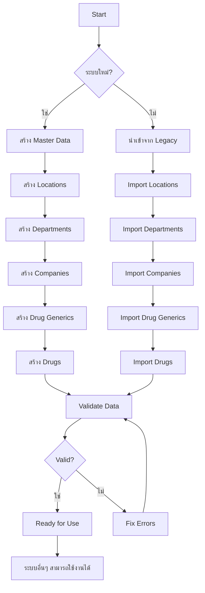

# 📦 Master Data Management System

**Priority**: ⭐⭐⭐ สูงสุด (ต้องทำก่อน)
**Tables**: 10 tables
**Complexity**: ⭐⭐ ปานกลาง
**Est. Time**: 1-2 weeks

---

## 📋 Overview

ระบบ Master Data เป็นข้อมูลพื้นฐานที่ทุกระบบอื่นต้องใช้ ประกอบด้วย:

- 📍 **Locations** - สถานที่เก็บยา (คลัง, ห้องยา, หอผู้ป่วย)
- 🏢 **Departments** - แผนกต่างๆ ในโรงพยาบาล
- 🏭 **Companies** - บริษัทผู้ขาย/ผู้ผลิต
- 💊 **Drug Generics** - ยา Generic (1,104 รายการ)
- 💉 **Drugs** - ยา Trade (7,258 รายการ)
- 🏦 **Banks** - ธนาคาร (สำหรับการเงิน)
- 💰 **Budget Types** - ประเภทงบประมาณ
- 📊 **Budget Categories** - หมวดค่าใช้จ่าย
- 💼 **Budgets** - งบประมาณ (type + category)
- 📄 **Ministry Reports** - รายงานกระทรวง

---

## 🗄️ Database Tables (10 tables)

### 1. locations - สถานที่เก็บยา

```prisma
model Location {
  id                BigInt       @id @default(autoincrement())
  locationCode      String       @unique // รหัสสถานที่
  locationName      String       // ชื่อสถานที่
  locationType      LocationType // warehouse, pharmacy, ward, emergency
  parentId          BigInt?      // สถานที่แม่ (hierarchy)
  address           String?
  responsiblePerson String?      // ผู้รับผิดชอบ
  isActive          Boolean      @default(true)
  createdAt         DateTime     @default(now())

  // Relations
  parent            Location?    @relation("LocationHierarchy")
  children          Location[]   @relation("LocationHierarchy")
  inventory         Inventory[]
  drugLots          DrugLot[]
}

enum LocationType {
  WAREHOUSE      // คลังกลาง
  PHARMACY       // ห้องยา
  WARD           // หอผู้ป่วย
  EMERGENCY      // ห้องฉุกเฉิน
  LABORATORY     // ห้องปฏิบัติการ
  OPERATING_ROOM // ห้องผ่าตัด
}
```

**Business Rules**:
- รหัสสถานที่ต้อง unique
- สามารถมี hierarchy (parent-child) ได้
- ต้องมีอย่างน้อย 1 สถานที่ประเภท WAREHOUSE
- ต้องมีอย่างน้อย 1 สถานที่ประเภท PHARMACY

---

### 2. departments - แผนกในโรงพยาบาล

```prisma
model Department {
  id                BigInt             @id @default(autoincrement())
  deptCode          String             @unique // รหัสแผนก
  deptName          String             // ชื่อแผนก
  hisCode           String?            // รหัสแผนกใน HIS
  parentId          BigInt?            // แผนกแม่ (hierarchy)
  headPerson        String?            // หัวหน้าแผนก
  isActive          Boolean            @default(true)
  createdAt         DateTime           @default(now())

  // Ministry Compliance (NEW - v2.2.0)
  consumptionGroup  DeptConsumptionGroup? // ประเภทการใช้ยา

  // Relations
  parent            Department?        @relation("DepartmentHierarchy")
  children          Department[]       @relation("DepartmentHierarchy")
  budgetAllocations BudgetAllocation[]
  purchaseRequests  PurchaseRequest[]
}

enum DeptConsumptionGroup {
  OPD_IPD_MIX       // 1 = ผสม OPD + IPD
  OPD_MAINLY        // 2 = OPD มากกว่า 70%
  IPD_MAINLY        // 3 = IPD มากกว่า 70%
  OTHER_INTERNAL    // 4 = OR, X-ray, Lab
  PRIMARY_CARE      // 5 = รพ.สต.
  PC_TRANSFERRED    // 6 = รพ.สต. ถ่ายโอน
  OTHER_EXTERNAL    // 9 = อื่นๆ
}
```

**Business Rules**:
- รหัสแผนกต้อง unique
- สามารถมี hierarchy ได้
- consumptionGroup สำคัญสำหรับรายงานกระทรวง

---

### 3. companies - บริษัทผู้ขาย/ผู้ผลิต

```prisma
model Company {
  id            BigInt      @id @default(autoincrement())
  companyCode   String      @unique // รหัสบริษัท
  companyName   String      // ชื่อบริษัท
  companyType   CompanyType // vendor, manufacturer, both
  taxId         String?     // เลขผู้เสียภาษี
  address       String?
  phone         String?
  email         String?
  contactPerson String?     // ผู้ติดต่อ
  isActive      Boolean     @default(true)
  createdAt     DateTime    @default(now())

  // Relations
  drugs         Drug[]          // ผู้ผลิต
  purchaseOrders PurchaseOrder[] // ผู้ขาย
  contracts     Contract[]      // สัญญา
}

enum CompanyType {
  VENDOR       // ผู้ขาย
  MANUFACTURER // ผู้ผลิต
  BOTH         // ทั้งสอง
}
```

**Business Rules**:
- รหัสบริษัทต้อง unique
- ต้องระบุประเภท (vendor/manufacturer/both)
- เลขผู้เสียภาษีควรเป็น 13 หลัก

---

### 4. drug_generics - ยา Generic

```prisma
model DrugGeneric {
  id              BigInt   @id @default(autoincrement())
  genericCode     String   @unique // รหัสยา generic
  genericName     String   // ชื่อสามัญ (generic name)
  workingCode     String?  // รหัสทำงาน
  dosageForm      String?  // รูปแบบยา (tab, cap, inj)
  strength        String?  // ความแรง
  unit            String?  // หน่วย
  therapeuticClass String? // หมวดการรักษา
  isActive        Boolean  @default(true)
  createdAt       DateTime @default(now())

  // Relations
  drugs           Drug[]   // ยา trade ที่เกี่ยวข้อง
}
```

**Business Rules**:
- รหัสยา generic ต้อง unique
- ใช้เป็นตัวกลางในการจัดกลุ่มยา trade
- ใช้ในการวางแผนงบประมาณ

---

### 5. drugs - ยา Trade (ยี่ห้อต่างๆ)

```prisma
model Drug {
  id                 BigInt   @id @default(autoincrement())
  drugCode           String   @unique // รหัสยา trade
  tradeName          String   // ชื่อการค้า
  genericId          BigInt?  // FK to drug_generics
  strength           String?
  dosageForm         String?
  manufacturerId     BigInt?  // FK to companies
  atcCode            String?  // ATC code
  standardCode       String?  // รหัสมาตรฐาน 24 หลัก
  barcode            String?
  packSize           Int      @default(1) // ขนาดบรรจุ
  unitPrice          Decimal? // ราคาขายต่อหน่วย
  unit               String   @default("TAB")
  isActive           Boolean  @default(true)
  createdAt          DateTime @default(now())
  updatedAt          DateTime @updatedAt

  // Ministry Compliance Fields (v2.2.0)
  nlemStatus         NlemStatus?      // E=Essential, N=Non-Essential
  drugStatus         DrugStatus       @default(ACTIVE)
  statusChangedDate  DateTime?        // วันที่เปลี่ยนสถานะ
  productCategory    ProductCategory? // ประเภทผลิตภัณฑ์

  // TMT Integration
  tmtTpuCode         String?  // รหัส TMT (TPU level)
  tmtTpuId           BigInt?

  // Relations
  generic            DrugGeneric? @relation
  manufacturer       Company?     @relation
  inventory          Inventory[]
  drugLots           DrugLot[]
}

enum NlemStatus {
  E  // Essential Drug (ยาในบัญชียาหลัก)
  N  // Non-Essential (ยานอกบัญชี)
}

enum DrugStatus {
  ACTIVE           // 1 = ยังใช้งาน
  DISCONTINUED     // 2 = ตัดจากบัญชีแต่ยังมียาเหลือ
  SPECIAL_CASE     // 3 = ยาเฉพาะราย
  REMOVED          // 4 = ตัดออกและไม่มียาเหลือ
}

enum ProductCategory {
  MODERN_REGISTERED // 1 = ยาแผนปัจจุบันขึ้นทะเบียน อย.
  MODERN_HOSPITAL   // 2 = ยาแผนปัจจุบันผลิตโรงพยาบาล
  HERBAL_REGISTERED // 3 = ยาสมุนไพรขึ้นทะเบียน
  HERBAL_HOSPITAL   // 4 = ยาสมุนไพรผลิตโรงพยาบาล
  OTHER             // 5 = ยาอื่นๆ
}
```

**Business Rules**:
- รหัสยาต้อง unique
- ต้องเชื่อมกับ generic (แนะนำ)
- ต้องเชื่อมกับ manufacturer
- nlemStatus, drugStatus สำคัญสำหรับรายงานกระทรวง
- packSize ต้องมากกว่า 0

---

### 6-10. Budget Related Tables

(เนื่องจากเกี่ยวข้องกับงบประมาณ จะอธิบายใน `02-budget-management/README.md`)

---

## 🔄 Flow Diagram



---

## 🔌 API Endpoints (Suggested)

### Locations

```typescript
// GET /api/master-data/locations
// Query: ?type=WAREHOUSE&active=true&page=1&limit=20
GET /api/master-data/locations

// GET /api/master-data/locations/:id
GET /api/master-data/locations/1

// POST /api/master-data/locations
POST /api/master-data/locations
Body: {
  locationCode: "WH01",
  locationName: "คลังกลาง",
  locationType: "WAREHOUSE",
  responsiblePerson: "นายทดสอบ"
}

// PUT /api/master-data/locations/:id
PUT /api/master-data/locations/1

// DELETE /api/master-data/locations/:id (soft delete)
DELETE /api/master-data/locations/1
```

### Departments

```typescript
// GET /api/master-data/departments
GET /api/master-data/departments

// POST /api/master-data/departments
POST /api/master-data/departments
Body: {
  deptCode: "PHARM",
  deptName: "ห้องยา",
  consumptionGroup: "OPD_IPD_MIX"
}
```

### Companies

```typescript
// GET /api/master-data/companies?type=VENDOR
GET /api/master-data/companies

// POST /api/master-data/companies
POST /api/master-data/companies
Body: {
  companyCode: "GPO",
  companyName: "องค์การเภสัชกรรม",
  companyType: "BOTH",
  taxId: "0994000158378"
}
```

### Drug Generics

```typescript
// GET /api/master-data/drug-generics
// Search: ?search=paracetamol
GET /api/master-data/drug-generics

// GET /api/master-data/drug-generics/:id/drugs
// Get all trade drugs for this generic
GET /api/master-data/drug-generics/1/drugs
```

### Drugs

```typescript
// GET /api/master-data/drugs
// Complex search: ?search=para&genericId=1&manufacturerId=2
GET /api/master-data/drugs

// GET /api/master-data/drugs/:id
GET /api/master-data/drugs/1

// POST /api/master-data/drugs
POST /api/master-data/drugs
Body: {
  drugCode: "PARA500",
  tradeName: "Paracetamol 500mg",
  genericId: 1,
  manufacturerId: 5,
  packSize: 100,
  unitPrice: 0.50,
  unit: "TAB",
  nlemStatus: "E",
  drugStatus: "ACTIVE",
  productCategory: "MODERN_REGISTERED"
}

// PUT /api/master-data/drugs/:id/status
// Change drug status
PUT /api/master-data/drugs/1/status
Body: {
  drugStatus: "DISCONTINUED",
  statusChangedDate: "2025-01-21",
  reason: "ยาเลิกผลิต"
}
```

---

## 💼 Business Logic

### 1. Location Hierarchy

```typescript
// Get location tree
async function getLocationTree(parentId?: number) {
  const locations = await prisma.location.findMany({
    where: { parentId: parentId || null },
    include: {
      children: true
    }
  });
  return locations;
}
```

### 2. Drug Search with Generic

```typescript
// Search drugs by generic name
async function searchDrugsByGeneric(genericName: string) {
  const drugs = await prisma.drug.findMany({
    where: {
      generic: {
        genericName: {
          contains: genericName,
          mode: 'insensitive'
        }
      },
      isActive: true
    },
    include: {
      generic: true,
      manufacturer: true
    }
  });
  return drugs;
}
```

### 3. Validate Drug Data (Ministry Compliance)

```typescript
// Validate drug for ministry reporting
function validateDrugForMinistry(drug: Drug): boolean {
  const required = [
    drug.nlemStatus,        // Must have NLEM status
    drug.drugStatus,        // Must have drug status
    drug.productCategory    // Must have product category
  ];

  return required.every(field => field !== null);
}
```

---

## 🧪 Sample Prisma Queries

### Create Location

```typescript
const location = await prisma.location.create({
  data: {
    locationCode: "WH01",
    locationName: "คลังกลาง",
    locationType: "WAREHOUSE",
    responsiblePerson: "นายทดสอบ",
    isActive: true
  }
});
```

### Get All Active Drugs with Generic

```typescript
const drugs = await prisma.drug.findMany({
  where: {
    isActive: true,
    drugStatus: "ACTIVE"
  },
  include: {
    generic: true,
    manufacturer: true,
    inventory: {
      include: {
        location: true
      }
    }
  },
  orderBy: {
    tradeName: 'asc'
  }
});
```

### Search Companies by Type

```typescript
const vendors = await prisma.company.findMany({
  where: {
    OR: [
      { companyType: "VENDOR" },
      { companyType: "BOTH" }
    ],
    isActive: true
  },
  orderBy: {
    companyName: 'asc'
  }
});
```

---

## ✅ Development Checklist

### Phase 1: Setup (Day 1-2)
- [ ] สร้าง API routes structure
- [ ] Setup validation schemas (Zod)
- [ ] สร้าง TypeScript types from Prisma
- [ ] Setup error handling

### Phase 2: Basic CRUD (Day 3-5)
- [ ] Locations CRUD
- [ ] Departments CRUD
- [ ] Companies CRUD
- [ ] Bank CRUD

### Phase 3: Drug Management (Day 6-8)
- [ ] Drug Generics CRUD
- [ ] Drugs CRUD
- [ ] Drug status management
- [ ] Ministry fields validation

### Phase 4: Advanced Features (Day 9-10)
- [ ] Search functionality
- [ ] Pagination
- [ ] Filtering
- [ ] Hierarchy queries (locations, departments)
- [ ] Bulk import APIs

### Phase 5: Testing (Day 11-12)
- [ ] Unit tests
- [ ] Integration tests
- [ ] API documentation (Swagger)
- [ ] Performance testing

---

## 🎯 Important Notes

### Ministry Compliance
ต้องระบุฟิลด์เหล่านี้สำหรับยาทุกรายการ:
- ✅ `nlemStatus` - E หรือ N
- ✅ `drugStatus` - ACTIVE, DISCONTINUED, SPECIAL_CASE, REMOVED
- ✅ `productCategory` - 1-5
- ✅ `statusChangedDate` - เมื่อเปลี่ยนสถานะ

### Performance
- สร้าง index สำหรับ `drugCode`, `genericCode`, `companyCode`
- Cache ข้อมูล companies และ locations (เปลี่ยนไม่บ่อย)
- ใช้ pagination สำหรับ drugs (มีหลายพันรายการ)

### Security
- Validate input ทุก endpoint
- ป้องกัน SQL injection (Prisma ป้องกันอัตโนมัติ)
- ใช้ soft delete (isActive = false) แทน hard delete
- Log การเปลี่ยนแปลงข้อมูลสำคัญ

---

## 📚 Related Documentation

- [Budget Management →](../02-budget-management/README.md)
- [Procurement System →](../03-procurement/README.md)
- [Inventory System →](../04-inventory/README.md)

---

**Created**: 2025-01-21
**Priority**: ⭐⭐⭐ High
**Status**: Ready for Development

*Start here first! 🚀*
