# 🏢 Master Data - Database Schema

**System:** Master Data Management
**Tables:** 12 tables (9 core + 3 drug info support) ⭐
**Version:** 2.4.0
**Last Updated:** 2025-01-22
**Data Migrated:** 3,152 records (Phase 1-4) 🔓

---

## 📊 Table Overview

### Core Tables (9 tables)

| Table | Records | Purpose |
|-------|---------|---------|
| `locations` | 5-20 | Storage locations (warehouse, pharmacy, ward, emergency) |
| `departments` | 10-50 | Hospital departments with budget codes |
| `budget_types` | 6-10 | Budget type groups (operational, investment, emergency) |
| `budget_categories` | 10-20 | Budget expense categories with accounting codes |
| `budgets` | 20-50 | Budget type + category combinations |
| `bank` | 15-20 | Bank master data for payment processing |
| `companies` | 50-200 | Vendors and manufacturers |
| `drug_generics` | 1,109 | Generic drug catalog (WORKING_CODE 7 chars) 🔓 |
| `drugs` | 1,169 | Trade drugs (TRADE_CODE 24 chars) with ministry compliance 🔓 |

### Drug Information Support Tables (3 tables) ⭐ NEW

| Table | Records | Purpose | Phase |
|-------|---------|---------|-------|
| `drug_components` | 736 | Active Pharmaceutical Ingredients for allergy checking 🔓 | ⭐ Phase 2 |
| `drug_focus_lists` | 0/92 | Controlled substance lists (ยาเสพติด, วัตถุออกฤทธิ์) | ⭐ Phase 2 |
| `drug_pack_ratios` | 0/1,641 | Pack size ratios and vendor-specific pricing | ⭐ Phase 1 |

**Total:** 12 tables

---

## 🗺️ Entity Relationship Diagram

### Core Relationships

```mermaid
erDiagram
    %% Organization & Budget Structure
    departments ||--o{ departments : "parent-child"
    departments ||--o{ budget_allocations : "has"
    budget_types ||--o{ budgets : "has"
    budget_categories ||--o{ budgets : "has"
    budgets ||--o{ budget_allocations : "uses"

    %% Locations
    locations ||--o{ locations : "parent-child"
    locations ||--o{ inventory : "stores"

    %% Companies & Drugs
    companies ||--o{ drugs : "manufactures"
    drug_generics ||--o{ drugs : "has trade name"
    drugs ||--o{ inventory : "tracked in"

    %% Bank
    bank ||--o{ companies : "has account"

    %% Key Attributes
    locations {
        int id PK
        string location_code UK
        string location_name
        enum location_type
        int parent_id FK
        string responsible_person
        boolean is_active
    }

    departments {
        int id PK
        string dept_code UK
        string dept_name
        string his_code
        int parent_id FK
        enum consumption_group "Ministry field ⭐"
        boolean is_active
    }

    budget_types {
        int id PK
        string type_code UK
        string type_name
        enum budget_class
    }

    budget_categories {
        int id PK
        string category_code UK
        string category_name
        string accounting_code
    }

    budgets {
        int id PK
        int budget_type_id FK
        int budget_category_id FK
        string description
    }

    bank {
        int id PK
        string bank_code UK
        string bank_name
        string swift_code
    }

    companies {
        int id PK
        string company_code UK
        string company_name
        string tax_id UK
        int bank_id FK
        boolean is_vendor
        boolean is_manufacturer
        boolean is_active
    }

    drug_generics {
        int id PK
        string working_code UK "7 chars"
        string generic_name
        string dosage_form
        decimal strength_value
        string strength_unit
        boolean is_active
    }

    drugs {
        int id PK
        string drug_code UK "24 chars"
        string trade_name
        int generic_id FK
        int manufacturer_id FK
        enum nlem_status "Ministry field ⭐"
        enum drug_status "Ministry field ⭐"
        enum product_category "Ministry field ⭐"
        date status_changed_date "Ministry field ⭐"
        decimal unit_price
        boolean is_active
    }
```



---

## 📋 Table Details

### 1. locations - Storage Locations

**Purpose:** Physical locations for drug storage

```sql
CREATE TABLE locations (
    id SERIAL PRIMARY KEY,
    location_code VARCHAR(10) UNIQUE NOT NULL,
    location_name VARCHAR(100) NOT NULL,
    location_type location_type_enum NOT NULL, -- WAREHOUSE, PHARMACY, WARD, EMERGENCY, etc.
    parent_id INTEGER REFERENCES locations(id),
    responsible_person VARCHAR(100),
    is_active BOOLEAN DEFAULT true,
    created_at TIMESTAMP DEFAULT NOW(),
    updated_at TIMESTAMP DEFAULT NOW()
);
```

**Enums:**
```typescript
enum LocationType {
  WAREHOUSE     // คลังยาหลัก
  PHARMACY      // ห้องยา
  WARD          // หอผู้ป่วย
  EMERGENCY     // ห้องฉุกเฉิน
  OPERATING     // ห้องผ่าตัด
  ICU           // ไอซียู
  STORAGE       // ห้องเก็บทั่วไป
}
```

**Key Constraints:**
- `location_code` must be unique (max 10 chars)
- `location_type` must be valid enum value
- `parent_id` can create hierarchical structure (no circular references allowed)

---

### 2. departments - Hospital Departments

**Purpose:** Hospital organizational structure with budget responsibility

```sql
CREATE TABLE departments (
    id SERIAL PRIMARY KEY,
    dept_code VARCHAR(10) UNIQUE NOT NULL,
    dept_name VARCHAR(100) NOT NULL,
    his_code VARCHAR(20),
    parent_id INTEGER REFERENCES departments(id),
    consumption_group dept_consumption_group_enum, -- Ministry requirement ⭐
    is_active BOOLEAN DEFAULT true,
    created_at TIMESTAMP DEFAULT NOW(),
    updated_at TIMESTAMP DEFAULT NOW()
);
```

**Enums:**
```typescript
enum DeptConsumptionGroup {
  GROUP_1  // 100% OPD
  GROUP_2  // 90% OPD, 10% IPD
  GROUP_3  // 80% OPD, 20% IPD
  GROUP_4  // 70% OPD, 30% IPD
  GROUP_5  // 50% OPD, 50% IPD
  GROUP_6  // 30% OPD, 70% IPD
  GROUP_7  // 20% OPD, 80% IPD
  GROUP_8  // 10% OPD, 90% IPD
  GROUP_9  // 100% IPD
}
```

**Ministry Compliance (v2.2.0):** ⭐
- `consumption_group` - กลุ่มหน่วยงานตามรูปแบบการใช้ยา (DMSIC Standards)

---

### 3. budget_types - Budget Type Groups

**Purpose:** High-level budget classification

```sql
CREATE TABLE budget_types (
    id SERIAL PRIMARY KEY,
    type_code VARCHAR(10) UNIQUE NOT NULL,
    type_name VARCHAR(100) NOT NULL,
    budget_class budget_class_enum NOT NULL,
    description TEXT,
    is_active BOOLEAN DEFAULT true,
    created_at TIMESTAMP DEFAULT NOW(),
    updated_at TIMESTAMP DEFAULT NOW()
);
```

**Enums:**
```typescript
enum BudgetClass {
  OPERATIONAL   // งบดำเนินงาน
  INVESTMENT    // งบลงทุน
  EMERGENCY     // งบฉุกเฉิน
  RESEARCH      // งบวิจัย
}
```

**Example Data:**
- `OP001` - Operational: Drugs & Medical Supplies
- `OP002` - Operational: Medical Equipment
- `IV001` - Investment: Building & Infrastructure
- `EM001` - Emergency: Disaster Response

---

### 4. budget_categories - Budget Categories

**Purpose:** Detailed expense categories with accounting codes

```sql
CREATE TABLE budget_categories (
    id SERIAL PRIMARY KEY,
    category_code VARCHAR(10) UNIQUE NOT NULL,
    category_name VARCHAR(100) NOT NULL,
    accounting_code VARCHAR(20),
    description TEXT,
    is_active BOOLEAN DEFAULT true,
    created_at TIMESTAMP DEFAULT NOW(),
    updated_at TIMESTAMP DEFAULT NOW()
);
```

**Example Data:**
- `CAT-001` - ยาและเวชภัณฑ์ (Accounting: 5100-01)
- `CAT-002` - เครื่องมือแพทย์ (Accounting: 5200-01)
- `CAT-003` - วัสดุสิ้นเปลือง (Accounting: 5300-01)

---

### 5. budgets - Budget Allocations

**Purpose:** Combination of budget type + category for fine-grained control

```sql
CREATE TABLE budgets (
    id SERIAL PRIMARY KEY,
    budget_type_id INTEGER REFERENCES budget_types(id) NOT NULL,
    budget_category_id INTEGER REFERENCES budget_categories(id) NOT NULL,
    description TEXT,
    is_active BOOLEAN DEFAULT true,
    created_at TIMESTAMP DEFAULT NOW(),
    updated_at TIMESTAMP DEFAULT NOW(),
    UNIQUE(budget_type_id, budget_category_id)
);
```

**Business Rule:**
- Each budget is a unique combination of type + category
- Allows flexible budget allocation per department per fiscal year
- See Budget Management system for actual allocations

---

### 6. bank - Bank Master Data

**Purpose:** Bank information for company payment processing

```sql
CREATE TABLE bank (
    id SERIAL PRIMARY KEY,
    bank_code VARCHAR(10) UNIQUE NOT NULL,
    bank_name VARCHAR(100) NOT NULL,
    swift_code VARCHAR(20),
    is_active BOOLEAN DEFAULT true,
    created_at TIMESTAMP DEFAULT NOW(),
    updated_at TIMESTAMP DEFAULT NOW()
);
```

**Example Data:**
- `BBL` - Bangkok Bank (SWIFT: BKKBTHBK)
- `SCB` - Siam Commercial Bank (SWIFT: SICOTHBK)
- `KBANK` - Kasikorn Bank (SWIFT: KASITHBK)

---

### 7. companies - Vendors & Manufacturers

**Purpose:** Vendor and manufacturer master data

```sql
CREATE TABLE companies (
    id SERIAL PRIMARY KEY,
    company_code VARCHAR(10) UNIQUE NOT NULL,
    company_name VARCHAR(200) NOT NULL,
    tax_id VARCHAR(20) UNIQUE,
    bank_id INTEGER REFERENCES bank(id),
    bank_account_number VARCHAR(50),
    bank_account_name VARCHAR(100),
    is_vendor BOOLEAN DEFAULT true,
    is_manufacturer BOOLEAN DEFAULT false,
    contact_person VARCHAR(100),
    phone VARCHAR(20),
    email VARCHAR(100),
    address TEXT,
    is_active BOOLEAN DEFAULT true,
    created_at TIMESTAMP DEFAULT NOW(),
    updated_at TIMESTAMP DEFAULT NOW()
);
```

**Key Features:**
- Can be vendor, manufacturer, or both
- Bank account information for payment processing
- Contact details for procurement

**Example Data:**
- `GPO` - Government Pharmaceutical Organization
- `ZUELLIG` - Zuellig Pharma
- `PFIZER` - Pfizer (Thailand)

---

### 8. drug_generics - Generic Drug Catalog

**Purpose:** Generic drug definitions with standardized working codes

```sql
CREATE TABLE drug_generics (
    id SERIAL PRIMARY KEY,
    working_code VARCHAR(7) UNIQUE NOT NULL, -- Ministry standard: exactly 7 chars
    generic_name VARCHAR(200) NOT NULL,
    dosage_form VARCHAR(50),
    strength_value DECIMAL(10,2),
    strength_unit VARCHAR(20),
    is_active BOOLEAN DEFAULT true,
    created_at TIMESTAMP DEFAULT NOW(),
    updated_at TIMESTAMP DEFAULT NOW()
);
```

**Key Constraints:**
- `working_code` - **Exactly 7 characters** (ministry standard)
  - Format: 7-digit number (e.g., "0001001")
  - Pad with leading zeros if needed

**Example Data:**
- `0001001` - Paracetamol 500mg TAB
- `0001002` - Ibuprofen 400mg TAB
- `0002001` - Amoxicillin 500mg CAP

---

### 9. drugs - Trade Name Drugs ⭐

**Purpose:** Trade drug catalog with ministry compliance fields

```sql
CREATE TABLE drugs (
    id SERIAL PRIMARY KEY,
    drug_code VARCHAR(24) UNIQUE NOT NULL, -- Ministry standard: exactly 24 chars
    trade_name VARCHAR(200) NOT NULL,
    generic_id INTEGER REFERENCES drug_generics(id) NOT NULL,
    manufacturer_id INTEGER REFERENCES companies(id) NOT NULL,

    -- Ministry Compliance Fields (v2.2.0) ⭐
    nlem_status nlem_status_enum NOT NULL,
    drug_status drug_status_enum NOT NULL,
    product_category product_category_enum NOT NULL,
    status_changed_date DATE,

    -- Pricing & Packaging
    unit_price DECIMAL(10,2),
    package_size INTEGER,
    package_unit VARCHAR(20),

    is_active BOOLEAN DEFAULT true,
    created_at TIMESTAMP DEFAULT NOW(),
    updated_at TIMESTAMP DEFAULT NOW()
);
```

**Ministry Compliance Enums (DMSIC Standards พ.ศ. 2568):** ⭐

```typescript
enum NlemStatus {
  E  // Essential - ยาในบัญชียาหลักแห่งชาติ
  N  // Non-Essential - ยานอกบัญชี
}

enum DrugStatus {
  STATUS_1  // ใช้งานปกติ (Active)
  STATUS_2  // ตัดออกจากบัญชีแต่ยังมีเหลือ (Discontinued but in stock)
  STATUS_3  // ใช้เฉพาะราย (Special approval required)
  STATUS_4  // ตัดออกจากบัญชีหมดแล้ว (Completely discontinued)
}

enum ProductCategory {
  CATEGORY_1  // ยาสำเร็จรูปที่ใช้ในปัจจุบัน (Current pharmaceutical products)
  CATEGORY_2  // ยาสมุนไพร (Herbal medicines)
  CATEGORY_3  // ยาที่มีเลขทะเบียนตำรับยา (Registered formulations)
  CATEGORY_4  // ยาที่ผลิตในโรงพยาบาล (Hospital preparations)
  CATEGORY_5  // อื่นๆ (Others)
}
```

**Key Constraints:**
- `drug_code` - **Exactly 24 characters** (ministry standard)
- All 4 ministry fields are **required** (NOT NULL)
- `status_changed_date` tracks when `drug_status` was last modified

**Example Data:**
```typescript
{
  drug_code: "123456789012345678901234",
  trade_name: "Tylenol 500mg",
  generic_id: 1, // Paracetamol
  manufacturer_id: 5, // Pfizer
  nlem_status: "E", // Essential
  drug_status: "STATUS_1", // Active
  product_category: "CATEGORY_1", // Current pharmaceutical
  status_changed_date: "2025-01-22",
  unit_price: 2.50
}
```

---

## 🔗 Cross-System Integration

### 1. Budget Management System
**Uses:**
- `budgets` - For budget allocations
- `departments` - For budget ownership

### 2. Procurement System
**Uses:**
- `drugs` - For purchase requests
- `companies` - For vendor selection
- `departments` - For requesting department

### 3. Inventory System
**Uses:**
- `drugs` - For stock tracking
- `locations` - For storage locations
- `drug_generics` - For generic grouping

### 4. TMT Integration
**Uses:**
- `drugs` - For TMT mapping
- `drug_generics` - For concept linking

### 5. Ministry Reporting
**Uses:**
- `drugs` - All ministry compliance fields (nlem_status, drug_status, product_category)
- `departments` - consumption_group field
- All master data for DRUGLIST export (11 fields)

---

## 📊 Ministry Compliance Coverage

**Status:** ✅ 100% Complete (79/79 fields)

**DRUGLIST Export (11 fields):**
1. `working_code` (drug_generics)
2. `generic_name` (drug_generics)
3. `trade_name` (drugs)
4. `dosage_form` (drug_generics)
5. `strength` (drug_generics)
6. `unit_price` (drugs)
7. `manufacturer` (companies.company_name)
8. `nlem_status` (drugs) ⭐
9. `drug_status` (drugs) ⭐
10. `product_category` (drugs) ⭐
11. `status_changed_date` (drugs) ⭐

---

## 🔍 Common Queries

### Get all active drugs with generic and manufacturer info
```sql
SELECT
    d.drug_code,
    d.trade_name,
    dg.working_code,
    dg.generic_name,
    c.company_name as manufacturer,
    d.nlem_status,
    d.drug_status,
    d.product_category,
    d.unit_price
FROM drugs d
JOIN drug_generics dg ON d.generic_id = dg.id
JOIN companies c ON d.manufacturer_id = c.id
WHERE d.is_active = true
ORDER BY dg.working_code, d.trade_name;
```

### Get department hierarchy with consumption groups
```sql
WITH RECURSIVE dept_tree AS (
    SELECT id, dept_code, dept_name, parent_id, consumption_group, 0 as level
    FROM departments
    WHERE parent_id IS NULL

    UNION ALL

    SELECT d.id, d.dept_code, d.dept_name, d.parent_id, d.consumption_group, dt.level + 1
    FROM departments d
    JOIN dept_tree dt ON d.parent_id = dt.id
)
SELECT * FROM dept_tree
ORDER BY level, dept_code;
```

### Get budget type + category combinations
```sql
SELECT
    b.id,
    bt.type_code,
    bt.type_name,
    bc.category_code,
    bc.category_name,
    bt.budget_class,
    bc.accounting_code
FROM budgets b
JOIN budget_types bt ON b.budget_type_id = bt.id
JOIN budget_categories bc ON b.budget_category_id = bc.id
WHERE b.is_active = true
ORDER BY bt.type_code, bc.category_code;
```

---

## ✅ Validation Rules Summary

| Table | Key Validation |
|-------|----------------|
| `locations` | `location_code` unique, max 10 chars |
| `departments` | `dept_code` unique, `consumption_group` required (1-9) |
| `budget_types` | `type_code` unique |
| `budget_categories` | `category_code` unique |
| `budgets` | Unique combination of `budget_type_id` + `budget_category_id` |
| `bank` | `bank_code` unique |
| `companies` | `company_code` unique, `tax_id` unique if provided |
| `drug_generics` | `working_code` unique, **exactly 7 chars** |
| `drugs` | `drug_code` unique, **exactly 24 chars**, all ministry fields required |

---

**Related Documentation:**
- [README.md](README.md) - System overview
- [WORKFLOWS.md](WORKFLOWS.md) - Business workflows
- [../../DATABASE_STRUCTURE.md](../../DATABASE_STRUCTURE.md) - Complete 44-table schema

**Last Updated:** 2025-01-22 | **Version:** 2.4.0
