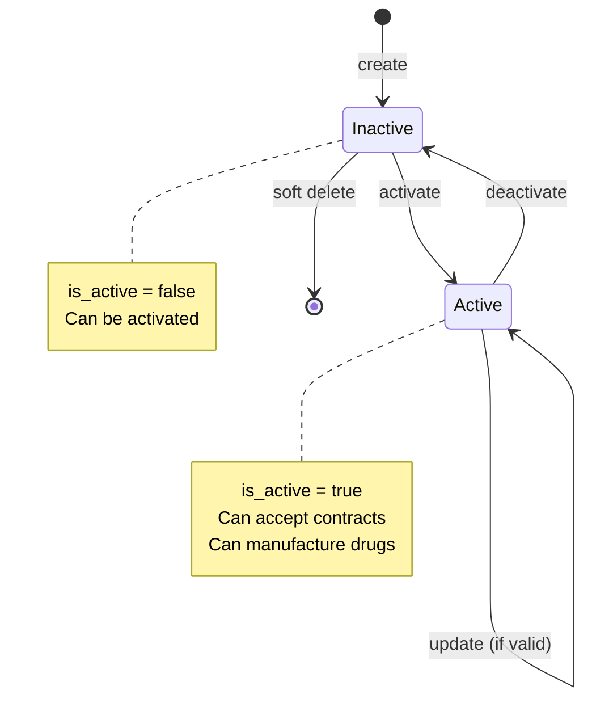
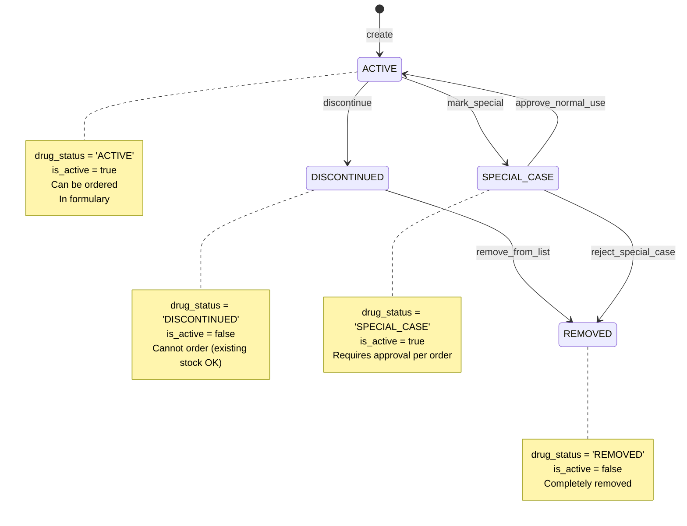
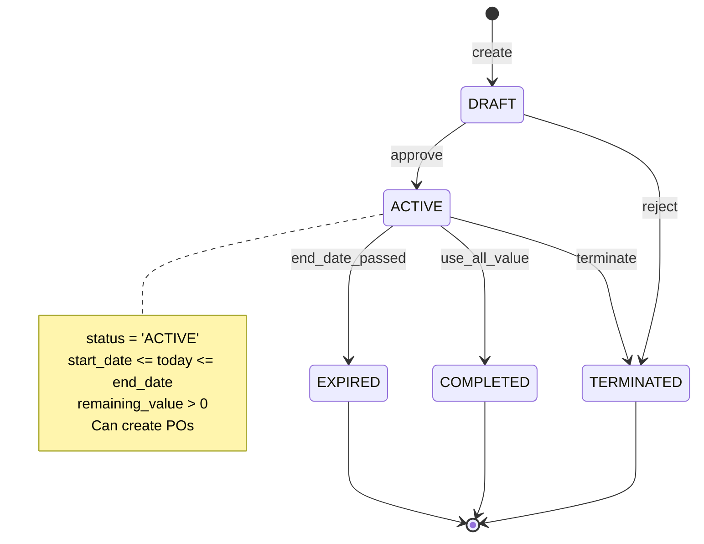

# State Machines - Master Data System
**Version**: 2.2.0 | **Last Updated**: 2025-01-21

> เอกสารนี้อธิบาย **Status Transitions** และ **State Machines** สำหรับทุก entity ในระบบ Master Data

---

## 📖 Table of Contents

1. [Overview](#overview)
2. [Company State Machine](#1-company-state-machine)
3. [Drug State Machine](#2-drug-state-machine-ministry-compliance)
4. [Contract State Machine](#3-contract-state-machine)
5. [Location/Department State Machine](#4-locationdepartment-state-machine)
6. [Implementation Guide](#implementation-guide)

---

## Overview

ระบบ Master Data ใช้ **is_active flag** เป็นหลัก แต่บางตารางมี **status enum** เฉพาะ (Drug, Contract)

### Common Pattern: Active/Inactive

```
┌────────┐    create     ┌────────┐    activate    ┌────────┐
│  NULL  │─────────────→│INACTIVE│──────────────→│ ACTIVE │
└────────┘               └────┬───┘               └───┬────┘
                              │                       │
                              │                       │
                              │    deactivate         │
                              └───────────────────────┘
```

ใช้กับ: Location, Department, Company, DrugGeneric, Bank, BudgetTypeGroup, BudgetCategory

---

## 1. Company State Machine

### State Diagram



### Transition Rules

#### CREATE → INACTIVE (Initial State)

**Condition**:
- Valid company_code format (`^C\d{5}$`)
- Unique company_code
- Valid company_type (VENDOR | MANUFACTURER | BOTH)
- Optional: tax_id (13 digits if provided)

**Permission**: ADMIN, WAREHOUSE_MANAGER

**SQL Check**:
```sql
-- Check unique company_code
SELECT COUNT(*) FROM companies WHERE company_code = :company_code;
-- Must return 0

-- Insert with is_active = false
INSERT INTO companies (company_code, company_name, company_type, is_active)
VALUES (:code, :name, :type, false);
```

**Business Rules**:
- Default status: `is_active = false`
- Requires activation before use

---

#### INACTIVE → ACTIVE (Activation)

**Condition**:
- Company exists
- Currently `is_active = false`
- All required fields complete:
  - company_name ✅
  - company_type ✅
  - tax_id (recommended)

**Permission**: ADMIN only

**SQL Check**:
```sql
-- Verify company is inactive
SELECT id, is_active FROM companies WHERE id = :id;
-- Must return is_active = false

-- Check required fields
SELECT
  CASE
    WHEN company_name IS NULL OR company_name = '' THEN false
    WHEN company_type IS NULL THEN false
    ELSE true
  END as can_activate
FROM companies WHERE id = :id;
-- Must return true

-- Activate
UPDATE companies
SET is_active = true, updated_at = NOW()
WHERE id = :id;
```

**TypeScript Implementation**:
```typescript
async function activateCompany(id: number) {
  // 1. Check exists
  const company = await prisma.company.findUnique({ where: { id } })
  if (!company) {
    throw new NotFoundError('Company not found')
  }

  // 2. Check not already active
  if (company.isActive) {
    throw new BusinessRuleError('COMP020', 'Company already active')
  }

  // 3. Validate required fields
  if (!company.companyName || !company.companyType) {
    throw new ValidationError('COMP021', 'Required fields missing')
  }

  // 4. Activate
  const activated = await prisma.company.update({
    where: { id },
    data: { isActive: true }
  })

  return activated
}
```

---

#### ACTIVE → INACTIVE (Deactivation)

**Condition**:
- Company exists
- Currently `is_active = true`
- **No active contracts** (critical!)
- **No active purchase orders** (critical!)

**Permission**: ADMIN, WAREHOUSE_MANAGER (with restrictions)

**SQL Check**:
```sql
-- Check active contracts
SELECT COUNT(*) FROM contracts
WHERE vendor_id = :company_id AND status = 'ACTIVE';
-- Must return 0

-- Check active purchase orders
SELECT COUNT(*) FROM purchase_orders
WHERE vendor_id = :company_id AND status IN ('PENDING', 'SENT', 'PARTIAL_RECEIVED');
-- Must return 0

-- Safe to deactivate
UPDATE companies
SET is_active = false, updated_at = NOW()
WHERE id = :id;
```

**TypeScript Implementation**:
```typescript
async function deactivateCompany(id: number) {
  // 1. Check active contracts
  const activeContracts = await prisma.contract.count({
    where: {
      vendorId: id,
      status: 'ACTIVE'
    }
  })

  if (activeContracts > 0) {
    throw new BusinessRuleError(
      'COMP010',
      `Cannot deactivate. ${activeContracts} active contracts found. ` +
      `Please close all contracts first.`
    )
  }

  // 2. Check active purchase orders
  const activePOs = await prisma.purchaseOrder.count({
    where: {
      vendorId: id,
      status: { in: ['PENDING', 'SENT', 'PARTIAL_RECEIVED'] }
    }
  })

  if (activePOs > 0) {
    throw new BusinessRuleError(
      'COMP011',
      `Cannot deactivate. ${activePOs} active POs found. ` +
      `Complete or cancel all POs first.`
    )
  }

  // 3. Deactivate
  const deactivated = await prisma.company.update({
    where: { id },
    data: { isActive: false }
  })

  return deactivated
}
```

**Recovery Actions** (if deactivation fails):
1. Close all active contracts
2. Complete or cancel pending POs
3. Transfer contracts to another vendor
4. Then retry deactivation

---

## 2. Drug State Machine (Ministry Compliance) ⭐

### Status Enum

```typescript
enum DrugStatus {
  ACTIVE = 'ACTIVE'             // 1 - ใช้งานปกติ
  DISCONTINUED = 'DISCONTINUED' // 2 - ยกเลิกการใช้
  SPECIAL_CASE = 'SPECIAL_CASE' // 3 - กรณีพิเศษ (ต้องขออนุมัติ)
  REMOVED = 'REMOVED'           // 4 - ถูกลบออกจากบัญชียา
}
```

### State Diagram



### Transition Rules

#### CREATE → ACTIVE (Initial State)

**Condition**:
- Valid drug_code format
- Valid generic_id reference
- Valid manufacturer_id reference
- NLEM status required (E | N) ⭐
- Product category required ⭐

**Permission**: PHARMACIST, ADMIN

**SQL Check**:
```sql
-- Validate relationships
SELECT id FROM drug_generics WHERE id = :generic_id; -- Must exist
SELECT id FROM companies WHERE id = :manufacturer_id; -- Must exist

-- Create drug
INSERT INTO drugs (
  drug_code, trade_name, generic_id, manufacturer_id,
  drug_status, nlem_status, product_category,
  status_changed_date, is_active
) VALUES (
  :code, :name, :generic_id, :manufacturer_id,
  'ACTIVE', :nlem, :category,
  CURRENT_DATE, true
);
```

---

#### ACTIVE → DISCONTINUED (Stop Using)

**Condition**:
- Drug exists
- Currently ACTIVE
- Decision to stop purchasing/using

**Permission**: PHARMACIST, ADMIN

**Tracking**: **status_changed_date** must be updated! ⭐

**SQL Check**:
```sql
UPDATE drugs
SET
  drug_status = 'DISCONTINUED',
  is_active = false,
  status_changed_date = CURRENT_DATE, -- ⭐ Ministry requirement
  updated_at = NOW()
WHERE id = :id AND drug_status = 'ACTIVE';
```

**TypeScript Implementation**:
```typescript
async function discontinueDrug(id: number, reason?: string) {
  const drug = await prisma.drug.findUnique({ where: { id } })

  if (!drug) throw new NotFoundError('Drug not found')
  if (drug.drugStatus !== 'ACTIVE') {
    throw new BusinessRuleError('DRUG020', 'Drug must be ACTIVE to discontinue')
  }

  // Update status
  const discontinued = await prisma.drug.update({
    where: { id },
    data: {
      drugStatus: 'DISCONTINUED',
      isActive: false,
      statusChangedDate: new Date(), // ⭐ Required for ministry reporting
      updatedAt: new Date()
    }
  })

  // Optional: Log reason
  // await createDrugStatusLog(id, 'ACTIVE', 'DISCONTINUED', reason)

  return discontinued
}
```

---

#### ACTIVE → SPECIAL_CASE (Requires Approval)

**Condition**:
- Drug has special restrictions
- Requires per-order approval
- Examples: Controlled substances, high-value drugs

**Permission**: PHARMACIST_CHIEF, ADMIN

**SQL Check**:
```sql
UPDATE drugs
SET
  drug_status = 'SPECIAL_CASE',
  is_active = true, -- Still active but restricted
  status_changed_date = CURRENT_DATE,
  updated_at = NOW()
WHERE id = :id AND drug_status = 'ACTIVE';
```

**Business Impact**:
- Purchase requests require additional approval
- Distribution requires special authorization
- Extra documentation needed

---

#### DISCONTINUED/SPECIAL_CASE → REMOVED

**Condition**:
- Drug discontinued OR special case rejected
- All inventory depleted OR transferred
- No pending orders
- Final removal from formulary

**Permission**: ADMIN only

**SQL Check**:
```sql
-- Check no pending orders
SELECT COUNT(*) FROM purchase_order_items poi
JOIN purchase_orders po ON poi.po_id = po.id
WHERE poi.drug_id = :drug_id
  AND po.status IN ('PENDING', 'SENT', 'PARTIAL_RECEIVED');
-- Must return 0

-- Check inventory
SELECT SUM(quantity_on_hand) FROM inventory
WHERE drug_id = :drug_id;
-- Should be 0 (or handle remaining stock)

-- Remove from list
UPDATE drugs
SET
  drug_status = 'REMOVED',
  is_active = false,
  status_changed_date = CURRENT_DATE,
  updated_at = NOW()
WHERE id = :drug_id;
```

---

## 3. Contract State Machine

### Status Enum

```typescript
enum ContractStatus {
  DRAFT = 'DRAFT'                 // ร่างสัญญา
  ACTIVE = 'ACTIVE'               // สัญญาใช้งาน
  EXPIRED = 'EXPIRED'             // สัญญาหมดอายุ
  TERMINATED = 'TERMINATED'       // ยกเลิกสัญญา
  COMPLETED = 'COMPLETED'         // ใช้งานครบ (remaining_value = 0)
}
```

### State Diagram



### Transition Rules

#### CREATE → DRAFT

**Condition**:
- Valid contract_number
- Valid vendor_id
- start_date < end_date
- total_value > 0
- At least one contract item

**Permission**: PROCUREMENT_OFFICER, ADMIN

**SQL Check**:
```sql
-- Validate dates
SELECT CASE
  WHEN :start_date >= :end_date THEN false
  ELSE true
END as dates_valid;
-- Must return true

-- Create contract
INSERT INTO contracts (
  contract_number, vendor_id, contract_type,
  start_date, end_date, total_value, remaining_value,
  fiscal_year, status
) VALUES (
  :number, :vendor_id, :type,
  :start, :end, :total, :total, -- remaining = total initially
  :fiscal_year, 'DRAFT'
);
```

---

#### DRAFT → ACTIVE (Approval)

**Condition**:
- Contract in DRAFT status
- All required fields complete
- All contract items validated
- Approved by authorized person

**Permission**: PROCUREMENT_MANAGER, ADMIN

**SQL Check**:
```sql
-- Verify contract items exist
SELECT COUNT(*) FROM contract_items
WHERE contract_id = :contract_id;
-- Must be > 0

-- Activate
UPDATE contracts
SET
  status = 'ACTIVE',
  approved_by = :approver_name,
  approval_date = CURRENT_DATE,
  updated_at = NOW()
WHERE id = :id AND status = 'DRAFT';
```

---

#### ACTIVE → COMPLETED (Value Depleted)

**Condition**:
- remaining_value reaches 0
- All contracted items delivered
- Automatic transition when POs consume all value

**Permission**: System (automatic)

**SQL Check**:
```sql
-- Check remaining value
SELECT remaining_value FROM contracts
WHERE id = :id;
-- If = 0, update status

UPDATE contracts
SET status = 'COMPLETED', updated_at = NOW()
WHERE id = :id AND remaining_value <= 0;
```

**TypeScript Trigger** (when PO created):
```typescript
async function updateContractValue(contractId: number, poValue: number) {
  const contract = await prisma.contract.findUnique({
    where: { id: contractId }
  })

  if (!contract) throw new NotFoundError('Contract not found')

  const newRemainingValue = contract.remainingValue.toNumber() - poValue

  if (newRemainingValue < 0) {
    throw new BusinessRuleError(
      'CONTRACT010',
      `PO value exceeds remaining contract value. ` +
      `Available: ${contract.remainingValue}, Requested: ${poValue}`
    )
  }

  // Update value
  const updated = await prisma.contract.update({
    where: { id: contractId },
    data: {
      remainingValue: newRemainingValue,
      // Auto-complete if depleted
      status: newRemainingValue === 0 ? 'COMPLETED' : contract.status
    }
  })

  return updated
}
```

---

#### ACTIVE → EXPIRED (Date Passed)

**Condition**:
- Current date > end_date
- Automatic check (daily cron job recommended)

**Permission**: System (automatic)

**SQL Cron Job**:
```sql
-- Run daily
UPDATE contracts
SET status = 'EXPIRED', updated_at = NOW()
WHERE status = 'ACTIVE'
  AND end_date < CURRENT_DATE;
```

**TypeScript Cron**:
```typescript
// Run daily at midnight
import cron from 'node-cron'

cron.schedule('0 0 * * *', async () => {
  const expired = await prisma.contract.updateMany({
    where: {
      status: 'ACTIVE',
      endDate: { lt: new Date() }
    },
    data: {
      status: 'EXPIRED'
    }
  })

  console.log(`Expired ${expired.count} contracts`)
})
```

---

## 4. Location/Department State Machine

### Simple Active/Inactive Pattern

```
┌────────┐    create     ┌──────────┐    activate    ┌────────┐
│  NULL  │─────────────→│ INACTIVE │──────────────→│ ACTIVE │
└────────┘               └────┬─────┘               └───┬────┘
                              │                        │
                              │       deactivate       │
                              └────────────────────────┘
```

### Transition Rules

#### CREATE → INACTIVE

**Permission**: ADMIN, WAREHOUSE_MANAGER

**Validation**:
- Unique location_code / dept_code
- Valid parent_id (if hierarchical)

---

#### INACTIVE → ACTIVE

**Permission**: ADMIN

**Condition**: All required fields complete

---

#### ACTIVE → INACTIVE

**Permission**: ADMIN

**Critical Check** (Location):
```sql
-- Cannot deactivate if has inventory
SELECT SUM(quantity_on_hand) FROM inventory
WHERE location_id = :id;
-- Must be 0
```

**Critical Check** (Department):
```sql
-- Cannot deactivate if has active budget allocations
SELECT COUNT(*) FROM budget_allocations
WHERE department_id = :id
  AND fiscal_year >= EXTRACT(YEAR FROM CURRENT_DATE);
-- Should be 0 or handled
```

---

## Implementation Guide

### Generic State Transition Function

```typescript
interface StateTransition<T> {
  fromStates: T[]
  toState: T
  condition: () => Promise<boolean>
  permission: string[]
  onTransition?: () => Promise<void>
}

async function transitionState<T extends string>(
  transition: StateTransition<T>
) {
  // 1. Check permission
  if (!hasPermission(currentUser, transition.permission)) {
    throw new PermissionError('Insufficient permissions')
  }

  // 2. Check condition
  const canTransition = await transition.condition()
  if (!canTransition) {
    throw new BusinessRuleError('Transition conditions not met')
  }

  // 3. Execute transition
  if (transition.onTransition) {
    await transition.onTransition()
  }

  return transition.toState
}
```

### Usage Example

```typescript
// Deactivate company with checks
await transitionState({
  fromStates: ['ACTIVE'],
  toState: 'INACTIVE',
  permission: ['ADMIN', 'WAREHOUSE_MANAGER'],
  condition: async () => {
    const activeContracts = await prisma.contract.count({
      where: { vendorId: companyId, status: 'ACTIVE' }
    })
    return activeContracts === 0
  },
  onTransition: async () => {
    await prisma.company.update({
      where: { id: companyId },
      data: { isActive: false }
    })
  }
})
```

---

## Summary Table: All Transitions

| Entity | States | Key Transitions | Critical Checks |
|--------|--------|----------------|----------------|
| **Company** | Active/Inactive | Create→Inactive→Active→Inactive | No active contracts before deactivation |
| **Drug** | ACTIVE, DISCONTINUED, SPECIAL_CASE, REMOVED | Active→Discontinued→Removed | Track status_changed_date (ministry) |
| **Contract** | DRAFT, ACTIVE, EXPIRED, COMPLETED, TERMINATED | Draft→Active→Completed/Expired | Auto-expire by date, auto-complete by value |
| **Location** | Active/Inactive | Create→Inactive→Active→Inactive | No inventory before deactivation |
| **Department** | Active/Inactive | Create→Inactive→Active→Inactive | No active budgets before deactivation |
| **DrugGeneric** | Active/Inactive | Create→Active (default) | Can deactivate if no active drugs |
| **Budget Types** | Active/Inactive | Create→Active (default) | Can deactivate if no active allocations |

---

**🎯 Next**: See [Validation Rules](03-VALIDATION-RULES.md) for detailed validation logic and error codes.

---

**Version**: 2.2.0
**Last Updated**: 2025-01-21
**Maintained by**: INVS Modern Team
