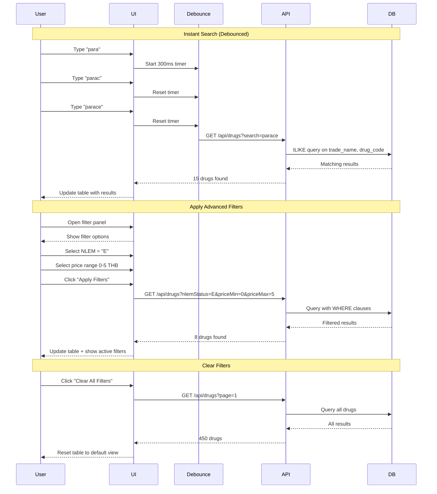

# FLOW 04: Advanced Search & Filter

**Module**: Master Data Management
**Feature**: Search & Filter
**Priority**: ⭐⭐⭐⭐ High
**User Role**: All users (Pharmacist, Admin, Viewer)
**Status**: Ready for Implementation

---

## 📋 User Stories

### Story 1: Quick Search
> **As a** pharmacist
> **I want to** quickly search drugs by name or code
> **So that** I can find specific drugs instantly without scrolling

### Story 2: Advanced Filtering
> **As a** pharmacist
> **I want to** filter drugs by multiple criteria (NLEM status, price range, manufacturer)
> **So that** I can find drugs matching specific requirements

### Story 3: Save Filter Presets
> **As a** pharmacist
> **I want to** save my frequently used filter combinations
> **So that** I can quickly apply them without reconfiguring each time

### Story 4: Export Filtered Results
> **As a** pharmacist
> **I want to** export filtered drug lists to Excel
> **So that** I can analyze data offline or share with colleagues

---

## 🔄 Search & Filter Flow

```mermaid
graph TD
    A[Drug List Page] --> B{Search Type}
    B -->|Quick Search| C[Type in Search Box]
    B -->|Advanced Filter| D[Open Filter Panel]

    C --> E[Instant Search Results]
    E --> F{Results Found?}
    F -->|Yes| G[Display Filtered Table]
    F -->|No| H[Show "No results" message]

    D --> I[Select Filter Criteria]
    I --> J{Apply Filters}
    J --> K[API Call with Filters]
    K --> L[Update Table]

    G --> M{User Action}
    L --> M
    M -->|Save Filter| N[Save as Preset]
    M -->|Clear Filters| O[Reset to Default]
    M -->|Export Results| P[Download Excel]
    M -->|Refine Search| D

    N --> Q[Filter Preset Saved]
    Q --> A
    O --> A
    P --> R[Excel Downloaded]
    R --> A
```

---

## 📊 Search Interaction Sequence



---

## 🖥️ UI Mockup 1: Basic Search

```
╔════════════════════════════════════════════════════════════════════════════╗
║  💊 Drug Management                                                        ║
╠════════════════════════════════════════════════════════════════════════════╣
║                                                                            ║
║  🔍 [Search drugs by name, code, generic..._______________] [🔍] [Clear]  ║
║       ↳ Searching... (15 results found)                                   ║
║                                                                            ║
║  [Advanced Filters ▼]                                                     ║
║                                                                            ║
║  ┌──────────────────────────────────────────────────────────────────────┐ ║
║  │Code     │Trade Name          │Generic  │Mfg │Price│NLEM│Status│     │ ║
║  ├─────────┼────────────────────┼─────────┼────┼─────┼────┼──────┼─────┤ ║
║  │PARA500  │Paracetamol 500mg   │PAR0001  │GPO │ 2.50│ E  │Active│ ⋮   │ ║
║  │PARA650  │Paracetamol 650mg   │PAR0001  │GPO │ 3.00│ E  │Active│ ⋮   │ ║
║  │PARA120  │Paracetamol Syrup   │PAR0002  │GPO │15.00│ E  │Active│ ⋮   │ ║
║  │...      │...                 │...      │... │ ... │... │...   │...  │ ║
║  └─────────┴────────────────────┴─────────┴────┴─────┴────┴──────┴─────┘ ║
║                                                                            ║
║  Showing 15 of 15 results                                                 ║
╚════════════════════════════════════════════════════════════════════════════╝
```

**Search Features:**
- Instant search (300ms debounce)
- Search across multiple fields (trade name, drug code, generic name)
- Results count display
- Clear button
- Highlight search term in results

---

## 🖥️ UI Mockup 2: Advanced Filter Panel (Expanded)

```
╔════════════════════════════════════════════════════════════════════════════╗
║  💊 Drug Management                                                        ║
╠════════════════════════════════════════════════════════════════════════════╣
║                                                                            ║
║  🔍 [Search drugs...____________________________________________] [Clear]  ║
║                                                                            ║
║  [Advanced Filters ▼] - Expanded                                          ║
║  ┌──────────────────────────────────────────────────────────────────────┐ ║
║  │  📋 Filter by:                                                       │ ║
║  │                                                                      │ ║
║  │  NLEM Status                                                         │ ║
║  │  ☐ E - Essential Drug (350)                                         │ ║
║  │  ☐ N - Non-Essential Drug (100)                                     │ ║
║  │                                                                      │ ║
║  │  Drug Status                                                         │ ║
║  │  ☑ Active (430)                                                     │ ║
║  │  ☐ Discontinued (15)                                                │ ║
║  │  ☐ Special Case (3)                                                 │ ║
║  │  ☐ Removed (2)                                                      │ ║
║  │                                                                      │ ║
║  │  Product Category                                                    │ ║
║  │  ☐ Modern Medicine - Registered (400)                               │ ║
║  │  ☐ Modern Medicine - Hospital (30)                                  │ ║
║  │  ☐ Herbal Medicine (20)                                             │ ║
║  │                                                                      │ ║
║  │  Price Range (THB)                                                   │ ║
║  │  Min: [0____]  Max: [1000__]                                        │ ║
║  │  ├────────────────────────────────┤                                 │ ║
║  │  0            50           100+                                      │ ║
║  │                                                                      │ ║
║  │  Manufacturer                                                        │ ║
║  │  [▼ Select manufacturer(s)...                    ]                  │ ║
║  │  ☑ GPO (250)                                                        │ ║
║  │  ☐ Zuellig Pharma (100)                                             │ ║
║  │  ☐ Pfizer (50)                                                      │ ║
║  │                                                                      │ ║
║  │  Generic Drug                                                        │ ║
║  │  [▼ Search generic...                            ]                  │ ║
║  │                                                                      │ ║
║  │  Dosage Form                                                         │ ║
║  │  ☐ Tablet (TAB) (300)                                               │ ║
║  │  ☐ Capsule (CAP) (80)                                               │ ║
║  │  ☐ Injection (INJ) (50)                                             │ ║
║  │  ☐ Syrup (SYP) (20)                                                 │ ║
║  │                                                                      │ ║
║  │  Stock Status                                                        │ ║
║  │  ☐ In Stock (> 0 units)                                             │ ║
║  │  ☐ Low Stock (< reorder point)                                      │ ║
║  │  ☐ Out of Stock (0 units)                                           │ ║
║  │                                                                      │ ║
║  │  ──────────────────────────────────────────────────────────         │ ║
║  │  💾 Filter Presets:                                                  │ ║
║  │  [Essential Drugs (E) ▼] [My Saved Filters ▼]                       │ ║
║  │  [Save Current Filters...]                                           │ ║
║  │                                                                      │ ║
║  │  [ Clear All ]                       [ Apply Filters (125 results) ] │ ║
║  └──────────────────────────────────────────────────────────────────────┘ ║
║                                                                            ║
║  Active Filters: ✖ Status: Active ✖ NLEM: E                              ║
║                                                                            ║
║  [ Export Filtered Results (CSV) ]  [ Export (Excel) ]                    ║
╚════════════════════════════════════════════════════════════════════════════╝
```

**Filter Panel Features:**
- Collapsible panel (saves screen space)
- Checkbox filters with result counts
- Price range slider
- Multi-select dropdowns
- Filter presets dropdown
- Save current filter button
- Clear all button
- Apply button shows result count preview
- Active filters chips (dismissible)
- Export buttons for filtered results

---

## 🖥️ UI Mockup 3: Save Filter Preset Dialog

```
╔════════════════════════════════════════════════════════════════════════╗
║  💾 Save Filter Preset                                             [X]║
╠════════════════════════════════════════════════════════════════════════╣
║                                                                        ║
║  Current Filter Configuration:                                        ║
║  ┌──────────────────────────────────────────────────────────────────┐ ║
║  │  • Drug Status: Active                                           │ ║
║  │  • NLEM Status: Essential (E)                                    │ ║
║  │  • Price Range: 0 - 10 THB                                       │ ║
║  │  • Manufacturer: GPO                                             │ ║
║  │                                                                  │ ║
║  │  → Will return 125 drugs                                         │ ║
║  └──────────────────────────────────────────────────────────────────┘ ║
║                                                                        ║
║  Preset Name *                                                         ║
║  [Active Essential Drugs under 10 THB____________________________]    ║
║                                                                        ║
║  Description (optional)                                                ║
║  [For quick access to essential drugs under budget limit________]     ║
║  [____________________________________________________________]        ║
║                                                                        ║
║  Visibility                                                            ║
║  ⦿ Private (only you can use)                                         ║
║  ○ Shared (all pharmacists can use)                                   ║
║                                                                        ║
║  ☑ Set as my default filter for this page                             ║
║                                                                        ║
║                              [ Cancel ]  [ Save Filter Preset ]       ║
╚════════════════════════════════════════════════════════════════════════╝
```

**Save Preset Features:**
- Preview of current filter configuration
- Result count preview
- Descriptive name (required)
- Optional description
- Visibility options (private/shared)
- Set as default option

---

## 🖥️ UI Mockup 4: Filter Preset Dropdown

```
╔══════════════════════════════════════════════════╗
║  My Filter Presets                           [+] ║
╠══════════════════════════════════════════════════╣
║  📌 Default                                      ║
║  ──────────────────────────────────────────      ║
║  Active Essential Drugs (★ Default)              ║
║  └─ E + Active, 350 results                      ║
║                                                  ║
║  Low Price Generics                              ║
║  └─ Price < 5 THB, 120 results                   ║
║                                                  ║
║  Out of Stock Items                              ║
║  └─ Stock = 0, 15 results                        ║
║  ──────────────────────────────────────────      ║
║  📤 Shared Presets                               ║
║  ──────────────────────────────────────────      ║
║  Essential Antibiotics (by ภญ.สมหญิง)            ║
║  └─ E + Generic=Antibiotics, 45 results          ║
║                                                  ║
║  High Value Drugs (by Admin)                     ║
║  └─ Price > 100 THB, 80 results                  ║
║  ──────────────────────────────────────────      ║
║  [+ Create New Preset]                           ║
║  [Manage Saved Filters...]                       ║
╚══════════════════════════════════════════════════╝
```

**Preset Dropdown Features:**
- Grouped by Personal and Shared
- Default preset marked with star
- Preview of filter criteria and result count
- Creator attribution for shared presets
- Quick access to create new or manage existing

---

## 💻 Code Examples

### Search with Debounce

```typescript
import { useState, useEffect } from 'react'
import { useDebounce } from '@/hooks/useDebounce'
import { useQuery } from '@tanstack/react-query'

function useSearchDrugs() {
  const [searchTerm, setSearchTerm] = useState('')
  const debouncedSearch = useDebounce(searchTerm, 300)

  const query = useQuery({
    queryKey: ['drugs', 'search', debouncedSearch],
    queryFn: async () => {
      if (!debouncedSearch) return null

      const response = await fetch(
        `/api/master-data/drugs?search=${debouncedSearch}`
      )
      return response.json()
    },
    enabled: debouncedSearch.length >= 2
  })

  return {
    searchTerm,
    setSearchTerm,
    results: query.data?.data || [],
    isSearching: query.isFetching,
    resultCount: query.data?.pagination?.total || 0
  }
}

// Debounce hook
function useDebounce<T>(value: T, delay: number): T {
  const [debouncedValue, setDebouncedValue] = useState(value)

  useEffect(() => {
    const timer = setTimeout(() => {
      setDebouncedValue(value)
    }, delay)

    return () => clearTimeout(timer)
  }, [value, delay])

  return debouncedValue
}

// Component
function DrugSearch() {
  const { searchTerm, setSearchTerm, results, isSearching, resultCount } =
    useSearchDrugs()

  return (
    <div className="search-box">
      <input
        type="text"
        value={searchTerm}
        onChange={(e) => setSearchTerm(e.target.value)}
        placeholder="Search drugs by name, code, generic..."
      />
      {isSearching && <span className="loading">Searching...</span>}
      {searchTerm && (
        <span className="result-count">
          {resultCount} result{resultCount !== 1 ? 's' : ''} found
        </span>
      )}
      {searchTerm && resultCount === 0 && (
        <div className="no-results">
          No drugs found matching "{searchTerm}"
        </div>
      )}
    </div>
  )
}
```

### Advanced Filters with URL State

```typescript
import { useSearchParams } from 'react-router-dom'

interface DrugFilters {
  search?: string
  nlemStatus?: string[]
  drugStatus?: string[]
  productCategory?: string[]
  priceMin?: number
  priceMax?: number
  manufacturerId?: string[]
  genericId?: string
  dosageForm?: string[]
  stockStatus?: string
}

function useDrugFilters() {
  const [searchParams, setSearchParams] = useSearchParams()

  const filters: DrugFilters = {
    search: searchParams.get('search') || undefined,
    nlemStatus: searchParams.get('nlemStatus')?.split(',') || [],
    drugStatus: searchParams.get('drugStatus')?.split(',') || [],
    priceMin: Number(searchParams.get('priceMin')) || undefined,
    priceMax: Number(searchParams.get('priceMax')) || undefined,
    manufacturerId: searchParams.get('manufacturerId')?.split(',') || []
  }

  const setFilters = (newFilters: Partial<DrugFilters>) => {
    const params = new URLSearchParams()

    // Add all non-empty filters to URL
    Object.entries({ ...filters, ...newFilters }).forEach(([key, value]) => {
      if (value !== undefined && value !== '' && value !== null) {
        if (Array.isArray(value) && value.length > 0) {
          params.set(key, value.join(','))
        } else if (!Array.isArray(value)) {
          params.set(key, String(value))
        }
      }
    })

    setSearchParams(params)
  }

  const clearFilters = () => {
    setSearchParams({})
  }

  return {
    filters,
    setFilters,
    clearFilters,
    hasActiveFilters: searchParams.toString().length > 0
  }
}

// Query drugs with filters
function useDrugsWithFilters() {
  const { filters } = useDrugFilters()

  return useQuery({
    queryKey: ['drugs', filters],
    queryFn: async () => {
      const params = new URLSearchParams()

      // Build query string
      if (filters.search) params.set('search', filters.search)
      if (filters.nlemStatus?.length) {
        params.set('nlemStatus', filters.nlemStatus.join(','))
      }
      if (filters.drugStatus?.length) {
        params.set('drugStatus', filters.drugStatus.join(','))
      }
      if (filters.priceMin !== undefined) {
        params.set('priceMin', String(filters.priceMin))
      }
      if (filters.priceMax !== undefined) {
        params.set('priceMax', String(filters.priceMax))
      }

      const response = await fetch(`/api/master-data/drugs?${params}`)
      return response.json()
    }
  })
}
```

### Filter Panel Component

```typescript
interface FilterPanelProps {
  onApply: (filters: DrugFilters) => void
  onClear: () => void
}

function AdvancedFilterPanel({ onApply, onClear }: FilterPanelProps) {
  const [filters, setFilters] = useState<DrugFilters>({
    nlemStatus: [],
    drugStatus: ['ACTIVE'], // Default to active
    priceMin: undefined,
    priceMax: undefined
  })

  const [isExpanded, setIsExpanded] = useState(false)

  // Get drug count preview
  const { data: previewCount } = useQuery({
    queryKey: ['drugs', 'count', filters],
    queryFn: async () => {
      const params = new URLSearchParams()
      Object.entries(filters).forEach(([key, value]) => {
        if (value !== undefined && value !== null) {
          if (Array.isArray(value) && value.length > 0) {
            params.set(key, value.join(','))
          } else if (!Array.isArray(value)) {
            params.set(key, String(value))
          }
        }
      })

      const response = await fetch(
        `/api/master-data/drugs?${params}&page=1&limit=1`
      )
      const result = await response.json()
      return result.pagination.total
    },
    enabled: isExpanded
  })

  const handleApply = () => {
    onApply(filters)
    setIsExpanded(false)
  }

  const handleClear = () => {
    setFilters({
      nlemStatus: [],
      drugStatus: [],
      priceMin: undefined,
      priceMax: undefined
    })
    onClear()
  }

  return (
    <div className="filter-panel">
      <button onClick={() => setIsExpanded(!isExpanded)}>
        Advanced Filters {isExpanded ? '▲' : '▼'}
      </button>

      {isExpanded && (
        <div className="filter-content">
          {/* NLEM Status */}
          <div className="filter-group">
            <label>NLEM Status</label>
            <label>
              <input
                type="checkbox"
                checked={filters.nlemStatus?.includes('E')}
                onChange={(e) => {
                  const nlem = filters.nlemStatus || []
                  setFilters({
                    ...filters,
                    nlemStatus: e.target.checked
                      ? [...nlem, 'E']
                      : nlem.filter((s) => s !== 'E')
                  })
                }}
              />
              Essential Drug (E)
            </label>
            <label>
              <input
                type="checkbox"
                checked={filters.nlemStatus?.includes('N')}
                onChange={(e) => {
                  const nlem = filters.nlemStatus || []
                  setFilters({
                    ...filters,
                    nlemStatus: e.target.checked
                      ? [...nlem, 'N']
                      : nlem.filter((s) => s !== 'N')
                  })
                }}
              />
              Non-Essential Drug (N)
            </label>
          </div>

          {/* Price Range */}
          <div className="filter-group">
            <label>Price Range (THB)</label>
            <div className="price-range">
              <input
                type="number"
                placeholder="Min"
                value={filters.priceMin || ''}
                onChange={(e) =>
                  setFilters({
                    ...filters,
                    priceMin: e.target.value ? Number(e.target.value) : undefined
                  })
                }
              />
              <span>to</span>
              <input
                type="number"
                placeholder="Max"
                value={filters.priceMax || ''}
                onChange={(e) =>
                  setFilters({
                    ...filters,
                    priceMax: e.target.value ? Number(e.target.value) : undefined
                  })
                }
              />
            </div>
          </div>

          {/* Actions */}
          <div className="filter-actions">
            <button onClick={handleClear} className="btn-secondary">
              Clear All
            </button>
            <button onClick={handleApply} className="btn-primary">
              Apply Filters ({previewCount || 0} results)
            </button>
          </div>
        </div>
      )}
    </div>
  )
}
```

### Save Filter Preset

```typescript
interface FilterPreset {
  id: string
  name: string
  description?: string
  filters: DrugFilters
  isDefault: boolean
  isShared: boolean
  createdBy: string
  createdAt: string
}

function useSaveFilterPreset() {
  const queryClient = useQueryClient()

  return useMutation({
    mutationFn: async (preset: Omit<FilterPreset, 'id' | 'createdAt'>) => {
      const response = await fetch('/api/master-data/filter-presets', {
        method: 'POST',
        headers: { 'Content-Type': 'application/json' },
        body: JSON.stringify(preset)
      })

      if (!response.ok) throw new Error('Failed to save preset')
      return response.json()
    },
    onSuccess: () => {
      queryClient.invalidateQueries({ queryKey: ['filter-presets'] })
      toast.success('Filter preset saved successfully')
    }
  })
}

function SavePresetDialog({ filters }: { filters: DrugFilters }) {
  const [name, setName] = useState('')
  const [description, setDescription] = useState('')
  const [isShared, setIsShared] = useState(false)
  const [isDefault, setIsDefault] = useState(false)

  const savePreset = useSaveFilterPreset()

  const handleSave = () => {
    savePreset.mutate({
      name,
      description,
      filters,
      isDefault,
      isShared,
      createdBy: currentUser.id
    })
  }

  return (
    <Dialog>
      <h3>Save Filter Preset</h3>

      <div>
        <label>Preset Name *</label>
        <input
          value={name}
          onChange={(e) => setName(e.target.value)}
          placeholder="e.g., Active Essential Drugs"
        />
      </div>

      <div>
        <label>Description (optional)</label>
        <textarea
          value={description}
          onChange={(e) => setDescription(e.target.value)}
          placeholder="Describe when to use this filter..."
        />
      </div>

      <div>
        <label>
          <input
            type="radio"
            checked={!isShared}
            onChange={() => setIsShared(false)}
          />
          Private (only you can use)
        </label>
        <label>
          <input
            type="radio"
            checked={isShared}
            onChange={() => setIsShared(true)}
          />
          Shared (all pharmacists can use)
        </label>
      </div>

      <div>
        <label>
          <input
            type="checkbox"
            checked={isDefault}
            onChange={(e) => setIsDefault(e.target.checked)}
          />
          Set as my default filter for this page
        </label>
      </div>

      <div className="actions">
        <button onClick={() => {}}>Cancel</button>
        <button onClick={handleSave} disabled={!name || savePreset.isPending}>
          {savePreset.isPending ? 'Saving...' : 'Save Filter Preset'}
        </button>
      </div>
    </Dialog>
  )
}
```

### Export Filtered Results

```typescript
function useExportDrugs() {
  return useMutation({
    mutationFn: async ({
      format,
      filters
    }: {
      format: 'csv' | 'excel'
      filters: DrugFilters
    }) => {
      const params = new URLSearchParams()
      params.set('format', format)

      // Add filters
      Object.entries(filters).forEach(([key, value]) => {
        if (value !== undefined && value !== null) {
          if (Array.isArray(value) && value.length > 0) {
            params.set(key, value.join(','))
          } else if (!Array.isArray(value)) {
            params.set(key, String(value))
          }
        }
      })

      const response = await fetch(`/api/master-data/drugs/export?${params}`)

      if (!response.ok) throw new Error('Export failed')

      const blob = await response.blob()
      const url = window.URL.createObjectURL(blob)
      const a = document.createElement('a')
      a.href = url
      a.download = `drugs-export-${new Date().toISOString().split('T')[0]}.${format === 'excel' ? 'xlsx' : 'csv'}`
      a.click()
      window.URL.revokeObjectURL(url)
    }
  })
}

// Usage
function ExportButton({ filters }: { filters: DrugFilters }) {
  const exportDrugs = useExportDrugs()

  return (
    <div>
      <button
        onClick={() => exportDrugs.mutate({ format: 'csv', filters })}
        disabled={exportDrugs.isPending}
      >
        Export CSV
      </button>
      <button
        onClick={() => exportDrugs.mutate({ format: 'excel', filters })}
        disabled={exportDrugs.isPending}
      >
        Export Excel
      </button>
    </div>
  )
}
```

---

## ✅ Acceptance Criteria

### Quick Search
- ✅ Search updates after 300ms of no typing (debounced)
- ✅ Search across drug code, trade name, generic name
- ✅ Show result count
- ✅ Highlight search term in results (optional)
- ✅ Clear button to reset search

### Advanced Filters
- ✅ Collapsible filter panel (default closed)
- ✅ Multi-select checkboxes for categorical filters
- ✅ Price range input (min/max)
- ✅ Show result count preview before applying
- ✅ Active filters displayed as dismissible chips
- ✅ Clear all filters button

### Filter Presets
- ✅ Save current filter configuration
- ✅ Private and shared presets
- ✅ Set default preset per user
- ✅ Quick apply from dropdown
- ✅ Edit/delete saved presets

### Export
- ✅ Export filtered results to CSV/Excel
- ✅ Include only visible columns
- ✅ Respect current filters and sorting
- ✅ Filename includes date

### URL State
- ✅ Filters reflected in URL (shareable)
- ✅ Back button preserves filters
- ✅ Bookmark-friendly URLs

---

## 🚀 Performance Optimization

### Debounced Search
```typescript
// Prevents API calls on every keystroke
// 300ms delay = good balance between UX and performance
```

### Filter Count Caching
```typescript
// Cache filter counts to avoid re-querying
const { data: counts } = useQuery({
  queryKey: ['drug-filter-counts'],
  queryFn: fetchFilterCounts,
  staleTime: 5 * 60 * 1000 // 5 minutes
})
```

### Virtualized Results
```typescript
// For large result sets (1000+ rows)
// Use react-window or react-virtual
import { useVirtualizer } from '@tanstack/react-virtual'
```

---

## 🔗 Related Documentation

- **API Specification**: `../api/API_SPECIFICATION.md`
- **Data Maintenance Flow**: `./03-DATA_MAINTENANCE_FLOW.md`
- **Bulk Import Flow**: `./02-BULK_IMPORT_FLOW.md`

---

**Version**: 1.0.0
**Last Updated**: 2025-01-22
**Status**: Ready for Implementation ✅
