# FLOW 02: Bulk Drug Import

**Module**: Master Data Management
**Feature**: Bulk Import
**Priority**: ⭐⭐⭐⭐⭐ Critical
**User Role**: Pharmacist, Admin
**Status**: Ready for Implementation

---

## 📋 User Story

> **As a** pharmacist
> **I want to** import 500 drugs from an Excel file
> **So that** I can quickly populate the system without manual entry

**Acceptance Criteria:**
- ✅ User can download a template file (Excel/CSV)
- ✅ User can upload a file and see validation results before importing
- ✅ User can see which rows have errors and which are valid
- ✅ User can download an error report
- ✅ User can import only valid rows (skip errors)
- ✅ User can track import progress in real-time
- ✅ User receives a summary after import completes

---

## 🔄 Process Flow (High-Level)


---

## 📊 Sequence Diagram (Detailed)

```mermaid
sequenceDiagram
    participant User
    participant UI
    participant API
    participant Queue
    participant DB

    Note over User,DB: Phase 1: Download Template
    User->>UI: Click "Import Drugs"
    UI->>User: Show import dialog
    User->>UI: Click "Download Template"
    UI->>API: GET /api/master-data/drugs/import/template?format=excel
    API-->>UI: Excel template file
    UI-->>User: Download drugs-template.xlsx

    Note over User,DB: Phase 2: Fill & Upload
    User->>User: Fill data in Excel (offline)
    User->>UI: Select filled Excel file
    UI->>API: POST /api/master-data/drugs/import/validate (multipart)

    Note over User,DB: Phase 3: Validation
    API->>API: Validate file format
    API->>API: Parse Excel rows
    loop For each row
        API->>DB: Check duplicates
        API->>DB: Validate foreign keys
        API->>API: Validate business rules
    end
    API->>API: Generate preview with errors
    API-->>UI: Validation result (sessionId, preview, errors)

    Note over User,DB: Phase 4: Preview & Decision
    UI->>User: Show preview table (✅ valid, ❌ errors)
    alt Has Errors
        User->>UI: Click "Download Error Report"
        UI->>API: GET /api/master-data/drugs/import/error-report/{sessionId}
        API-->>UI: Excel with errors highlighted
        UI-->>User: Download error report
        User->>User: Fix errors in Excel
        User->>UI: Re-upload fixed file
    else All Valid or Skip Errors
        User->>UI: Click "Import 450 Valid Rows"
    end

    Note over User,DB: Phase 5: Execute Import
    UI->>API: POST /api/master-data/drugs/import/execute {sessionId}
    API->>Queue: Create import job
    Queue-->>API: jobId
    API-->>UI: 202 Accepted {jobId, trackingUrl}

    Note over User,DB: Phase 6: Progress Tracking
    loop Every 1 second
        UI->>API: GET /api/master-data/drugs/import/status/{jobId}
        API->>Queue: Get job status
        Queue-->>API: Progress {current: 250, total: 450, 55%}
        API-->>UI: Progress update
        UI->>User: Update progress bar
    end

    Note over User,DB: Phase 7: Completion
    Queue->>DB: Bulk insert drugs (batch 100)
    DB-->>Queue: Success
    Queue->>Queue: Update job status = completed
    UI->>API: GET /api/master-data/drugs/import/status/{jobId}
    API->>Queue: Get final status
    Queue-->>API: Completed {successful: 450, failed: 0}
    API-->>UI: Final summary
    UI->>User: Show success message + summary
```



---

## 🖥️ UI Mockup 1: Import Dialog

```
╔════════════════════════════════════════════════════════════════════════╗
║  Import Drugs                                                    [X]  ║
╠════════════════════════════════════════════════════════════════════════╣
║                                                                        ║
║  Step 1: Download Template                                            ║
║  ┌──────────────────────────────────────────────────────────────────┐ ║
║  │  📥 Download import template to get started                      │ ║
║  │                                                                  │ ║
║  │  Format: ○ CSV    ⦿ Excel (.xlsx)                               │ ║
║  │                                                                  │ ║
║  │  ☑ Include example data                                         │ ║
║  │  ☑ Include instructions sheet                                   │ ║
║  │                                                                  │ ║
║  │  [ Download Template ]                                           │ ║
║  └──────────────────────────────────────────────────────────────────┘ ║
║                                                                        ║
║  Step 2: Upload Filled File                                           ║
║  ┌──────────────────────────────────────────────────────────────────┐ ║
║  │                                                                  │ ║
║  │                  📂 Drag & drop Excel file here                  │ ║
║  │                     or click to browse                           │ ║
║  │                                                                  │ ║
║  │                  Supported: .xlsx, .csv (Max 10MB)               │ ║
║  │                  Max 1000 rows per import                        │ ║
║  │                                                                  │ ║
║  └──────────────────────────────────────────────────────────────────┘ ║
║                                                                        ║
║                                          [ Cancel ]  [ Next: Validate ]║
╚════════════════════════════════════════════════════════════════════════╝
```

**UI Elements:**
- Radio buttons for format selection
- Checkboxes for options
- Drag & drop zone with file picker fallback
- Clear file size and row limits
- Primary action button (disabled until file selected)

---

## 🖥️ UI Mockup 2: Validation Preview

```
╔════════════════════════════════════════════════════════════════════════╗
║  Import Preview - drugs-import.xlsx                              [X]  ║
╠════════════════════════════════════════════════════════════════════════╣
║                                                                        ║
║  📊 Validation Summary                                                 ║
║  ┌──────────────────────────────────────────────────────────────────┐ ║
║  │  Total Rows: 500                                                 │ ║
║  │  ✅ Valid: 450  ⚠️ Warnings: 30  ❌ Errors: 50                   │ ║
║  │                                                                  │ ║
║  │  Will Import: 450 drugs  |  Will Skip: 50 drugs                 │ ║
║  └──────────────────────────────────────────────────────────────────┘ ║
║                                                                        ║
║  Filter: [All ▼] [✅ Valid] [⚠️ Warnings] [❌ Errors]    🔍 [Search] ║
║                                                                        ║
║  ┌──────────────────────────────────────────────────────────────────┐ ║
║  │Row│Status│Drug Code │Trade Name        │Generic│Mfg│Error       │ ║
║  ├───┼──────┼──────────┼──────────────────┼───────┼───┼────────────┤ ║
║  │ 1 │  ✅  │ PARA500  │ Paracetamol 500mg│   1   │ 1 │            │ ║
║  │ 2 │  ⚠️  │ IBU200   │ Ibuprofen 200mg  │   2   │ 1 │ No price   │ ║
║  │ 3 │  ✅  │ AMOX500  │ Amoxicillin 500mg│   3   │ 1 │            │ ║
║  │ 5 │  ❌  │          │                  │  999  │   │ Trade name │ ║
║  │   │      │          │                  │       │   │ required;  │ ║
║  │   │      │          │                  │       │   │ Generic not│ ║
║  │   │      │          │                  │       │   │ found      │ ║
║  │ 7 │  ❌  │ PARA500  │ Paracetamol (Dup)│   1   │ 1 │ Duplicate  │ ║
║  │   │      │          │                  │       │   │ code (Row1)│ ║
║  │...│ ...  │   ...    │       ...        │  ...  │...│    ...     │ ║
║  └───┴──────┴──────────┴──────────────────┴───────┴───┴────────────┘ ║
║  Showing 1-10 of 500 rows            [◄] Page 1/50 [►]               ║
║                                                                        ║
║  [ Download Error Report (50 errors) ]                                ║
║                                                                        ║
║  ☑ Skip rows with errors (import 450 valid rows only)                 ║
║                                                                        ║
║            [ Cancel ]  [ Back ]  [ Import 450 Valid Rows → ]          ║
╚════════════════════════════════════════════════════════════════════════╝
```

**UI Elements:**
- Summary cards with color-coded counts
- Filter chips for quick filtering
- Table with row-level status indicators
- Color coding: Green (✅), Yellow (⚠️), Red (❌)
- Pagination for large datasets
- Download error report button
- Checkbox to confirm skipping errors
- Clear call-to-action button with count

---

## 🖥️ UI Mockup 3: Import Progress

```
╔════════════════════════════════════════════════════════════════════════╗
║  Importing Drugs...                                       [Background]║
╠════════════════════════════════════════════════════════════════════════╣
║                                                                        ║
║  ████████████████████████░░░░░░░░░░  65% (292/450)                    ║
║                                                                        ║
║  ┌──────────────────────────────────────────────────────────────────┐ ║
║  │  ✅ Successfully imported: 292                                   │ ║
║  │  ⏳ Remaining: 158                                               │ ║
║  │  ❌ Failed: 0                                                    │ ║
║  │                                                                  │ ║
║  │  Current: Creating Aspirin 100mg...                             │ ║
║  │  Elapsed: 00:01:30  |  Estimated remaining: 00:00:45             │ ║
║  └──────────────────────────────────────────────────────────────────┘ ║
║                                                                        ║
║  📝 Recent Activity:                                                   ║
║  ┌──────────────────────────────────────────────────────────────────┐ ║
║  │  ✅ Row 292: Created Aspirin 100mg                               │ ║
║  │  ✅ Row 291: Created Ibuprofen 400mg                             │ ║
║  │  ✅ Row 290: Created Paracetamol 650mg                           │ ║
║  │  ✅ Row 289: Created Amoxicillin 250mg                           │ ║
║  └──────────────────────────────────────────────────────────────────┘ ║
║                                                                        ║
║                               [ Run in Background ]  [ Cancel Import ]║
╚════════════════════════════════════════════════════════════════════════╝
```

**UI Elements:**
- Animated progress bar with percentage
- Real-time statistics (success/remaining/failed)
- Current processing item display
- Time estimates (elapsed and remaining)
- Activity log (scrollable)
- Option to background the operation
- Cancel button with confirmation

---

## 🖥️ UI Mockup 4: Import Complete

```
╔════════════════════════════════════════════════════════════════════════╗
║  ✅ Import Completed Successfully                                 [X] ║
╠════════════════════════════════════════════════════════════════════════╣
║                                                                        ║
║  📊 Import Summary                                                     ║
║  ┌──────────────────────────────────────────────────────────────────┐ ║
║  │                                                                  │ ║
║  │  File: drugs-import.xlsx                                        │ ║
║  │  Completed: 2025-01-22 10:15:30                                 │ ║
║  │  Duration: 2 minutes 15 seconds                                 │ ║
║  │                                                                  │ ║
║  │  ┌────────────────────────────────────────────────────────────┐ │ ║
║  │  │         ✅ Successfully Imported                           │ │ ║
║  │  │                    450                                     │ │ ║
║  │  │                   drugs                                    │ │ ║
║  │  └────────────────────────────────────────────────────────────┘ │ ║
║  │                                                                  │ ║
║  │  Details:                                                        │ ║
║  │  • Created: 440 new drugs                                       │ ║
║  │  • Updated: 10 existing drugs                                   │ ║
║  │  • Skipped: 50 rows (with errors)                               │ ║
║  │  • Warnings: 30 (imported with default values)                  │ ║
║  │                                                                  │ ║
║  └──────────────────────────────────────────────────────────────────┘ ║
║                                                                        ║
║  📥 Downloads:                                                         ║
║  • [ Download Error Report (50 skipped rows) ]                        ║
║  • [ Download Import Summary (Excel) ]                                ║
║                                                                        ║
║  Next Steps:                                                           ║
║  • [ View Imported Drugs ] - See all 450 drugs in the system          ║
║  • [ Import More Drugs ] - Start another import                       ║
║  • [ Fix Errors & Retry ] - Download errors, fix, and re-import       ║
║                                                                        ║
║                                                      [ Close ]  [ Done ]║
╚════════════════════════════════════════════════════════════════════════╝
```

**UI Elements:**
- Success icon and message
- Summary card with key metrics
- Large success number (visual impact)
- Detailed breakdown
- Download options for reports
- Clear next steps with action buttons
- Primary CTA to view results

---

## 💻 Code Examples

### React Component (TypeScript)

```typescript
import { useState } from 'react'
import { useMutation, useQuery } from '@tanstack/react-query'

interface ImportSession {
  sessionId: string
  totalRows: number
  validRows: number
  invalidRows: number
  preview: PreviewRow[]
}

interface PreviewRow {
  rowNumber: number
  status: 'valid' | 'warning' | 'error' | 'duplicate'
  data: any
  errors: ValidationError[]
}

export function BulkImportDialog() {
  const [file, setFile] = useState<File | null>(null)
  const [session, setSession] = useState<ImportSession | null>(null)
  const [step, setStep] = useState<'upload' | 'preview' | 'importing' | 'complete'>('upload')

  // Step 1: Validate file
  const validateMutation = useMutation({
    mutationFn: async (file: File) => {
      const formData = new FormData()
      formData.append('file', file)
      formData.append('options', JSON.stringify({
        skipDuplicates: true,
        continueOnError: true
      }))

      const response = await fetch('/api/master-data/drugs/import/validate', {
        method: 'POST',
        body: formData
      })

      if (!response.ok) throw new Error('Validation failed')
      return response.json()
    },
    onSuccess: (result) => {
      setSession(result.data)
      setStep('preview')
    }
  })

  // Step 2: Execute import
  const executeMutation = useMutation({
    mutationFn: async (sessionId: string) => {
      const response = await fetch('/api/master-data/drugs/import/execute', {
        method: 'POST',
        headers: { 'Content-Type': 'application/json' },
        body: JSON.stringify({ sessionId })
      })

      if (!response.ok) throw new Error('Import failed')
      return response.json()
    },
    onSuccess: (result) => {
      setStep('importing')
      // Start polling for progress
      startProgressPolling(result.data.jobId)
    }
  })

  const handleFileSelect = (selectedFile: File) => {
    setFile(selectedFile)
  }

  const handleValidate = () => {
    if (file) {
      validateMutation.mutate(file)
    }
  }

  const handleImport = () => {
    if (session) {
      executeMutation.mutate(session.sessionId)
    }
  }

  return (
    <Dialog open onClose={() => {}}>
      {step === 'upload' && (
        <UploadStep
          onFileSelect={handleFileSelect}
          onValidate={handleValidate}
          isValidating={validateMutation.isPending}
        />
      )}

      {step === 'preview' && session && (
        <PreviewStep
          session={session}
          onImport={handleImport}
          onBack={() => setStep('upload')}
          isImporting={executeMutation.isPending}
        />
      )}

      {step === 'importing' && (
        <ProgressStep />
      )}

      {step === 'complete' && (
        <CompleteStep />
      )}
    </Dialog>
  )
}
```

### Upload Step Component

```typescript
interface UploadStepProps {
  onFileSelect: (file: File) => void
  onValidate: () => void
  isValidating: boolean
}

function UploadStep({ onFileSelect, onValidate, isValidating }: UploadStepProps) {
  const [selectedFile, setSelectedFile] = useState<File | null>(null)

  const handleDrop = (e: React.DragEvent) => {
    e.preventDefault()
    const file = e.dataTransfer.files[0]
    if (file && (file.name.endsWith('.xlsx') || file.name.endsWith('.csv'))) {
      setSelectedFile(file)
      onFileSelect(file)
    }
  }

  const handleFileChange = (e: React.ChangeEvent<HTMLInputElement>) => {
    const file = e.target.files?.[0]
    if (file) {
      setSelectedFile(file)
      onFileSelect(file)
    }
  }

  return (
    <div className="space-y-6">
      <div>
        <h3>Step 1: Download Template</h3>
        <button
          onClick={() => {
            window.location.href = '/api/master-data/drugs/import/template?format=excel'
          }}
          className="btn-secondary"
        >
          📥 Download Template
        </button>
      </div>

      <div>
        <h3>Step 2: Upload Filled File</h3>
        <div
          onDrop={handleDrop}
          onDragOver={(e) => e.preventDefault()}
          className="border-2 border-dashed p-8 text-center cursor-pointer"
        >
          {selectedFile ? (
            <div>
              <p>✅ {selectedFile.name}</p>
              <p className="text-sm text-gray-500">
                {(selectedFile.size / 1024 / 1024).toFixed(2)} MB
              </p>
            </div>
          ) : (
            <div>
              <p>📂 Drag & drop Excel file here</p>
              <p className="text-sm">or click to browse</p>
            </div>
          )}
          <input
            type="file"
            accept=".xlsx,.csv"
            onChange={handleFileChange}
            className="hidden"
            id="file-upload"
          />
          <label htmlFor="file-upload" className="cursor-pointer">
            Browse
          </label>
        </div>
      </div>

      <div className="flex justify-end gap-2">
        <button onClick={() => {}} className="btn-secondary">
          Cancel
        </button>
        <button
          onClick={onValidate}
          disabled={!selectedFile || isValidating}
          className="btn-primary"
        >
          {isValidating ? 'Validating...' : 'Next: Validate'}
        </button>
      </div>
    </div>
  )
}
```

### Progress Tracking with Polling

```typescript
function useImportProgress(jobId: string) {
  return useQuery({
    queryKey: ['import-progress', jobId],
    queryFn: async () => {
      const response = await fetch(
        `/api/master-data/drugs/import/status/${jobId}`
      )
      return response.json()
    },
    refetchInterval: (data) => {
      // Stop polling if completed or failed
      if (data?.data?.status === 'completed' || data?.data?.status === 'failed') {
        return false
      }
      return 1000 // Poll every 1 second
    },
    enabled: !!jobId
  })
}

function ProgressStep({ jobId }: { jobId: string }) {
  const { data } = useImportProgress(jobId)

  if (!data?.data) return <div>Loading...</div>

  const { progress, summary, currentRow } = data.data

  return (
    <div className="space-y-4">
      <h3>Importing Drugs...</h3>

      {/* Progress Bar */}
      <div className="w-full bg-gray-200 rounded-full h-4">
        <div
          className="bg-blue-600 h-4 rounded-full transition-all"
          style={{ width: `${progress.percentage}%` }}
        />
      </div>

      <div className="text-center">
        {progress.percentage}% ({progress.current}/{progress.total})
      </div>

      {/* Statistics */}
      <div className="grid grid-cols-3 gap-4">
        <div>
          <div className="text-2xl">✅ {summary.successful}</div>
          <div className="text-sm">Imported</div>
        </div>
        <div>
          <div className="text-2xl">⏳ {progress.total - progress.current}</div>
          <div className="text-sm">Remaining</div>
        </div>
        <div>
          <div className="text-2xl">❌ {summary.failed}</div>
          <div className="text-sm">Failed</div>
        </div>
      </div>

      {/* Current Item */}
      {currentRow && (
        <div className="text-sm text-gray-600">
          Current: {currentRow.data.trade_name}
        </div>
      )}
    </div>
  )
}
```

### Download Template

```typescript
const downloadTemplate = async () => {
  const response = await fetch(
    '/api/master-data/drugs/import/template?format=excel&includeExample=true',
    {
      headers: {
        'Authorization': `Bearer ${token}`
      }
    }
  )

  const blob = await response.blob()
  const url = window.URL.createObjectURL(blob)
  const a = document.createElement('a')
  a.href = url
  a.download = 'drugs-import-template.xlsx'
  a.click()
  window.URL.revokeObjectURL(url)
}
```

### Download Error Report

```typescript
const downloadErrorReport = async (jobId: string) => {
  const response = await fetch(
    `/api/master-data/drugs/import/error-report/${jobId}?format=excel`,
    {
      headers: {
        'Authorization': `Bearer ${token}`
      }
    }
  )

  const blob = await response.blob()
  const url = window.URL.createObjectURL(blob)
  const a = document.createElement('a')
  a.href = url
  a.download = `drugs-import-errors-${new Date().toISOString().split('T')[0]}.xlsx`
  a.click()
  window.URL.revokeObjectURL(url)
}
```

---

## 🚨 Error Scenarios

### Scenario 1: Invalid File Format

```
User uploads: drugs.pdf

Response:
{
  "success": false,
  "error": {
    "code": "INVALID_FILE_FORMAT",
    "message": "File format not supported. Please use .csv or .xlsx"
  }
}

UI Action: Show error toast, keep upload dialog open
```

### Scenario 2: File Too Large

```
User uploads: drugs-20mb.xlsx

Response: 413 Payload Too Large

UI Action: Show error "File exceeds 10MB limit. Please split into smaller files."
```

### Scenario 3: Required Field Missing

```
Row 5 in Excel:
drug_code | trade_name | generic_id
INVALID   |            | 1

Validation Result:
{
  "rowNumber": 5,
  "status": "error",
  "errors": [
    {
      "field": "trade_name",
      "message": "Trade name is required",
      "code": "REQUIRED_FIELD_MISSING"
    }
  ]
}

UI: Highlight row 5 in red, show error message
```

### Scenario 4: Foreign Key Not Found

```
Row 12:
drug_code | trade_name      | generic_id
TEST123   | Test Drug       | 999

Error:
{
  "field": "generic_id",
  "message": "Generic drug with ID 999 not found",
  "code": "FOREIGN_KEY_NOT_FOUND"
}

UI: Show error, suggest creating generic drug first
```

### Scenario 5: Duplicate in File

```
Row 1: drug_code = "PARA500"
Row 10: drug_code = "PARA500"

Error on Row 10:
{
  "field": "drug_code",
  "message": "Drug code 'PARA500' already exists (Row 1)",
  "code": "DUPLICATE_IN_FILE"
}

UI: Highlight both rows, link to first occurrence
```

### Scenario 6: Session Expired

```
User validates file at 10:00 AM
User waits 35 minutes
User clicks "Import" at 10:35 AM

Response:
{
  "success": false,
  "error": {
    "code": "SESSION_EXPIRED",
    "message": "Import session expired. Please validate the file again."
  }
}

UI: Show error, reset to upload step
```

---

## ✅ Acceptance Testing

### Test Case 1: Happy Path - All Valid

**Given**: Excel file with 50 valid, unique drugs
**When**: User uploads and imports
**Then**:
- ✅ All 50 rows show as valid in preview
- ✅ Import completes successfully
- ✅ Summary shows: 50 imported, 0 errors

### Test Case 2: Partial Success

**Given**: Excel with 40 valid, 10 invalid drugs
**When**: User imports valid rows only
**Then**:
- ✅ Preview shows 40 valid, 10 errors
- ✅ Import creates 40 drugs
- ✅ Error report contains 10 rows

### Test Case 3: Duplicate Handling

**Given**: Excel with 5 drugs, 2 duplicates of existing data
**When**: User imports with skipDuplicates=true
**Then**:
- ✅ Preview marks 2 rows as duplicate
- ✅ Import creates 3 new drugs, skips 2
- ✅ Summary shows: 3 created, 2 skipped

### Test Case 4: Progress Tracking

**Given**: Import job processing 1000 drugs
**When**: User watches progress
**Then**:
- ✅ Progress bar updates every second
- ✅ Percentage increases from 0% to 100%
- ✅ Current item updates in real-time
- ✅ Time estimates are shown

### Test Case 5: Cancel Import

**Given**: Import job in progress (500/1000 processed)
**When**: User clicks "Cancel Import"
**Then**:
- ✅ Confirmation dialog appears
- ✅ Import stops at current row
- ✅ 500 drugs are created, 500 cancelled
- ✅ Summary reflects partial import

### Test Case 6: Error Report Download

**Given**: Import with 20 errors
**When**: User downloads error report
**Then**:
- ✅ Excel file downloads
- ✅ Contains only 20 error rows
- ✅ Error messages are in separate column
- ✅ User can fix and re-upload

---

## 📈 Performance Considerations

### File Size Limits
- **Max file size**: 10 MB
- **Max rows**: 1,000 per import
- **Reason**: Balance between usability and server load

### Processing Speed
- **Target**: 100 rows per second
- **1000 rows**: ~10 seconds
- **Batch size**: 100 rows (bulk insert)

### Session Timeout
- **Validation session**: 30 minutes
- **Cleanup**: Auto-delete expired sessions

### Progress Updates
- **Polling interval**: 1 second
- **Alternative**: WebSocket for real-time updates (future)

---

## 🔗 Related Documentation

- **API Specification**: `../api/BULK_IMPORT_API_SPEC.md`
- **Error Codes**: `../detailed/08-ERROR-CODES.md`
- **Validation Rules**: `../detailed/03-VALIDATION-RULES.md`
- **Database Schema**: `../detailed/01-SCHEMA.md`

---

## 📝 Notes for Developers

### Backend Implementation Tips

1. **Use Streaming for Large Files**
   ```typescript
   // Don't load entire file into memory
   // Process row by row
   for await (const row of parseExcelStream(file)) {
     await validateRow(row)
   }
   ```

2. **Use Job Queue for Async Import**
   ```typescript
   // Bull, BullMQ, or similar
   import Queue from 'bull'
   const importQueue = new Queue('drug-import')

   importQueue.process(async (job) => {
     // Import logic here
     job.progress(50) // Update progress
   })
   ```

3. **Use Transactions**
   ```typescript
   // Rollback on error (if continueOnError=false)
   await prisma.$transaction(async (tx) => {
     for (const row of validRows) {
       await tx.drug.create({ data: row })
     }
   })
   ```

4. **Batch Inserts for Performance**
   ```typescript
   // Insert 100 at a time
   await prisma.drug.createMany({
     data: batch,
     skipDuplicates: true
   })
   ```

### Frontend Implementation Tips

1. **Use React Query for Polling**
   - Automatic refetch on interval
   - Stop when status = completed
   - Error handling built-in

2. **Show Visual Feedback**
   - Loading states
   - Progress animations
   - Success/error toasts

3. **Handle Large Tables**
   - Virtualize preview table (react-window)
   - Pagination
   - Filter/search

4. **Optimize File Upload**
   - Show upload progress
   - Validate file size before upload
   - Show file info (name, size, row count)

---

**Version**: 1.0.0
**Last Updated**: 2025-01-22
**Status**: Ready for Implementation ✅
