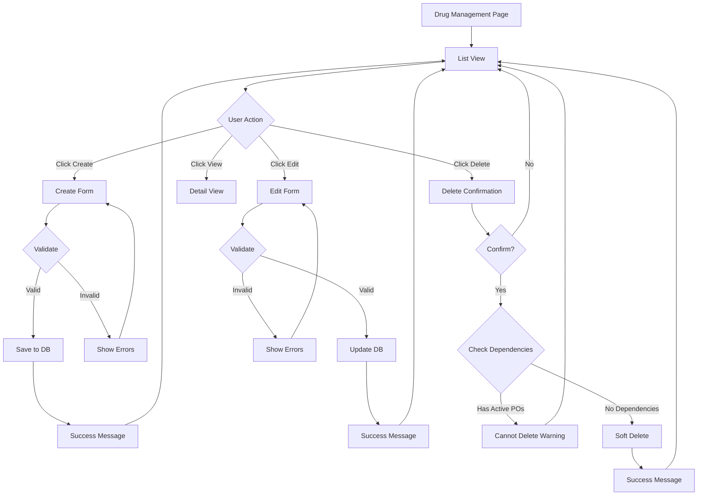
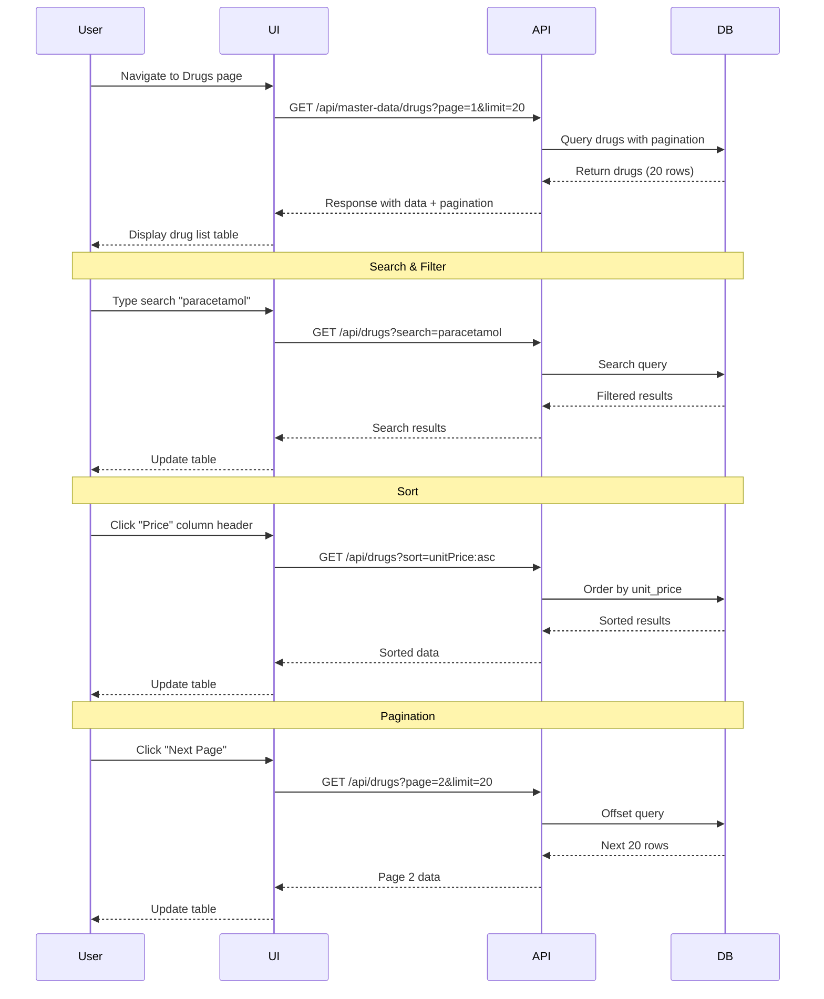
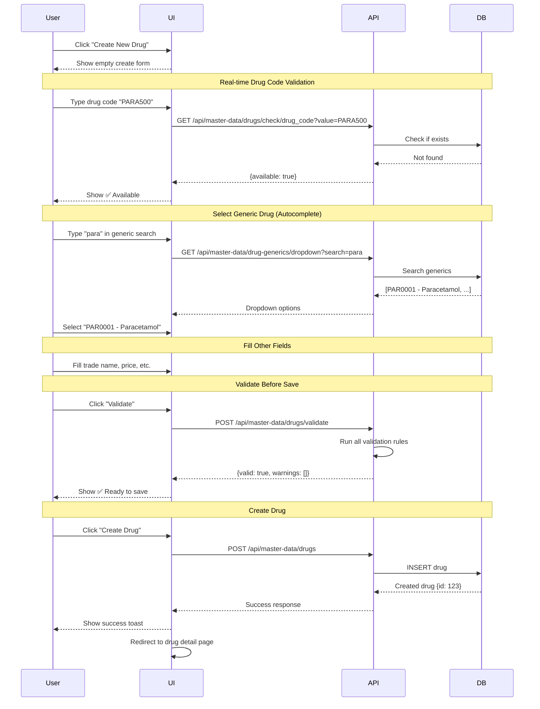

# FLOW 03: Data Maintenance & Management

**Module**: Master Data Management
**Feature**: CRUD Operations (Create, Read, Update, Delete)
**Priority**: ⭐⭐⭐⭐⭐ Critical
**User Role**: Pharmacist, Admin
**Status**: Ready for Implementation

---

## 📋 User Stories

### Story 1: View Drug List
> **As a** pharmacist
> **I want to** view all drugs in the system with filtering and search
> **So that** I can quickly find and manage drug information

### Story 2: Create New Drug
> **As a** pharmacist
> **I want to** add a new drug to the system
> **So that** it's available for purchase requests and inventory

### Story 3: Edit Drug Information
> **As a** pharmacist
> **I want to** update drug information (price, status, etc.)
> **So that** the system reflects current accurate data

### Story 4: Deactivate Drug
> **As a** pharmacist
> **I want to** deactivate a discontinued drug
> **So that** it's no longer available for new purchases but history is preserved

---

## 🔄 Overall CRUD Flow



---

## 📊 List View Flow



---

## 🖥️ UI Mockup 1: Drug List View

```
╔════════════════════════════════════════════════════════════════════════════════╗
║  💊 Drug Management                                        👤 Pharmacist [⚙️]  ║
╠════════════════════════════════════════════════════════════════════════════════╣
║                                                                                ║
║  [+ Create New Drug]  [📥 Import]  [📤 Export]         🔍 [Search drugs...  ]║
║                                                                                ║
║  Filters:  [All Status ▼] [All NLEM ▼] [All Categories ▼]  [Clear Filters]   ║
║                                                                                ║
║  ┌──────────────────────────────────────────────────────────────────────────┐ ║
║  │Code      │Trade Name          │Generic   │Mfg  │Price │NLEM│Status│     │ ║
║  ├──────────┼────────────────────┼──────────┼─────┼──────┼────┼──────┼─────┤ ║
║  │PARA500   │Paracetamol 500mg   │PAR0001   │GPO  │ 2.50 │ E  │Active│ ⋮   │ ║
║  │IBU200    │Ibuprofen 200mg     │IBU0001   │GPO  │ 3.00 │ E  │Active│ ⋮   │ ║
║  │AMOX500   │Amoxicillin 500mg   │AMO0001   │GPO  │ 5.50 │ E  │Active│ ⋮   │ ║
║  │ASPIRIN100│Aspirin 100mg       │ASP0001   │Pfiz │ 1.20 │ N  │Active│ ⋮   │ ║
║  │OMPZ20    │Omeprazole 20mg     │OMP0001   │GPO  │ 8.00 │ E  │Active│ ⋮   │ ║
║  │OLD001    │Old Drug (Disc)     │OLD0001   │GPO  │ 0.00 │ N  │Disc. │ ⋮   │ ║
║  │...       │...                 │...       │...  │ ...  │... │...   │...  │ ║
║  └──────────┴────────────────────┴──────────┴─────┴──────┴────┴──────┴─────┘ ║
║                                                                                ║
║  Showing 1-20 of 450 drugs        [◄] Page 1 of 23 [►]      20 per page [▼]  ║
║                                                                                ║
║  Selected: 0 drugs    [ Bulk Actions ▼ ]                                      ║
╚════════════════════════════════════════════════════════════════════════════════╝

   ╔══════════════════════════════════════════╗
   ║  Actions Menu (⋮)                        ║
   ╠══════════════════════════════════════════╣
   ║  👁️  View Details                        ║
   ║  ✏️  Edit Drug                            ║
   ║  📋 Copy Drug                             ║
   ║  📊 View History                          ║
   ║  ──────────────────────────────           ║
   ║  🚫 Deactivate                            ║
   ║  🗑️  Delete                               ║
   ╚══════════════════════════════════════════╝
```

**UI Features:**
- Action buttons (Create, Import, Export)
- Search bar with instant search
- Filter dropdowns (multi-select)
- Sortable columns (click header)
- Row actions menu (⋮)
- Checkbox for bulk selection
- Pagination controls
- Items per page selector
- Status badges (color-coded)

---

## 🖥️ UI Mockup 2: Create Drug Form

```
╔════════════════════════════════════════════════════════════════════════════╗
║  Create New Drug                                                       [X] ║
╠════════════════════════════════════════════════════════════════════════════╣
║                                                                            ║
║  Basic Information                                                         ║
║  ┌────────────────────────────────────────────────────────────────────┐   ║
║  │  Drug Code * (7-24 chars)                                          │   ║
║  │  [PARA500_____________________]  ✅ Available                       │   ║
║  │                                                                     │   ║
║  │  Trade Name * (in Thai or English)                                 │   ║
║  │  [Paracetamol 500mg____________________________________________]   │   ║
║  │                                                                     │   ║
║  │  Generic Drug *                           [ Search Generic... ▼ ]  │   ║
║  │  Selected: PAR0001 - Paracetamol 500mg                    [Change] │   ║
║  │                                                                     │   ║
║  │  Manufacturer *                          [ Search Company... ▼ ]   │   ║
║  │  Selected: GPO - องค์การเภสัชกรรม                        [Change] │   ║
║  └────────────────────────────────────────────────────────────────────┘   ║
║                                                                            ║
║  Drug Details                                                              ║
║  ┌────────────────────────────────────────────────────────────────────┐   ║
║  │  Strength           Dosage Form         Pack Size      Unit        │   ║
║  │  [500mg_____]      [▼ Tablet    ]     [1000__]      [▼ TAB ]      │   ║
║  │                                                                     │   ║
║  │  Unit Price (THB) *     Standard Code (24 chars)                   │   ║
║  │  [2.50_________]       [10123456789012345678PARA______________]    │   ║
║  │                                                                     │   ║
║  │  Barcode                ATC Code                                   │   ║
║  │  [8851234567890_]      [N02BE01_______]                            │   ║
║  └────────────────────────────────────────────────────────────────────┘   ║
║                                                                            ║
║  Ministry Compliance (DMSIC Standards)                                     ║
║  ┌────────────────────────────────────────────────────────────────────┐   ║
║  │  NLEM Status          Drug Status           Product Category       │   ║
║  │  ○ E (Essential)      ○ Active (1)          ○ Modern Registered(1) │   ║
║  │  ⦿ N (Non-Essential)  ○ Discontinued (2)    ○ Modern Hospital (2)  │   ║
║  │                       ○ Special Case (3)    ○ Herbal Registered(3) │   ║
║  │                       ○ Removed (4)         ○ Herbal Hospital (4)  │   ║
║  │                                             ○ Other (5)             │   ║
║  └────────────────────────────────────────────────────────────────────┘   ║
║                                                                            ║
║  Additional Information                                                    ║
║  ┌────────────────────────────────────────────────────────────────────┐   ║
║  │  Remarks / Notes                                                   │   ║
║  │  [____________________________________________________________]    │   ║
║  │  [____________________________________________________________]    │   ║
║  │  [____________________________________________________________]    │   ║
║  └────────────────────────────────────────────────────────────────────┘   ║
║                                                                            ║
║  ☑ Active (available for purchase)                                        ║
║                                                                            ║
║  * Required fields                                                         ║
║                                                                            ║
║         [ Cancel ]  [ Save as Draft ]  [ Validate ]  [ Create Drug ]      ║
╚════════════════════════════════════════════════════════════════════════════╝
```

**Form Features:**
- Real-time validation (drug code uniqueness)
- Autocomplete for generic drug and manufacturer
- Grouped sections for better UX
- Ministry compliance fields (NLEM, status, category)
- Draft save functionality
- Validate button (test before save)
- Clear required field indicators

---

## 📊 Create Flow Sequence



---

## 🖥️ UI Mockup 3: Edit Drug Form

```
╔════════════════════════════════════════════════════════════════════════════╗
║  Edit Drug - PARA500                                                   [X] ║
╠════════════════════════════════════════════════════════════════════════════╣
║                                                                            ║
║  ⚠️ Warning: This drug has 5 active purchase orders and 2,500 units in    ║
║     stock. Changes may affect ongoing operations.                         ║
║                                                                            ║
║  Basic Information                                                         ║
║  ┌────────────────────────────────────────────────────────────────────┐   ║
║  │  Drug Code (cannot change)                                         │   ║
║  │  PARA500                                              [🔒 Locked]  │   ║
║  │                                                                     │   ║
║  │  Trade Name *                                                      │   ║
║  │  [Paracetamol 500mg____________________________________________]   │   ║
║  │  Last modified: 2025-01-15 by ภญ.สมหญิง                           │   ║
║  │                                                                     │   ║
║  │  Generic Drug (cannot change after creation)                       │   ║
║  │  PAR0001 - Paracetamol 500mg                          [🔒 Locked]  │   ║
║  │                                                                     │   ║
║  │  Manufacturer *                                                    │   ║
║  │  [▼ GPO - องค์การเภสัชกรรม                    ]     [Change]     │   ║
║  └────────────────────────────────────────────────────────────────────┘   ║
║                                                                            ║
║  Pricing (affects all new purchases)                                      ║
║  ┌────────────────────────────────────────────────────────────────────┐   ║
║  │  Current Price: 2.50 THB/TAB                                       │   ║
║  │  New Price *:  [2.75_________] THB/TAB                             │   ║
║  │                                                                     │   ║
║  │  ⚠️ Price increase: +0.25 THB (+10%)                               │   ║
║  │  Effective Date: [2025-01-25________] [▼]                          │   ║
║  │  Reason for change: [__________________________________________]   │   ║
║  └────────────────────────────────────────────────────────────────────┘   ║
║                                                                            ║
║  Status Change                                                             ║
║  ┌────────────────────────────────────────────────────────────────────┐   ║
║  │  Current: ● Active                                                 │   ║
║  │  Change to: [▼ Active        ]                                     │   ║
║  │                                                                     │   ║
║  │  If changing to Discontinued:                                      │   ║
║  │  Reason (required): [_________________________________________]    │   ║
║  │  ⚠️ This will prevent new purchases but preserve history          │   ║
║  └────────────────────────────────────────────────────────────────────┘   ║
║                                                                            ║
║  Change History                                      [View Full History]   ║
║  ┌────────────────────────────────────────────────────────────────────┐   ║
║  │  2025-01-15  ภญ.สมหญิง    Updated trade name                      │   ║
║  │  2025-01-10  ภก.สมชาย     Changed price 2.30 → 2.50               │   ║
║  │  2024-12-20  System        Created                                 │   ║
║  └────────────────────────────────────────────────────────────────────┘   ║
║                                                                            ║
║          [ Cancel ]  [ Reset Changes ]  [ Save Changes ]                  ║
╚════════════════════════════════════════════════════════════════════════════╝
```

**Edit Form Features:**
- Warning banner for drugs with dependencies
- Locked fields (drug_code, generic_id)
- Last modified timestamp
- Price change tracking with percentage
- Effective date for price changes
- Reason field for status changes
- Change history preview
- Reset button to undo changes

---

## 🖥️ UI Mockup 4: Deactivate Confirmation

```
╔════════════════════════════════════════════════════════════════════════╗
║  ⚠️ Deactivate Drug - PARA500                                      [X]║
╠════════════════════════════════════════════════════════════════════════╣
║                                                                        ║
║  You are about to deactivate:                                         ║
║  📦 Paracetamol 500mg (PARA500)                                       ║
║                                                                        ║
║  ╔══════════════════════════════════════════════════════════════════╗ ║
║  ║  Impact Analysis                                                 ║ ║
║  ╠══════════════════════════════════════════════════════════════════╣ ║
║  ║                                                                  ║ ║
║  ║  ✅ Can Deactivate                                               ║ ║
║  ║                                                                  ║ ║
║  ║  Current Usage:                                                  ║ ║
║  ║  • Inventory: 2,500 units in stock (will remain)                ║ ║
║  ║  • Active Purchase Orders: 5 orders (will continue)             ║ ║
║  ║  • Budget Plans: 2 fiscal years (will be marked inactive)       ║ ║
║  ║                                                                  ║ ║
║  ║  After Deactivation:                                             ║ ║
║  ║  ✅ Existing stock can still be dispensed                        ║ ║
║  ║  ✅ Active POs will complete normally                            ║ ║
║  ║  ❌ New purchase requests cannot be created                      ║ ║
║  ║  ❌ Will not appear in active drug lists                         ║ ║
║  ║  ℹ️  Can be reactivated later if needed                         ║ ║
║  ║                                                                  ║ ║
║  ╚══════════════════════════════════════════════════════════════════╝ ║
║                                                                        ║
║  Deactivation Details                                                 ║
║  ┌──────────────────────────────────────────────────────────────────┐ ║
║  │  Reason (required, min 10 characters):                           │ ║
║  │  [Drug discontinued by manufacturer. No longer available_____]   │ ║
║  │  [for purchase._______________________________________________]   │ ║
║  │                                                                  │ ║
║  │  Effective Date:  [2025-01-25________] [▼]                       │ ║
║  │  Deactivated by:  Pharmacist (You)                              │ ║
║  └──────────────────────────────────────────────────────────────────┘ ║
║                                                                        ║
║  ☑ I understand the impact and want to proceed                        ║
║                                                                        ║
║                    [ Cancel ]  [ Deactivate Drug ]                    ║
╚════════════════════════════════════════════════════════════════════════╝
```

**Deactivation Features:**
- Impact analysis with dependency check
- Clear explanation of consequences
- Required reason field (audit trail)
- Effective date
- Confirmation checkbox
- Can reactivate note (soft delete)

---

## 🖥️ UI Mockup 5: Cannot Delete Warning

```
╔════════════════════════════════════════════════════════════════════════╗
║  ❌ Cannot Delete Drug - PARA500                                   [X]║
╠════════════════════════════════════════════════════════════════════════╣
║                                                                        ║
║  This drug cannot be permanently deleted because it has:              ║
║                                                                        ║
║  ╔══════════════════════════════════════════════════════════════════╗ ║
║  ║  Active Dependencies                                             ║ ║
║  ╠══════════════════════════════════════════════════════════════════╣ ║
║  ║                                                                  ║ ║
║  ║  📋 Purchase Orders:  5 active orders                            ║ ║
║  ║     [View Active POs →]                                          ║ ║
║  ║                                                                  ║ ║
║  ║  📦 Inventory Records:  2,500 units in stock                     ║ ║
║  ║     [View Inventory →]                                           ║ ║
║  ║                                                                  ║ ║
║  ║  📊 Budget Plans:  2 fiscal years (2024-2025)                    ║ ║
║  ║     [View Budget Plans →]                                        ║ ║
║  ║                                                                  ║ ║
║  ║  🏥 Distribution History:  150 transactions                      ║ ║
║  ║     [View History →]                                             ║ ║
║  ║                                                                  ║ ║
║  ╚══════════════════════════════════════════════════════════════════╝ ║
║                                                                        ║
║  Recommended Actions:                                                 ║
║  ┌──────────────────────────────────────────────────────────────────┐ ║
║  │  Instead of deleting, you can:                                   │ ║
║  │                                                                  │ ║
║  │  ✅ [ Deactivate Drug ]                                          │ ║
║  │     Prevents new purchases but preserves all history            │ ║
║  │                                                                  │ ║
║  │  ℹ️ Permanent deletion is only possible for drugs with:         │ ║
║  │     • No purchase orders                                        │ ║
║  │     • No inventory records                                      │ ║
║  │     • No budget plans                                           │ ║
║  │     • No distribution history                                   │ ║
║  └──────────────────────────────────────────────────────────────────┘ ║
║                                                                        ║
║                                                  [ Close ]  [ Deactivate Instead ]
╚════════════════════════════════════════════════════════════════════════╝
```

**Warning Features:**
- Clear explanation why deletion is blocked
- Links to view dependencies
- Recommended alternative action (deactivate)
- Educational note about deletion rules

---

## 💻 Code Examples

### React Hook for CRUD Operations

```typescript
import { useMutation, useQuery, useQueryClient } from '@tanstack/react-query'

// Get drug list with filters
function useDrugs(filters: DrugFilters) {
  return useQuery({
    queryKey: ['drugs', filters],
    queryFn: async () => {
      const params = new URLSearchParams({
        page: filters.page.toString(),
        limit: filters.limit.toString(),
        search: filters.search || '',
        nlemStatus: filters.nlemStatus || '',
        drugStatus: filters.drugStatus || '',
        sort: filters.sort || 'tradeName:asc'
      })

      const response = await fetch(`/api/master-data/drugs?${params}`)
      return response.json()
    }
  })
}

// Create drug
function useCreateDrug() {
  const queryClient = useQueryClient()

  return useMutation({
    mutationFn: async (data: CreateDrugInput) => {
      const response = await fetch('/api/master-data/drugs', {
        method: 'POST',
        headers: { 'Content-Type': 'application/json' },
        body: JSON.stringify(data)
      })

      if (!response.ok) {
        const error = await response.json()
        throw new Error(error.error.message)
      }

      return response.json()
    },
    onSuccess: () => {
      // Invalidate and refetch
      queryClient.invalidateQueries({ queryKey: ['drugs'] })
    }
  })
}

// Update drug
function useUpdateDrug() {
  const queryClient = useQueryClient()

  return useMutation({
    mutationFn: async ({ id, data }: { id: string; data: UpdateDrugInput }) => {
      const response = await fetch(`/api/master-data/drugs/${id}`, {
        method: 'PUT',
        headers: { 'Content-Type': 'application/json' },
        body: JSON.stringify(data)
      })

      if (!response.ok) throw new Error('Update failed')
      return response.json()
    },
    onSuccess: (_, variables) => {
      // Invalidate list and detail
      queryClient.invalidateQueries({ queryKey: ['drugs'] })
      queryClient.invalidateQueries({ queryKey: ['drug', variables.id] })
    }
  })
}

// Deactivate drug
function useDeactivateDrug() {
  const queryClient = useQueryClient()

  return useMutation({
    mutationFn: async ({ id, reason }: { id: string; reason: string }) => {
      const response = await fetch(`/api/master-data/drugs/${id}/deactivate`, {
        method: 'PATCH',
        headers: { 'Content-Type': 'application/json' },
        body: JSON.stringify({ reason })
      })

      if (!response.ok) {
        const error = await response.json()
        throw error
      }

      return response.json()
    },
    onSuccess: () => {
      queryClient.invalidateQueries({ queryKey: ['drugs'] })
    }
  })
}

// Check drug code availability (real-time)
function useDrugCodeCheck(drugCode: string) {
  return useQuery({
    queryKey: ['drug-code-check', drugCode],
    queryFn: async () => {
      if (!drugCode || drugCode.length < 7) return null

      const response = await fetch(
        `/api/master-data/drugs/check/drug_code?value=${drugCode}`
      )
      return response.json()
    },
    enabled: drugCode.length >= 7,
    staleTime: 0 // Always fresh
  })
}
```

### Create Drug Form Component

```typescript
interface CreateDrugFormProps {
  onSuccess: () => void
  onCancel: () => void
}

function CreateDrugForm({ onSuccess, onCancel }: CreateDrugFormProps) {
  const [drugCode, setDrugCode] = useState('')
  const createDrug = useCreateDrug()
  const codeCheck = useDrugCodeCheck(drugCode)

  const {
    register,
    handleSubmit,
    formState: { errors },
    watch
  } = useForm<CreateDrugInput>()

  const onSubmit = async (data: CreateDrugInput) => {
    try {
      await createDrug.mutateAsync(data)
      toast.success('Drug created successfully')
      onSuccess()
    } catch (error) {
      toast.error(error.message)
    }
  }

  return (
    <form onSubmit={handleSubmit(onSubmit)}>
      {/* Drug Code with Real-time Validation */}
      <div>
        <label>Drug Code *</label>
        <input
          {...register('drugCode', {
            required: 'Drug code is required',
            minLength: { value: 7, message: 'Min 7 characters' },
            maxLength: { value: 24, message: 'Max 24 characters' }
          })}
          value={drugCode}
          onChange={(e) => setDrugCode(e.target.value)}
        />
        {codeCheck.data?.available && (
          <span className="text-green-600">✅ Available</span>
        )}
        {codeCheck.data?.available === false && (
          <span className="text-red-600">❌ Already exists</span>
        )}
        {errors.drugCode && (
          <span className="error">{errors.drugCode.message}</span>
        )}
      </div>

      {/* Trade Name */}
      <div>
        <label>Trade Name *</label>
        <input
          {...register('tradeName', {
            required: 'Trade name is required',
            minLength: { value: 3, message: 'Min 3 characters' }
          })}
        />
        {errors.tradeName && (
          <span className="error">{errors.tradeName.message}</span>
        )}
      </div>

      {/* Generic Drug Autocomplete */}
      <div>
        <label>Generic Drug *</label>
        <GenericDrugAutocomplete
          onChange={(generic) => setValue('genericId', generic.id)}
        />
      </div>

      {/* Other fields... */}

      <div className="actions">
        <button type="button" onClick={onCancel}>
          Cancel
        </button>
        <button
          type="submit"
          disabled={createDrug.isPending || !codeCheck.data?.available}
        >
          {createDrug.isPending ? 'Creating...' : 'Create Drug'}
        </button>
      </div>
    </form>
  )
}
```

### Deactivate with Dependency Check

```typescript
function useDeactivateDrugWithCheck() {
  const [dependencies, setDependencies] = useState<DependencyCheck | null>(null)
  const [showConfirm, setShowConfirm] = useState(false)

  const checkDependencies = async (drugId: string) => {
    const response = await fetch(`/api/master-data/drugs/${drugId}/dependencies`)
    const result = await response.json()

    setDependencies(result.data)

    if (result.data.canDeactivate) {
      setShowConfirm(true)
    } else {
      // Show cannot delete warning
      showWarning(result.data)
    }
  }

  const deactivateMutation = useMutation({
    mutationFn: async ({ id, reason }: { id: string; reason: string }) => {
      const response = await fetch(`/api/master-data/drugs/${id}/deactivate`, {
        method: 'PATCH',
        headers: { 'Content-Type': 'application/json' },
        body: JSON.stringify({ reason })
      })

      if (!response.ok) throw new Error('Deactivation failed')
      return response.json()
    },
    onSuccess: () => {
      toast.success('Drug deactivated successfully')
      setShowConfirm(false)
    }
  })

  return {
    checkDependencies,
    deactivate: deactivateMutation.mutate,
    dependencies,
    showConfirm,
    isDeactivating: deactivateMutation.isPending
  }
}

// Usage
function DrugListItem({ drug }: { drug: Drug }) {
  const deactivateAction = useDeactivateDrugWithCheck()

  const handleDeactivate = async () => {
    await deactivateAction.checkDependencies(drug.id)
  }

  return (
    <>
      <tr>
        <td>{drug.drugCode}</td>
        <td>{drug.tradeName}</td>
        <td>
          <button onClick={handleDeactivate}>Deactivate</button>
        </td>
      </tr>

      {deactivateAction.showConfirm && (
        <DeactivateConfirmDialog
          drug={drug}
          dependencies={deactivateAction.dependencies}
          onConfirm={(reason) =>
            deactivateAction.deactivate({ id: drug.id, reason })
          }
          onCancel={() => deactivateAction.setShowConfirm(false)}
        />
      )}
    </>
  )
}
```

---

## ✅ Acceptance Criteria

### List View
- ✅ Display drugs in paginated table (20 per page default)
- ✅ Search by drug code or trade name (instant)
- ✅ Filter by NLEM status, drug status, category
- ✅ Sort by any column (ascending/descending)
- ✅ Show row actions menu (View, Edit, Delete)
- ✅ Bulk selection for batch operations

### Create Drug
- ✅ Validate drug code in real-time (must be unique)
- ✅ Autocomplete for generic drug and manufacturer
- ✅ Show validation errors inline
- ✅ Save draft functionality
- ✅ Success message with link to view created drug

### Edit Drug
- ✅ Load existing drug data into form
- ✅ Lock critical fields (drug_code, generic_id)
- ✅ Show dependency warning if drug has active POs
- ✅ Track price changes with reason
- ✅ Display change history
- ✅ Reset button to undo unsaved changes

### Deactivate Drug
- ✅ Check dependencies before deactivation
- ✅ Show impact analysis
- ✅ Require reason for deactivation (min 10 chars)
- ✅ Allow setting effective date
- ✅ Soft delete (can reactivate)
- ✅ Show cannot delete warning if has critical dependencies

---

## 🔗 Related Documentation

- **API Specification**: `../api/API_SPECIFICATION.md`
- **Search & Filter Flow**: `./04-SEARCH_FILTER_FLOW.md`
- **Bulk Import Flow**: `./02-BULK_IMPORT_FLOW.md`
- **Validation Rules**: `../detailed/03-VALIDATION-RULES.md`

---

**Version**: 1.0.0
**Last Updated**: 2025-01-22
**Status**: Ready for Implementation ✅
