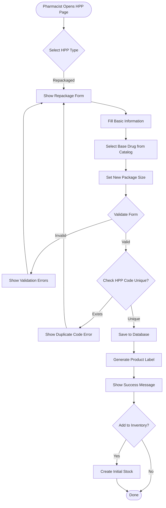
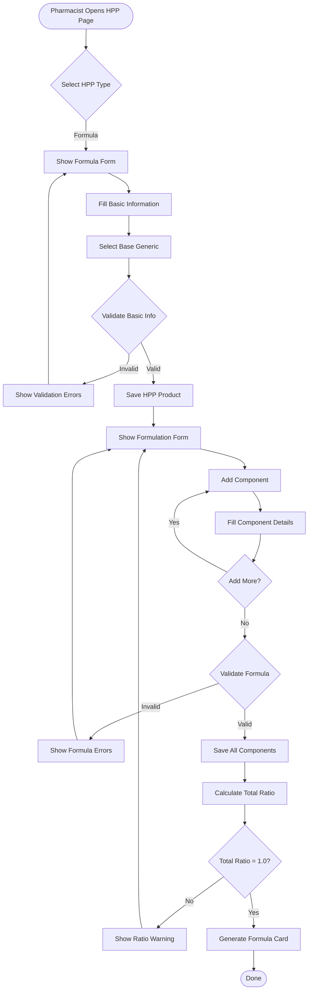
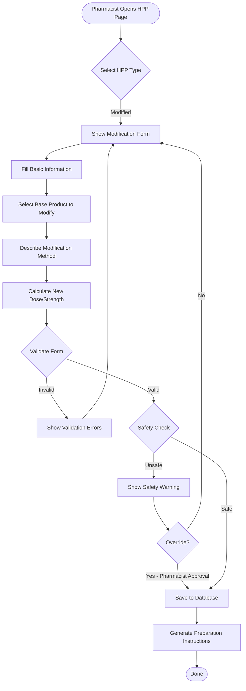
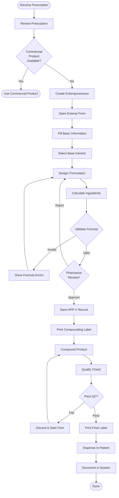

# 🔄 HPP System - Business Workflows

**System:** Hospital Pharmaceutical Products (HPP)
**Version:** 2.2.0
**Last Updated:** 2025-01-22

---

## 📋 Overview

This document describes the **4 core workflows** for Hospital Pharmaceutical Products (HPP) System:

1. **Create Repackaged Product (HPP-R)** - Repackage bulk drugs into smaller units
2. **Create Hospital Formula (HPP-F)** - Prepare hospital-developed formulas with components
3. **Create Modified Product (HPP-M)** - Modify commercial products (split/dissolve)
4. **Create Extemporaneous Product (HPP-X)** - Patient-specific compounding

---

## Workflow 1: Create Repackaged Product (HPP-R)

### 🎯 User Story

**As a pharmacist**, I want to repackage bulk drugs into smaller units so that patients can receive appropriate quantities.

**Example:** Repackage Paracetamol 500mg from a bottle of 1,000 tablets into blister packs of 10 tablets.

---

### 📊 Process Flow



---

### 📝 Step-by-Step: Create Repackaged Product

#### Step 1: Select HPP Type
**User Action:** Navigate to HPP page → Click "Create New HPP" → Select "Repackaged (R)"

**System Response:**
- Display repackage form
- Show drug selection dropdown
- HPP code pattern: `HPP-R-XXX`

#### Step 2: Fill Basic Information
**User Fills:**
```typescript
{
  hpp_code: "HPP-R-001", // Auto-generated or manual
  hpp_type: 'R',
  product_name: "Paracetamol 500mg Blister Pack x10",
  drug_id: 1n, // Select original bulk drug
  is_outsourced: false,
  is_active: true
}
```

#### Step 3: Select Base Drug
**API:** `GET /api/drugs?search=paracetamol`

**Response:**
```typescript
[
  {
    id: 1n,
    drug_code: "123456789012345678901234",
    trade_name: "Paracetamol 500mg Tab (Bottle x1000)",
    generic_name: "Paracetamol",
    unit_price: 0.50, // per tablet
    package_size: 1000
  }
]
```

**User Selects:** Paracetamol 500mg Tab (Bottle x1000)

#### Step 4: Set New Package Details
**User Inputs:**
```typescript
{
  new_package_size: 10, // tablets per blister
  new_package_unit: "BLISTER",
  new_unit_cost: 5.50, // cost per blister (10 tablets × 0.50 + packaging)
  cost_breakdown: {
    drug_cost: 5.00, // 10 tablets × 0.50
    packaging_cost: 0.30,
    labor_cost: 0.20
  }
}
```

#### Step 5: Validation
**Client-side Checks:**
- ✅ `hpp_code` matches pattern `HPP-R-XXX`
- ✅ `product_name` is not empty
- ✅ `drug_id` is selected
- ✅ New package size > 0
- ✅ New unit cost > 0

**Server-side Checks:**
```typescript
// API: POST /api/hpp/repackaged

// Check HPP code uniqueness
const existing = await prisma.hospitalPharmaceuticalProduct.findUnique({
  where: { hpp_code: data.hpp_code }
});
if (existing) {
  return { error: "HPP code already exists" };
}

// Check base drug exists and is active
const baseDrug = await prisma.drug.findUnique({
  where: { id: data.drug_id }
});
if (!baseDrug || !baseDrug.is_active) {
  return { error: "Invalid base drug" };
}

// Verify is_outsourced = false for R type
if (data.is_outsourced !== false) {
  return { error: "Repackaged products cannot be outsourced" };
}
```

#### Step 6: Save to Database
```typescript
const repackaged = await prisma.hospitalPharmaceuticalProduct.create({
  data: {
    hpp_code: "HPP-R-001",
    hpp_type: 'R',
    product_name: "Paracetamol 500mg Blister Pack x10",
    drug_id: 1n,
    is_outsourced: false,
    is_active: true
  },
  include: {
    drug: true,
    generic: true
  }
});
```

#### Step 7: Generate Product Label
**System Generates:**
```
┌─────────────────────────────────────┐
│ Hospital Pharmaceutical Product     │
├─────────────────────────────────────┤
│ HPP-R-001                          │
│ Paracetamol 500mg Blister Pack x10 │
│                                     │
│ Base Drug: Paracetamol 500mg Tab   │
│ Generic: Paracetamol               │
│ Package: 10 tablets per blister    │
│ Cost: 5.50 THB                     │
│                                     │
│ Manufactured: [Date]               │
│ Expiry: [Same as base drug]        │
│                                     │
│ FOR HOSPITAL USE ONLY              │
└─────────────────────────────────────┘
```

#### Step 8: Optional - Add to Inventory
**If user selects "Add to Inventory":**
```typescript
// Create inventory record
await prisma.inventory.create({
  data: {
    drug_id: repackaged.id, // Use new HPP product ID
    location_id: 1n, // Central Pharmacy
    quantity_on_hand: 0,
    min_level: 50,
    max_level: 500,
    reorder_point: 100
  }
});
```

---

## Workflow 2: Create Hospital Formula (HPP-F)

### 🎯 User Story

**As a pharmacist**, I want to create hospital-developed formulas with documented components so that we can prepare standardized medications.

**Example:** Metoclopramide Oral Solution 5mg/5mL with active ingredient, excipient, and preservative.

---

### 📊 Process Flow



---

### 📝 Step-by-Step: Create Hospital Formula

#### Step 1: Select HPP Type
**User Action:** Navigate to HPP page → Click "Create New HPP" → Select "Hospital Formula (F)"

**System Response:**
- Display formula form
- Show generic selection dropdown
- HPP code pattern: `HPP-F-XXX`

#### Step 2: Fill Basic Information
**User Fills:**
```typescript
{
  hpp_code: "HPP-F-001",
  hpp_type: 'F',
  product_name: "Metoclopramide Oral Solution 5mg/5mL",
  generic_id: 10n, // Select base generic
  drug_id: null, // Not based on trade drug
  is_outsourced: false,
  is_active: true
}
```

#### Step 3: Save HPP Product
**API:** `POST /api/hpp/formula`

```typescript
const formula = await prisma.$transaction(async (tx) => {
  // Create HPP product
  const hpp = await tx.hospitalPharmaceuticalProduct.create({
    data: {
      hpp_code: "HPP-F-001",
      hpp_type: 'F',
      product_name: "Metoclopramide Oral Solution 5mg/5mL",
      generic_id: 10n,
      is_outsourced: false,
      is_active: true
    }
  });

  return hpp;
});
```

#### Step 4: Add Formulation Components
**User Adds Multiple Components:**

**Component 1 - Active Ingredient:**
```typescript
{
  hpp_id: formula.id,
  component_type: 'ACTIVE',
  component_name: 'Metoclopramide HCl',
  component_strength: '5mg/5mL',
  component_ratio: 0.01 // 1% of total
}
```

**Component 2 - Excipient:**
```typescript
{
  hpp_id: formula.id,
  component_type: 'EXCIPIENT',
  component_name: 'Syrup Simple',
  component_strength: null,
  component_ratio: 0.88 // 88% of total
}
```

**Component 3 - Preservative:**
```typescript
{
  hpp_id: formula.id,
  component_type: 'PRESERVATIVE',
  component_name: 'Sodium Benzoate',
  component_strength: '0.1%',
  component_ratio: 0.001 // 0.1% of total
}
```

**Component 4 - Solvent:**
```typescript
{
  hpp_id: formula.id,
  component_type: 'SOLVENT',
  component_name: 'Purified Water',
  component_strength: null,
  component_ratio: 0.109 // 10.9% of total (balance to 100%)
}
```

#### Step 5: Validation
**Client-side Checks:**
- ✅ At least 1 ACTIVE component exists
- ✅ All component names filled
- ✅ All ratios are positive numbers
- ✅ Sum of ratios ≈ 1.0 (100%)

**Server-side Validation:**
```typescript
// API: POST /api/hpp/formula/:id/components

// Check HPP exists
const hpp = await prisma.hospitalPharmaceuticalProduct.findUnique({
  where: { id: hppId, hpp_type: 'F' }
});
if (!hpp) {
  return { error: "HPP formula not found" };
}

// Validate at least 1 ACTIVE component
const activeCount = components.filter(c => c.component_type === 'ACTIVE').length;
if (activeCount === 0) {
  return { error: "At least 1 ACTIVE component required" };
}

// Check ratio total
const totalRatio = components.reduce((sum, c) => sum + c.component_ratio, 0);
if (Math.abs(totalRatio - 1.0) > 0.001) {
  return {
    warning: `Total ratio is ${totalRatio}, should be 1.0`,
    components
  };
}
```

#### Step 6: Save Components
```typescript
await prisma.hppFormulation.createMany({
  data: [
    {
      hpp_id: formula.id,
      component_type: 'ACTIVE',
      component_name: 'Metoclopramide HCl',
      component_strength: '5mg/5mL',
      component_ratio: 0.01
    },
    {
      hpp_id: formula.id,
      component_type: 'EXCIPIENT',
      component_name: 'Syrup Simple',
      component_ratio: 0.88
    },
    {
      hpp_id: formula.id,
      component_type: 'PRESERVATIVE',
      component_name: 'Sodium Benzoate',
      component_strength: '0.1%',
      component_ratio: 0.001
    },
    {
      hpp_id: formula.id,
      component_type: 'SOLVENT',
      component_name: 'Purified Water',
      component_ratio: 0.109
    }
  ]
});
```

#### Step 7: Generate Formula Card
**System Generates:**
```
╔═══════════════════════════════════════════════════╗
║ HOSPITAL FORMULA - HPP-F-001                     ║
╠═══════════════════════════════════════════════════╣
║ Metoclopramide Oral Solution 5mg/5mL             ║
║                                                   ║
║ FORMULATION (per 100mL):                         ║
║                                                   ║
║ Active Ingredient:                               ║
║   • Metoclopramide HCl ............ 100mg (1.0%) ║
║                                                   ║
║ Excipients:                                      ║
║   • Syrup Simple .................. 88g (88.0%)  ║
║   • Purified Water ................ 10.9g (10.9%)║
║                                                   ║
║ Preservative:                                    ║
║   • Sodium Benzoate 0.1% ......... 100mg (0.1%)  ║
║                                                   ║
║ PREPARATION METHOD:                              ║
║ 1. Dissolve Metoclopramide HCl in 50mL water    ║
║ 2. Add Syrup Simple and mix well                ║
║ 3. Add Sodium Benzoate solution                 ║
║ 4. Add water to make 100mL                      ║
║ 5. Mix thoroughly                                ║
║                                                   ║
║ STORAGE: Refrigerate 2-8°C                       ║
║ BEYOND USE DATE: 30 days                        ║
║                                                   ║
║ Prepared by: _____________ Date: ____________    ║
║ Checked by: ______________ Date: ____________    ║
╚═══════════════════════════════════════════════════╝
```

---

## Workflow 3: Create Modified Product (HPP-M)

### 🎯 User Story

**As a pharmacist**, I want to modify commercial products (split tablets, dissolve capsules) to create pediatric or adjusted doses.

**Example:** Split Paracetamol 500mg tablet to create Paracetamol 250mg half-tablet for pediatric use.

---

### 📊 Process Flow



---

### 📝 Step-by-Step: Create Modified Product

#### Step 1: Fill Basic Information
**User Fills:**
```typescript
{
  hpp_code: "HPP-M-001",
  hpp_type: 'M',
  product_name: "Paracetamol 250mg (Split Tablet)",
  base_product_id: 5n, // Select original HPP or drug
  drug_id: 1n, // Original trade drug
  generic_id: 1n, // Same generic
  modification_method: "SPLIT_TABLET",
  is_outsourced: false,
  is_active: true
}
```

#### Step 2: Describe Modification
**User Inputs:**
```typescript
{
  original_strength: "500mg",
  new_strength: "250mg",
  modification_ratio: 0.5, // Half tablet
  modification_description: "Split 500mg tablet in half along score line",
  special_handling: "Use tablet splitter for accuracy. Store in tight container.",
  stability_note: "Use within 7 days after splitting"
}
```

#### Step 3: Safety Check
**System Validates:**
```typescript
// Check if drug is safe to split
const drugProperties = await prisma.drug.findUnique({
  where: { id: data.drug_id },
  include: { generic: true }
});

// Common safety checks:
const unsafeSplitTypes = [
  'CONTROLLED_RELEASE',
  'ENTERIC_COATED',
  'EXTENDED_RELEASE',
  'SUSTAINED_RELEASE'
];

if (unsafeSplitTypes.includes(drugProperties.dosage_form_type)) {
  return {
    warning: "This drug type should not be split - may affect efficacy/safety",
    requires_pharmacist_override: true
  };
}

// Check if tablet has score line
if (!drugProperties.has_score_line) {
  return {
    warning: "Tablet has no score line - splitting may be inaccurate",
    requires_pharmacist_override: true
  };
}
```

#### Step 4: Save to Database
```typescript
const modified = await prisma.hospitalPharmaceuticalProduct.create({
  data: {
    hpp_code: "HPP-M-001",
    hpp_type: 'M',
    product_name: "Paracetamol 250mg (Split Tablet)",
    base_product_id: 5n,
    drug_id: 1n,
    generic_id: 1n,
    is_outsourced: false,
    is_active: true
  }
});
```

#### Step 5: Generate Preparation Instructions
**System Generates:**
```
┌────────────────────────────────────────────────┐
│ MODIFIED PRODUCT PREPARATION INSTRUCTIONS      │
├────────────────────────────────────────────────┤
│ HPP-M-001                                     │
│ Paracetamol 250mg (Split Tablet)             │
│                                               │
│ BASE PRODUCT:                                 │
│ • Paracetamol 500mg Tablet                   │
│                                               │
│ MODIFICATION METHOD:                          │
│ 1. Use tablet splitter for accuracy          │
│ 2. Place tablet in splitter along score line │
│ 3. Press firmly to split                     │
│ 4. Inspect for even split                    │
│                                               │
│ RESULTING STRENGTH: 250mg per half tablet    │
│                                               │
│ STORAGE:                                      │
│ • Store split tablets in tight container     │
│ • Protect from moisture                      │
│ • Use within 7 days after splitting          │
│                                               │
│ LABELING:                                     │
│ • Label: "Paracetamol 250mg (Half Tablet)"   │
│ • Date prepared                              │
│ • Use by date                                │
│ • "FOR HOSPITAL USE ONLY"                    │
│                                               │
│ ⚠️ PRECAUTIONS:                               │
│ • Verify dose before dispensing              │
│ • Counsel patient on use                     │
│                                               │
│ Approved by: _____________ Date: _________   │
└────────────────────────────────────────────────┘
```

---

## Workflow 4: Create Extemporaneous Product (HPP-X)

### 🎯 User Story

**As a pharmacist**, I want to compound patient-specific medications to meet unique dosing requirements that aren't commercially available.

**Example:** Prepare Amoxicillin Suspension 125mg/5mL for a pediatric patient with specific dosing needs.

---

### 📊 Process Flow



---

### 📝 Step-by-Step: Create Extemporaneous Product

#### Step 1: Review Prescription
**Pharmacist Reviews:**
```
Prescription:
Patient: John Doe (Age: 5 years, Weight: 18kg)
Drug: Amoxicillin 125mg PO TID × 7 days
Notes: Patient cannot swallow capsules
```

**Decision:** Commercial product (Amoxicillin 250mg/5mL) too strong → Create custom 125mg/5mL

#### Step 2: Fill Basic Information
**User Fills:**
```typescript
{
  hpp_code: "HPP-X-001",
  hpp_type: 'X',
  product_name: "Amoxicillin Suspension 125mg/5mL (Custom)",
  generic_id: 3n, // Amoxicillin
  patient_id: "HN123456", // Optional patient ID
  prescription_id: "RX789012",
  quantity_needed: 105, // mL (for 7 days TID)
  is_outsourced: false,
  is_active: true,
  expiry_days: 14 // Suspension stable for 14 days
}
```

#### Step 3: Design Formulation
**Pharmacist Calculates:**
```typescript
// Target: 105mL of Amoxicillin 125mg/5mL

const formula = {
  target_volume: 105, // mL
  target_strength: 125, // mg per 5mL

  ingredients: [
    {
      component_type: 'ACTIVE',
      component_name: 'Amoxicillin Powder',
      component_strength: '250mg/capsule',
      quantity_needed: 11, // capsules (11 × 250mg = 2750mg total)
      // Provides: 2750mg ÷ 105mL = 26.19mg/mL = 130.95mg/5mL (close to 125mg/5mL)
    },
    {
      component_type: 'VEHICLE',
      component_name: 'Ora-Sweet SF',
      quantity_needed: 50, // mL
      component_ratio: 0.476
    },
    {
      component_type: 'VEHICLE',
      component_name: 'Ora-Plus',
      quantity_needed: 50, // mL
      component_ratio: 0.476
    },
    {
      component_type: 'FLAVOR',
      component_name: 'Cherry Flavor',
      quantity_needed: 5, // mL
      component_ratio: 0.048
    }
  ],

  stability: {
    storage: 'Refrigerate 2-8°C',
    beyond_use_date: '14 days',
    shake_before_use: true
  }
};
```

#### Step 4: Validation
**System Checks:**
```typescript
// Verify strength calculation
const totalAmoxicillin = 11 * 250; // 2750mg
const concentration = (totalAmoxicillin / formula.target_volume) * 5; // mg per 5mL
const strengthVariance = Math.abs(concentration - 125) / 125;

if (strengthVariance > 0.1) { // More than 10% off target
  return {
    warning: `Calculated strength is ${concentration.toFixed(2)}mg/5mL, target is 125mg/5mL`,
    variance: `${(strengthVariance * 100).toFixed(1)}% off target`
  };
}

// Verify total volume
const totalVolume = formula.ingredients.reduce((sum, ing) =>
  sum + (ing.quantity_needed || 0), 0
);
if (totalVolume < formula.target_volume * 0.95) {
  return { error: "Total volume insufficient" };
}
```

#### Step 5: Pharmacist Review & Approval
**Pharmacist Verifies:**
- ✅ Correct drug and strength
- ✅ Appropriate for patient age/weight
- ✅ Calculation accuracy
- ✅ Stability data reviewed
- ✅ Beyond-use date appropriate

**Approval:** Pharmacist signs off electronically

#### Step 6: Save & Print Compounding Label
```typescript
const extemp = await prisma.hospitalPharmaceuticalProduct.create({
  data: {
    hpp_code: "HPP-X-001",
    hpp_type: 'X',
    product_name: "Amoxicillin Suspension 125mg/5mL (Custom)",
    generic_id: 3n,
    is_outsourced: false,
    is_active: true
  }
});

// Save formulation components
await prisma.hppFormulation.createMany({
  data: formula.ingredients.map(ing => ({
    hpp_id: extemp.id,
    component_type: ing.component_type,
    component_name: ing.component_name,
    component_strength: ing.component_strength,
    component_ratio: ing.component_ratio
  }))
});
```

**Print Compounding Worksheet:**
```
┌────────────────────────────────────────────────┐
│ EXTEMPORANEOUS COMPOUNDING WORKSHEET          │
├────────────────────────────────────────────────┤
│ HPP-X-001                                     │
│ Amoxicillin Suspension 125mg/5mL (Custom)     │
│                                               │
│ FOR PATIENT: John Doe (HN123456)             │
│ PRESCRIPTION: RX789012                        │
│                                               │
│ QUANTITY TO PREPARE: 105 mL                   │
│                                               │
│ INGREDIENTS:                                  │
│ ☐ Amoxicillin 250mg capsules ....... 11 caps │
│ ☐ Ora-Sweet SF ...................... 50 mL  │
│ ☐ Ora-Plus .......................... 50 mL  │
│ ☐ Cherry Flavor ..................... 5 mL   │
│                                               │
│ PROCEDURE:                                    │
│ 1. Empty 11 Amoxicillin capsules into mortar │
│ 2. Add 10mL Ora-Plus and triturate to paste  │
│ 3. Add 40mL Ora-Plus in portions, mix well   │
│ 4. Transfer to graduated cylinder             │
│ 5. Add 50mL Ora-Sweet SF, mix                │
│ 6. Add 5mL Cherry Flavor                     │
│ 7. QS to 105mL with Ora-Sweet SF             │
│ 8. Mix thoroughly                             │
│                                               │
│ QUALITY CHECKS:                               │
│ ☐ Color: Off-white to pink                   │
│ ☐ Consistency: Uniform suspension            │
│ ☐ Volume: 105mL ± 2mL                        │
│ ☐ pH: 5.5-7.0                                │
│                                               │
│ Prepared by: __________ Date: _____ Time: __ │
│ Checked by: ___________ Date: _____ Time: __ │
└────────────────────────────────────────────────┘
```

#### Step 7: Quality Check & Final Label
**QC Checks:**
- Volume: 105mL ± 2mL ✅
- Appearance: Uniform suspension ✅
- pH: 6.5 ✅

**Print Final Label:**
```
╔═══════════════════════════════════════╗
║ PATIENT: JOHN DOE (HN123456)         ║
╠═══════════════════════════════════════╣
║ AMOXICILLIN SUSPENSION               ║
║ 125mg per 5mL                        ║
║                                      ║
║ QUANTITY: 105 mL                     ║
║                                      ║
║ DIRECTIONS:                          ║
║ Take 5mL by mouth three times daily  ║
║ for 7 days                           ║
║                                      ║
║ ⚠️ SHAKE WELL BEFORE USE              ║
║ ⚠️ REFRIGERATE 2-8°C                  ║
║                                      ║
║ PREPARED: 2025-01-22                 ║
║ EXPIRY: 2025-02-05 (14 days)        ║
║                                      ║
║ Rx789012 | RPh: [Pharmacist Name]   ║
║ HPP-X-001                            ║
╚═══════════════════════════════════════╝
```

#### Step 8: Documentation
```typescript
// Record compounding details
await prisma.compoundingLog.create({
  data: {
    hpp_id: extemp.id,
    prescription_id: "RX789012",
    patient_id: "HN123456",
    quantity_prepared: 105,
    prepared_by: pharmacistId,
    prepared_at: new Date(),
    checked_by: seniorPharmacistId,
    checked_at: new Date(),
    beyond_use_date: new Date(Date.now() + 14 * 24 * 60 * 60 * 1000),
    qc_passed: true,
    notes: "pH: 6.5, Appearance: uniform suspension"
  }
});
```

---

## 📚 Business Rules

### HPP Product Creation Rules

#### 1. HPP Code Format
```typescript
const hppCodePattern = {
  'R': /^HPP-R-\d{3}$/,  // HPP-R-001
  'M': /^HPP-M-\d{3}$/,  // HPP-M-001
  'F': /^HPP-F-\d{3}$/,  // HPP-F-001
  'X': /^HPP-X-\d{3}$/,  // HPP-X-001
  'OHPP': /^HPP-O-\d{3}$/ // HPP-O-001
};
```

#### 2. Type-Specific Requirements
```typescript
const typeRequirements = {
  'R': {
    requires: ['drug_id'],
    forbids: ['generic_id', 'base_product_id'],
    is_outsourced: false
  },
  'M': {
    requires: ['base_product_id'],
    optional: ['drug_id', 'generic_id'],
    is_outsourced: false
  },
  'F': {
    requires: ['generic_id', 'formulations'],
    forbids: ['drug_id', 'base_product_id'],
    min_components: 1,
    requires_active_component: true,
    is_outsourced: false
  },
  'X': {
    requires: ['generic_id'],
    optional: ['patient_id', 'prescription_id'],
    forbids: ['base_product_id'],
    is_outsourced: false
  },
  'OHPP': {
    requires: ['generic_id', 'contractor_info'],
    is_outsourced: true
  }
};
```

#### 3. Formulation Component Rules
```typescript
// For HPP-F type only
const formulationRules = {
  min_components: 1,
  requires_active: true,
  total_ratio: 1.0,
  ratio_tolerance: 0.001,

  component_types: [
    'ACTIVE',      // Active pharmaceutical ingredient
    'EXCIPIENT',   // Filler, binder
    'PRESERVATIVE',// Preservative
    'SOLVENT',     // Water, alcohol
    'VEHICLE',     // Suspension/emulsion base
    'FLAVOR',      // Flavoring agent
    'COLORANT'     // Coloring agent
  ]
};

// Validation
function validateFormulation(components) {
  // Check at least 1 ACTIVE
  const hasActive = components.some(c => c.component_type === 'ACTIVE');
  if (!hasActive) {
    throw new Error('At least 1 ACTIVE component required');
  }

  // Check total ratio
  const totalRatio = components.reduce((sum, c) => sum + c.component_ratio, 0);
  if (Math.abs(totalRatio - 1.0) > 0.001) {
    throw new Error(`Total ratio must equal 1.0, got ${totalRatio}`);
  }

  return true;
}
```

#### 4. Ministry Compliance Rules
```typescript
const ministryRules = {
  hpp_tmt_mapping_required: true, // HPP products must have TMT code
  approval_required: {
    'F': true,  // Hospital formula needs committee approval
    'X': true,  // Extemp needs pharmacist approval
    'OHPP': true, // Outsourced needs contractor license
    'R': false,
    'M': false
  },
  documentation_required: {
    'F': ['formula_card', 'preparation_method', 'stability_data'],
    'X': ['compounding_worksheet', 'beyond_use_date', 'qc_record'],
    'OHPP': ['contractor_license', 'gmp_certificate', 'qc_certificate']
  }
};
```

---

## 🔗 API Summary

### HPP Product Management

```typescript
// Create Repackaged Product
POST /api/hpp/repackaged
Body: {
  hpp_code: string,
  product_name: string,
  drug_id: bigint,
  new_package_size: number,
  new_unit_cost: number
}

// Create Hospital Formula
POST /api/hpp/formula
Body: {
  hpp_code: string,
  product_name: string,
  generic_id: bigint,
  components: Array<{
    component_type: string,
    component_name: string,
    component_strength?: string,
    component_ratio: number
  }>
}

// Create Modified Product
POST /api/hpp/modified
Body: {
  hpp_code: string,
  product_name: string,
  base_product_id: bigint,
  modification_method: string,
  new_strength: string,
  modification_ratio: number
}

// Create Extemporaneous Product
POST /api/hpp/extemporaneous
Body: {
  hpp_code: string,
  product_name: string,
  generic_id: bigint,
  patient_id?: string,
  prescription_id: string,
  quantity_needed: number,
  formulation: object,
  expiry_days: number
}

// Get HPP Product with Formulation
GET /api/hpp/:id
Response: {
  id: bigint,
  hpp_code: string,
  hpp_type: HPPType,
  product_name: string,
  formulations: Array<Formulation>,
  generic?: DrugGeneric,
  drug?: Drug,
  base_product?: HPP
}

// Search HPP Products
GET /api/hpp?type=F&search=metoclopramide
Response: Array<HPP>

// Get Active HPP Products by Type
GET /api/hpp?type=R&is_active=true
Response: Array<HPP>

// Add/Update Formulation Components
POST /api/hpp/:id/components
Body: Array<{
  component_type: string,
  component_name: string,
  component_strength?: string,
  component_ratio: number
}>

// Deactivate HPP Product
PATCH /api/hpp/:id/deactivate
Response: { success: boolean }
```

---

## 🔍 Related Documentation

### System Documentation
- **[README.md](README.md)** - HPP System overview
- **[SCHEMA.md](SCHEMA.md)** - Database schema: 2 tables + 5 HPP types

### Global Documentation
- **[SYSTEM_ARCHITECTURE.md](../../SYSTEM_ARCHITECTURE.md)** - All 8 systems
- **[DATABASE_STRUCTURE.md](../../DATABASE_STRUCTURE.md)** - Complete database schema
- **[END_TO_END_WORKFLOWS.md](../../END_TO_END_WORKFLOWS.md)** - Cross-system workflows

### Related Systems
- **[Master Data](../01-master-data/WORKFLOWS.md)** - Drug generics and drugs
- **[Inventory](../04-inventory/WORKFLOWS.md)** - HPP stock management
- **[Distribution](../05-distribution/WORKFLOWS.md)** - Dispense HPP products

---

**Built with ❤️ for INVS Modern Team**
**Last Updated:** 2025-01-22 | **Version:** 2.2.0
